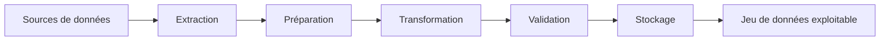
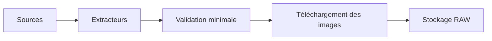
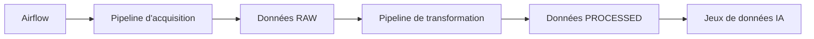

# Architecture globale

## Objectif

Cette section présente l'architecture générale du projet **CheckIt.AI**.

Le projet repose sur une architecture modulaire permettant de collecter automatiquement des données multimodales provenant de différentes sources, de les transformer dans un format homogène puis de les stocker afin de constituer un jeu de données exploitable pour des traitements d'intelligence artificielle.

Chaque composant possède une responsabilité clairement définie afin de faciliter la maintenance, les tests unitaires, les évolutions futures et l'orchestration automatique des traitements avec Apache Airflow.

---

# Vue d'ensemble de l'architecture

Le pipeline est organisé autour d'une succession d'étapes indépendantes.

Chaque étape transforme progressivement les données jusqu'à produire un jeu de données propre, normalisé et exploitable.



Chaque module communique uniquement avec l'étape suivante afin de limiter les dépendances entre les composants.

---

# Sources de données

Le pipeline agrège plusieurs catégories de sources afin de constituer un corpus multimodal riche et varié.

| Catégorie | Exemples | Données collectées |
|------------|----------|--------------------|
| APIs d'actualité | NewsData.io, GNews, GDELT | Articles récents |
| Flux RSS | BBC News, France Info, Le Monde | Articles d'actualité |
| Réseaux sociaux | Reddit | Publications multimodales |
| Datasets académiques | FakeNewsNet, Fakeddit | Données labellisées |

Ces sources fournissent principalement :

- du texte ;
- des images ;
- des métadonnées ;
- des labels pour les jeux de données supervisés.

---

# Organisation du projet

Le projet est organisé en modules spécialisés respectant le principe de responsabilité unique.

```text
checkit_ai/
│
├── docs/
│
├── src/
│   │
│   ├── extractors/
│   │
│   ├── cleaners/
│   │
│   ├── transformers/
│   │
│   ├── validators/
│   │
│   ├── services/
│   │
│   ├── storage/
│   │
│   ├── pipelines/
│   │
│   ├── utils/
│   │
│   ├── config/
│   │
│   └── logger.py
│
├── dags/
│
├── data/
│   ├── raw/
│   ├── processed/
│   └── images/
│
├── logs/
│
├── tests/
│
├── pyproject.toml
├── mkdocs.yml
└── README.md
```

Cette organisation facilite la séparation des responsabilités et permet de faire évoluer chaque composant indépendamment.

---

# Description des composants

| Composant | Responsabilité |
|------------|----------------|
| **Extracteurs** | Collecter les publications depuis les différentes sources. |
| **Cleaners** | Nettoyer et normaliser les contenus textuels. |
| **Transformers** | Appliquer les règles métier et générer les variables dérivées destinées aux traitements IA. |
| **Validators** | Vérifier la cohérence des données, des images et des métadonnées. |
| **Services** | Orchestrer les traitements spécialisés (préparation, images, stockage...). |
| **Storage** | Sauvegarder les données aux formats JSON et CSV. |
| **Pipelines** | Enchaîner les différentes étapes de traitement. |
| **Utils** | Fournir les fonctions communes utilisées par l'ensemble du projet. |
| **Airflow** | Automatiser l'exécution planifiée des pipelines. |
| **Logging** | Journaliser les différentes opérations et faciliter le suivi des traitements. |

---

# Cycle de traitement

Le projet distingue désormais deux pipelines complémentaires.

## Pipeline d'acquisition

Ce pipeline collecte les données brutes provenant des différentes sources.



Les données produites constituent une photographie fidèle des informations extraites.

---

## Pipeline de transformation

Les données brutes sont ensuite transformées afin de produire un jeu de données homogène.


Cette seconde étape garantit la reproductibilité des traitements sans devoir réinterroger les sources distantes.

---

# Principes d'architecture

La conception du projet repose sur plusieurs principes logiciels.

| Principe | Description |
|-----------|-------------|
| **Responsabilité unique** | Chaque module réalise une seule tâche bien définie. |
| **Modularité** | Les composants évoluent indépendamment les uns des autres. |
| **Réutilisabilité** | Les traitements peuvent être réutilisés dans plusieurs pipelines. |
| **Reproductibilité** | Les transformations peuvent être rejouées à partir des données brutes. |
| **Traçabilité** | Chaque étape est journalisée afin de faciliter les diagnostics. |
| **Évolutivité** | De nouvelles sources ou transformations peuvent être ajoutées facilement. |
| **Automatisation** | Les pipelines sont conçus pour être orchestrés automatiquement par Apache Airflow. |

---

# Architecture cible

À terme, Apache Airflow pilotera automatiquement l'ensemble des traitements.



Cette architecture permettra notamment :

- la planification automatique des collectes ;
- la reprise sur erreur ;
- le suivi des exécutions ;
- la génération de rapports de traitement ;
- la production continue de jeux de données destinés aux futurs modèles d'intelligence artificielle.

---

# Conclusion

L'architecture de **CheckIt.AI** repose sur une séparation claire entre l'acquisition des données, leur transformation et leur stockage.

Cette organisation modulaire facilite la maintenance du projet, améliore la reproductibilité des traitements et prépare l'intégration d'Apache Airflow pour l'automatisation complète des pipelines.