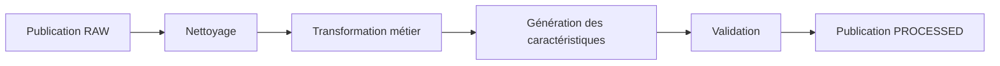
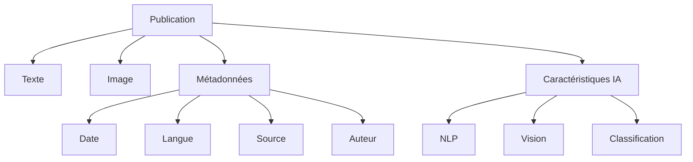

# Modèle de données

## Objectif

Cette section décrit le modèle de données utilisé dans le projet **CheckIt.AI**.

L'objectif est de fournir une représentation homogène des publications provenant de différentes sources (flux RSS, APIs, réseaux sociaux ou jeux de données académiques) afin de faciliter leur validation, leur transformation et leur exploitation par des modèles d'intelligence artificielle.

Le pipeline distingue deux niveaux de données :

- les **données brutes (RAW)**, correspondant aux informations directement extraites ;
- les **données transformées (PROCESSED)**, enrichies par le pipeline de transformation.

---

# Principes de conception

Le modèle de données repose sur plusieurs principes.

- utiliser un schéma commun quelle que soit la source ;
- conserver l'association entre le texte, l'image et les métadonnées ;
- séparer les données brutes des données transformées ;
- enrichir les publications avec des caractéristiques utiles aux traitements IA ;
- garantir la reproductibilité des transformations.

---

# Modèle RAW

Les données RAW correspondent aux informations directement extraites des différentes sources.

Aucune transformation métier n'est encore appliquée.

## Structure d'une publication

| Champ | Type conceptuel | Obligatoire | Description |
|--------|-----------------|:-----------:|-------------|
| `id` | Texte | ✅ | Identifiant unique |
| `source` | Texte | ✅ | Nom de la source |
| `title` | Texte | ✅ | Titre |
| `text` | Texte | ✅ | Contenu principal |
| `image_url` | Lien | ❌ | URL de l'image distante |
| `image_path` | Fichier | ❌ | Chemin de l'image téléchargée |
| `published_at` | Date | ✅ | Date de publication |
| `url` | Lien | ✅ | URL originale |
| `author` | Texte | ❌ | Auteur |
| `language` | Texte | ❌ | Langue |
| `category` | Catégorie | ❌ | Thématique |
| `label` | Catégorie | ❌ | Label éventuel |
| `dataset_role` | Catégorie | ❌ | Rôle du jeu de données |
| `extraction_date` | Date | ✅ | Date d'extraction |

---

# Modèle PROCESSED

Les données PROCESSED correspondent aux publications après exécution du pipeline de transformation.

Elles comprennent les données initiales ainsi que plusieurs variables calculées automatiquement.

---

## Variables textuelles

| Champ | Description |
|--------|-------------|
| `title_length` | Longueur du titre |
| `text_length` | Longueur du contenu |
| `total_text_length` | Longueur totale |
| `title_word_count` | Nombre de mots du titre |
| `text_word_count` | Nombre de mots du texte |
| `total_word_count` | Nombre total de mots |

---

## Variables temporelles

| Champ | Description |
|--------|-------------|
| `publication_year` | Année de publication |
| `publication_month` | Mois |
| `publication_day` | Jour |
| `publication_hour` | Heure |
| `publication_weekday` | Jour de la semaine |
| `has_publication_date` | Présence d'une date valide |

---

## Variables image

| Champ | Description |
|--------|-------------|
| `has_image_url` | URL d'image disponible |
| `has_image_path` | Image téléchargée |
| `image_exists` | Fichier présent |
| `is_image_valid` | Image valide |
| `image_width` | Largeur |
| `image_height` | Hauteur |
| `image_format` | Format |
| `image_size_bytes` | Taille du fichier |
| `text_image_association_valid` | Association texte-image valide |

---

## Variables métier

| Champ | Description |
|--------|-------------|
| `has_title` | Présence d'un titre |
| `has_text` | Présence d'un texte |
| `has_author` | Présence d'un auteur |
| `has_url` | Présence d'une URL |
| `has_label` | Présence d'un label |
| `is_labeled` | Donnée supervisée |
| `is_multimodal` | Texte et image disponibles |

---

## Variables de traçabilité

| Champ | Description |
|--------|-------------|
| `transformation_date` | Date de transformation |
| `transformation_version` | Version du pipeline |
| `data_quality_status` | Résultat de la validation |
| `rejection_reason` | Cause éventuelle du rejet |

---

# Cycle de transformation

Les publications suivent les étapes suivantes.



---

# Organisation des données

Les fichiers produits par le pipeline sont organisés selon plusieurs niveaux.

```text
data/
│
├── raw/
│   ├── rss/
│   ├── newsdata/
│   ├── reddit/
│   └── ...
│
├── processed/
│   ├── transformed/
│   │   ├── articles_transformed_*.json
│   │   └── articles_transformed_*.csv
│   │
│   └── reports/
│       └── transformation_report_*.json
│
└── images/
    ├── rss/
    ├── newsdata/
    ├── reddit/
    └── ...
```

---

# Formats de stockage

Les données sont enregistrées dans plusieurs formats.

| Format | Utilisation |
|--------|-------------|
| **JSON** | Stockage principal et échanges entre composants |
| **CSV** | Export et analyses exploratoires |

Le pipeline est conçu pour permettre l'ajout futur de formats analytiques tels que **Parquet** sans modifier les traitements existants.

---

# Relations entre les données

Chaque publication conserve l'association entre ses différentes composantes.



Cette organisation garantit la cohérence entre les informations textuelles, visuelles et contextuelles tout au long du pipeline.

---

# Validation du modèle

Avant leur stockage définitif, les publications sont soumises à plusieurs contrôles.

Les principales règles de validation sont :

- présence d'un identifiant unique ;
- présence d'un titre ou d'un contenu exploitable ;
- validation des URLs ;
- validation des dates ;
- contrôle des images ;
- vérification de l'association texte-image ;
- validation des métadonnées.

Les publications rejetées sont journalisées afin de garantir la traçabilité des traitements.

---

# Conclusion

Le modèle de données constitue le contrat d'échange entre les différents composants de **CheckIt.AI**.

La distinction entre les données **RAW** et **PROCESSED** garantit la reproductibilité des traitements tandis que les variables générées par le pipeline facilitent les futurs travaux de traitement automatique du langage, de vision par ordinateur et de classification multimodale.