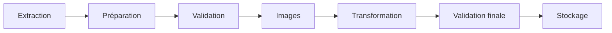

# Gestion des erreurs

## Objectif

Cette section présente les mécanismes mis en place afin de garantir la robustesse des pipelines de **CheckIt.AI**.

Les données étant collectées depuis des sources externes (flux RSS, APIs, réseaux sociaux ou jeux de données), différentes anomalies peuvent survenir : indisponibilité d'un service, données incomplètes, images invalides ou erreurs d'écriture.

L'objectif est de détecter ces situations, de les journaliser et de poursuivre le traitement dès que cela est possible afin de limiter leur impact sur le reste du pipeline.

---

# Principes retenus

La gestion des erreurs repose sur plusieurs principes.

- détecter les anomalies le plus tôt possible ;
- isoler les erreurs afin qu'une publication invalide ne bloque pas le traitement des autres ;
- journaliser chaque anomalie rencontrée ;
- garantir la cohérence des données enregistrées ;
- assurer la reproductibilité des traitements.

---

# Validation progressive

Les contrôles sont répartis tout au long des pipelines.

Cette approche permet de détecter rapidement les anomalies avant qu'elles ne se propagent aux étapes suivantes.

Chaque étape peut rejeter une publication sans interrompre le traitement des autres.

---

# Gestion des exceptions

Les opérations sensibles sont protégées par des blocs `try/except`.

Cela concerne notamment :

- les communications avec les APIs ;
- le téléchargement des images ;
- la lecture et l'écriture des fichiers ;
- la validation des images ;
- les traitements de transformation.

Lorsqu'une exception est rencontrée, celle-ci est enregistrée dans les journaux d'exécution afin de faciliter le diagnostic.

Le pipeline poursuit ensuite son exécution lorsque cela est possible.

---

# Validation des données

Les publications sont contrôlées avant et après leur transformation.

Les principales vérifications portent sur :

| Élément contrôlé | Vérification |
|------------------|--------------|
| Identifiant | Présence et unicité |
| Titre | Longueur minimale |
| Texte | Contenu exploitable |
| URL | Format valide |
| Date | Format cohérent |
| Source | Nom renseigné |
| Image | Présence, format et intégrité lorsque disponible |
| Métadonnées | Cohérence générale |

Les publications invalides sont rejetées et leur motif est conservé dans le rapport de transformation.

---

# Validation des images

Les images téléchargées sont contrôlées avant d'être intégrées au corpus.

Les principales vérifications sont :

- présence du fichier ;
- format supporté ;
- dimensions minimales ;
- lecture correcte de l'image ;
- emplacement autorisé ;
- association entre le texte et l'image.

Les publications peuvent être conservées même en l'absence d'image lorsque celle-ci n'est pas obligatoire.

---

# Journalisation

Le projet utilise un système centralisé de journalisation basé sur le module **logging**.

Les événements enregistrés comprennent notamment :

- démarrage d'un pipeline ;
- nombre d'articles extraits ;
- nombre d'articles rejetés ;
- téléchargement des images ;
- validations ;
- avertissements ;
- erreurs ;
- fin d'exécution.

Cette journalisation facilite le suivi des traitements et le diagnostic des anomalies.

---

# Gestion des erreurs par composant

| Composant | Erreurs possibles | Traitement |
|------------|-------------------|------------|
| Extracteurs | API indisponible, erreur HTTP, timeout | Journalisation puis poursuite des autres sources |
| Préparation | Données incomplètes | Normalisation ou rejet |
| Validation | Champs invalides | Rejet de la publication |
| Images | URL invalide, téléchargement impossible, image corrompue | Rejet de l'image ou de la publication selon la configuration |
| Transformation | Valeurs incohérentes | Nettoyage ou rejet |
| Stockage | Erreur d'écriture | Journalisation puis arrêt de la sauvegarde |

---

# Sécurisation du stockage

Les opérations d'écriture utilisent plusieurs mécanismes afin d'éviter la corruption des fichiers.

Le pipeline met notamment en œuvre :

- un verrou de fichier (*File Lock*) afin d'éviter les écritures concurrentes ;
- un fichier temporaire ;
- un remplacement atomique du fichier final.

Cette approche garantit que les fichiers enregistrés restent cohérents même en cas d'interruption pendant l'écriture.

---

# Rapports de transformation

À la fin du pipeline de transformation, un rapport est généré automatiquement.

Il contient notamment :

- le nombre d'articles chargés ;
- le nombre d'articles transformés ;
- le nombre d'articles rejetés ;
- les motifs de rejet ;
- les fichiers exportés ;
- la durée d'exécution ;
- la version du pipeline.

Ces rapports facilitent le suivi des traitements et la reproductibilité des exécutions.

---

# Robustesse de l'architecture

La fiabilité globale du système repose sur plusieurs mécanismes complémentaires.

| Mécanisme | Objectif |
|------------|----------|
| Validation progressive | Détecter rapidement les anomalies |
| Nettoyage des données | Uniformiser les contenus |
| Validation des images | Garantir un corpus multimodal exploitable |
| Journalisation | Faciliter le diagnostic |
| Stockage atomique | Éviter les fichiers corrompus |
| Modularité | Limiter la propagation des erreurs |
| Rapports de transformation | Assurer la traçabilité |
| Apache Airflow | Permettre la reprise automatique des traitements |

---

# Limites connues

Certaines situations restent dépendantes des sources externes.

Par exemple :

- indisponibilité temporaire d'une API ;
- modification de la structure d'un flux RSS ;
- suppression d'une image après sa publication ;
- dépassement des quotas d'utilisation ;
- interruption réseau.

Ces situations ne peuvent pas être totalement évitées mais leur impact est limité grâce aux mécanismes de validation, de journalisation et de reprise intégrés au projet.

---

# Conclusion

La gestion des erreurs constitue un élément central de l'architecture de **CheckIt.AI**.

La combinaison d'une validation progressive, d'une journalisation détaillée, d'un stockage sécurisé et d'une architecture modulaire permet de poursuivre les traitements malgré les anomalies rencontrées tout en garantissant la traçabilité et la cohérence des données produites.

Cette approche prépare également l'intégration d'**Apache Airflow**, qui pourra automatiser la reprise des traitements en cas d'échec d'une tâche.