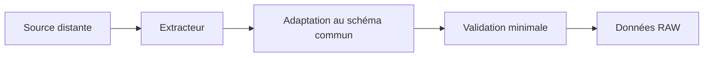
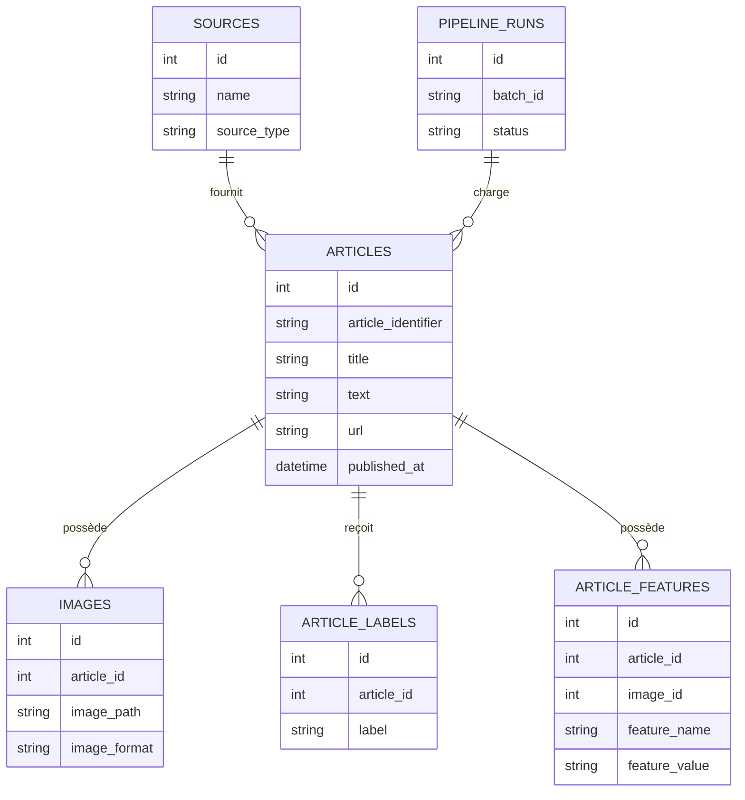
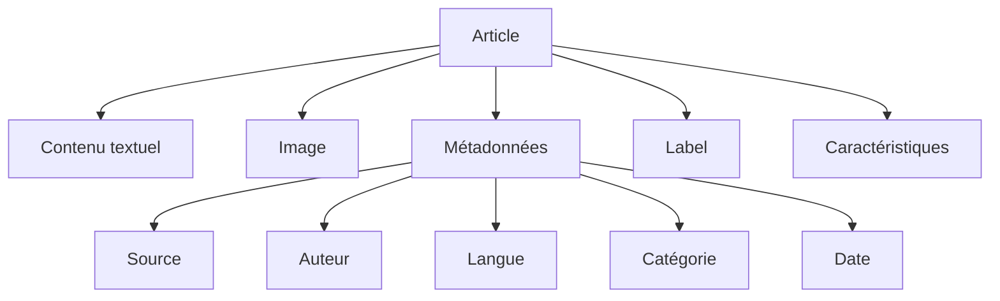

# Modèle de données

## Objectif

Dans cette section, je présente le modèle de données utilisé dans **CheckIt.AI**.

Les publications collectées proviennent de sources différentes, comme les flux RSS, les API, les réseaux sociaux, les sites de fact-checking ou les datasets académiques. Ces sources ne fournissent pas toutes les mêmes champs ni les mêmes formats.

J’ai donc défini une structure commune afin de pouvoir appliquer les mêmes étapes de préparation, de validation, de transformation et de stockage à l’ensemble des publications.

Le pipeline distingue deux niveaux de données :

- les données **RAW**, qui correspondent aux publications produites par les extracteurs ;
- les données **PROCESSED**, qui correspondent aux publications préparées, transformées, enrichies et validées.

Cette séparation me permet de conserver les données extraites et de rejouer le pipeline de transformation sans devoir interroger une nouvelle fois les sources distantes.

---

## Principes de conception

Pour construire le modèle de données, je me suis appuyé sur plusieurs principes :

- utiliser un schéma commun quelle que soit la source ;
- conserver l’association entre le texte, l’image et les métadonnées ;
- accepter que certains champs facultatifs soient absents ;
- séparer les données extraites des données transformées ;
- conserver les informations nécessaires à la traçabilité ;
- enrichir les publications avec des caractéristiques calculées ;
- permettre la réexécution des transformations à partir des données déjà collectées.

---

## Schéma commun d’un article

Les données provenant des différentes sources sont converties vers un schéma standard.

Ce schéma constitue le format d’échange commun entre les extracteurs, le pipeline de transformation et les composants de stockage.

| Champ | Type conceptuel | Description |
|---|---|---|
| `id` | Texte | Identifiant de l’article. |
| `source` | Texte | Nom de la source ayant fourni la publication. |
| `title` | Texte | Titre de la publication. |
| `text` | Texte | Contenu textuel principal. |
| `image_url` | URL | Adresse distante de l’image associée. |
| `image_path` | Chemin | Chemin local de l’image téléchargée. |
| `image_download_status` | Texte | Résultat du téléchargement de l’image. |
| `image_download_error` | Texte | Description de l’erreur rencontrée pendant le téléchargement. |
| `published_at` | Date | Date de publication fournie par la source. |
| `url` | URL | Adresse originale de la publication. |
| `author` | Texte | Auteur de la publication lorsqu’il est disponible. |
| `language` | Texte | Langue de la publication. |
| `category` | Texte | Catégorie ou thématique associée. |
| `label` | Texte | Label fourni par une source ou un dataset annoté. |
| `dataset_role` | Texte | Rôle de la publication dans le projet. |
| `extraction_date` | Date | Date à laquelle la publication a été extraite. |

Tous les champs ne sont pas obligatoires pour toutes les sources.

Par exemple, une publication provenant d’un dataset annoté peut posséder un label mais aucune URL publique. À l’inverse, un article d’actualité récent peut posséder une URL mais aucun label de véracité.

Les règles appliquées dépendent donc du rôle de la publication et de la politique de préparation utilisée.

---

## Rôle des publications

Le champ `dataset_role` me permet de différencier l’utilisation prévue des publications.

Les principaux rôles utilisés dans le projet sont :

| Rôle | Utilisation |
|---|---|
| `acquisition` | Article d’actualité collecté depuis une source distante. |
| `fact_checking` | Publication provenant d’un organisme de vérification. |
| `labeled_reference` | Donnée possédant un label exploitable pour l’apprentissage supervisé. |
| `multimodal_reference` | Donnée de référence contenant du texte et une image. |
| `claim_reference` | Allégation accompagnée d’une évaluation de fact-checking. |
| `social_reference` | Publication issue d’un réseau social. |

Cette information permet au pipeline de choisir une politique de préparation adaptée.

Dans le pipeline de transformation, les articles sont notamment préparés selon les profils suivants :

- `acquisition` ;
- `labeled_reference` ;
- `multimodal_reference`.

---

## Données RAW

Les données RAW correspondent aux publications produites après l’extraction.

Elles utilisent déjà le schéma commun de CheckIt.AI, mais elles n’ont pas encore suivi l’ensemble du pipeline de transformation.

Elles peuvent encore contenir :

- des valeurs textuelles non homogènes ;
- des espaces inutiles ;
- des dates provenant de formats différents ;
- des catégories ou des langues écrites de plusieurs manières ;
- des labels propres à une source ;
- des doublons ;
- des champs facultatifs absents ;
- des images non téléchargées ou invalides.

Les données RAW sont conservées afin de disposer d’un état intermédiaire réutilisable.



---

## Données PROCESSED

Les données PROCESSED correspondent aux publications obtenues après l’exécution du pipeline de transformation.

Le pipeline applique successivement :

- la préparation des articles ;
- la normalisation ;
- le nettoyage ;
- la déduplication ;
- les transformations métier ;
- la génération des caractéristiques ;
- la validation finale.

Les publications conservées contiennent les données d’origine normalisées ainsi que des informations supplémentaires produites pendant la transformation.


---

## Caractéristiques textuelles

Le pipeline génère des caractéristiques à partir du titre et du contenu des publications.

Ces valeurs permettent de décrire simplement la quantité de texte disponible.

| Champ | Description |
|---|---|
| `title_length` | Nombre de caractères présents dans le titre. |
| `text_length` | Nombre de caractères présents dans le contenu. |
| `title_word_count` | Nombre de mots présents dans le titre. |
| `text_word_count` | Nombre de mots présents dans le contenu. |

Ces caractéristiques pourront être utilisées pour les contrôles de qualité, les analyses exploratoires et les futurs traitements d’intelligence artificielle.

---

## Caractéristiques temporelles

La date de publication peut être utilisée pour produire des informations temporelles complémentaires.

Le projet exploite notamment l’heure de publication lorsqu’une date valide est disponible.

| Champ | Description |
|---|---|
| `publication_hour` | Heure de publication extraite depuis la date normalisée. |

La date originale normalisée reste conservée dans le champ `published_at`.

---

## Métadonnées des images

Lorsqu’une image est disponible et téléchargée, le pipeline peut enregistrer plusieurs informations techniques.

| Champ | Description |
|---|---|
| `image_format` | Format réel de l’image. |
| `image_width` | Largeur de l’image en pixels. |
| `image_height` | Hauteur de l’image en pixels. |
| `image_mode` | Mode de couleur de l’image. |
| `animated` | Indique si l’image contient plusieurs images ou animations. |
| `frame_count` | Nombre d’images composant le fichier. |
| `file_size` | Taille du fichier image. |

Ces métadonnées permettent de vérifier qu’une image est exploitable avant son utilisation dans de futurs traitements multimodaux.

L’état du téléchargement est également conservé dans les champs :

- `image_download_status` ;
- `image_download_error`.

---

## Informations de transformation

Le pipeline ajoute des informations permettant d’identifier la transformation appliquée aux données.

| Champ | Description |
|---|---|
| `transformation_date` | Date d’exécution de la transformation. |
| `transformation_version` | Version du pipeline ayant produit le résultat. |
| `data_quality_status` | Statut obtenu après la validation finale. |
| `rejection_reason` | Motif de rejet lorsqu’un article ne respecte pas les règles attendues. |

La version du pipeline est enregistrée afin de pouvoir identifier les règles utilisées pour produire un fichier transformé.

---

## Organisation des fichiers

Les fichiers produits sont séparés selon leur niveau de traitement.

```text
data/
├── datasets/
│
├── raw/
│
├── processed/
│   ├── transformed/
│   │   ├── articles_transformed_*.json
│   │   └── articles_transformed_*.csv
│   │
│   └── reports/
│       └── transformation_report_*.json
│
└── images/
```

Le dossier `raw` contient les données issues de l’extraction.

Le dossier `processed/transformed` contient les publications ayant terminé le pipeline de transformation.

Le dossier `processed/reports` contient les rapports produits pendant les exécutions.

Le dossier `images` contient les fichiers téléchargés lorsqu’une publication possède une image exploitable.

---

## Formats de stockage

Le pipeline produit actuellement des fichiers JSON et CSV.

| Format | Utilisation |
|---|---|
| **JSON** | Conservation structurée des publications et échanges entre les étapes du pipeline. |
| **CSV** | Consultation, export et analyse des données sous forme tabulaire. |
| **PostgreSQL** | Stockage relationnel final des articles et des données associées. |

Le format JSON est adapté aux échanges internes, car il conserve facilement les différents champs d’une publication.

Le format CSV facilite l’ouverture des données dans un tableur ou leur chargement avec pandas.

PostgreSQL permet ensuite de stocker les données de manière structurée et d’établir des relations entre les articles, les images, les labels, les caractéristiques et les exécutions du pipeline.

---

## Modèle relationnel

Après leur transformation, les données sont chargées dans plusieurs tables PostgreSQL.



Ce schéma représente les principales relations utilisées dans le projet.

Un article peut être associé à :

- une source ;
- une exécution du pipeline ;
- une ou plusieurs informations liées aux images ;
- des labels ;
- des caractéristiques calculées.

Certaines caractéristiques concernent uniquement l’article. Dans ce cas, leur `image_id` peut rester vide.

---

## Association entre les données

Chaque article reste l’élément central du modèle.



Cette organisation me permet de conserver le lien entre les différentes composantes d’une publication tout au long du pipeline.

L’identifiant de l’article est utilisé pour retrouver les données associées pendant le chargement en base.

---

## Validation du modèle

Les articles sont contrôlés à plusieurs étapes du pipeline.

Les règles appliquées dépendent de leur profil de préparation et de leur rôle.

Les contrôles peuvent notamment concerner :

- la présence du titre ;
- la longueur minimale du titre ;
- la présence d’un texte exploitable ;
- la longueur totale du contenu ;
- la présence d’une URL lorsque celle-ci est obligatoire ;
- la présence d’un label pour les datasets annotés ;
- la présence d’une image pour les données multimodales ;
- le rejet des contenus supprimés ;
- la détection des doublons ;
- la validité de l’image téléchargée.

Lorsque la validation finale réussit, le champ `data_quality_status` reçoit la valeur `valid`.

Lorsqu’un article est rejeté, le motif est comptabilisé dans le rapport de transformation.

---

## Traçabilité des transformations

Chaque exécution du pipeline produit un rapport contenant notamment :

- le statut de l’exécution ;
- la version du pipeline ;
- les dates de début et de fin ;
- la durée du traitement ;
- le nombre d’articles chargés ;
- le nombre d’articles préparés ;
- le nombre de doublons ;
- le nombre d’articles invalides ;
- le nombre d’articles valides ;
- les motifs de rejet ;
- les fichiers exportés ;
- l’erreur éventuelle.

Ces informations me permettent de comprendre ce qui s’est passé pendant une exécution et de comparer plusieurs transformations.

---

## Conclusion

Le modèle de données constitue le contrat commun entre les différents composants de **CheckIt.AI**.

Le schéma standard permet de traiter de la même manière des publications provenant de sources très différentes.

La séparation entre les données **RAW** et **PROCESSED** me permet de conserver les données extraites tout en produisant une version normalisée, enrichie et validée.

Enfin, le stockage dans PostgreSQL permet de conserver les relations entre les articles, les images, les labels, les caractéristiques et les exécutions du pipeline.

Cette organisation prépare l’exploitation future des données pour des traitements de classification, d’analyse textuelle et d’analyse multimodale.