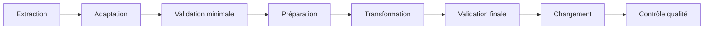

# Gestion des erreurs

## Objectif

Dans cette section, je présente les mécanismes que j’ai mis en place pour rendre les pipelines de **CheckIt.AI** plus robustes.

Les données proviennent de sources externes comme des API, des flux RSS, des réseaux sociaux, des sites web ou des datasets. Leur disponibilité et leur qualité peuvent varier.

Le pipeline doit donc pouvoir gérer plusieurs types de problèmes :

- une source temporairement indisponible ;
- une erreur HTTP ;
- une mauvaise configuration ;
- une publication incomplète ;
- une image invalide ;
- un fichier absent ;
- une erreur de transformation ;
- une erreur de chargement dans PostgreSQL.

Mon objectif est de détecter ces situations, de les enregistrer dans les logs et de poursuivre le traitement lorsque cela reste possible.

---

## Principes retenus

J’ai construit la gestion des erreurs autour de plusieurs principes :

- détecter les anomalies le plus tôt possible ;
- distinguer les erreurs locales des erreurs bloquantes ;
- éviter qu’un article invalide bloque tout un lot ;
- journaliser les erreurs avec suffisamment de contexte ;
- conserver les motifs de rejet ;
- ne pas masquer les exceptions importantes ;
- éviter la création de fichiers incomplets ;
- permettre à Airflow d’identifier clairement l’étape en échec.

Cette séparation est importante car toutes les erreurs n’ont pas le même impact.

Par exemple, une image invalide peut concerner un seul article, alors qu’une erreur de connexion à PostgreSQL peut empêcher le chargement de tout le lot.

---

## Validation progressive

Les contrôles sont répartis tout au long du pipeline.

Cette organisation permet d’écarter rapidement les données incorrectes avant qu’elles ne provoquent des erreurs dans les étapes suivantes.

