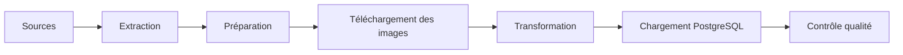
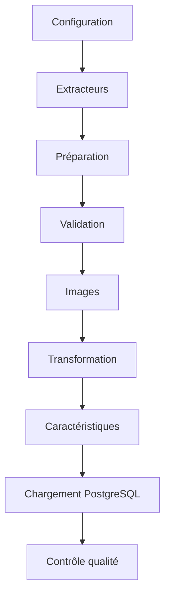

# Fonctionnement du pipeline

## Présentation

Dans cette section, je présente le fonctionnement général du pipeline développé dans **CheckIt.AI**.

Mon objectif est de transformer des publications provenant de sources hétérogènes en un jeu de données homogène, validé et directement exploitable.

Pour cela, j'ai organisé le traitement sous la forme d'une succession d'étapes indépendantes. Chaque étape reçoit les données produites par la précédente, applique un traitement précis puis transmet le résultat à l'étape suivante.

Cette organisation me permet de mieux séparer les responsabilités, de faciliter la maintenance du projet, de simplifier le diagnostic des erreurs et d'automatiser plus facilement les traitements avec Apache Airflow.

---

## Vue d'ensemble

Le fonctionnement général du pipeline peut être résumé par les étapes suivantes.

J'ai choisi cette organisation afin que chaque composant réalise une tâche précise sans dépendre fortement des autres modules.

---

## 1. Extraction

La première étape consiste à récupérer les publications depuis les différentes sources configurées.

Le projet prend actuellement en charge plusieurs familles de sources :

- les flux RSS ;
- les API d'actualité ;
- les sites de fact-checking ;
- les réseaux sociaux ;
- les datasets académiques.

Chaque famille possède son propre moteur d'extraction ainsi que des adaptateurs permettant de convertir les données vers le schéma commun utilisé dans le projet.

À la fin de cette étape, toutes les publications possèdent une structure identique, quelle que soit leur origine.

---

## 2. Préparation des articles

Les publications extraites passent ensuite par une phase de préparation.

Pendant cette étape, j'applique plusieurs traitements destinés à homogénéiser les données avant leur transformation :

- normalisation du schéma ;
- nettoyage des valeurs ;
- harmonisation des champs ;
- suppression des doublons ;
- validation selon le rôle de la publication.

Les règles appliquées dépendent du profil de préparation utilisé (`acquisition`, `labeled_reference` ou `multimodal_reference`).

Les articles qui ne respectent pas les critères définis sont rejetés avant de poursuivre le pipeline.

---

## 3. Téléchargement et validation des images

Lorsqu'une publication possède une image, celle-ci est téléchargée localement.

Avant de la conserver, je réalise plusieurs contrôles afin de vérifier notamment :

- son format réel ;
- ses dimensions ;
- son intégrité ;
- sa taille ;
- son type de contenu ;
- la cohérence entre son extension et son format.

Les informations obtenues sont enregistrées dans les métadonnées de l'article.

Lorsque l'image n'est pas exploitable, son statut est conservé afin de faciliter le diagnostic sans interrompre le traitement des autres publications.

---

## 4. Transformation des données

Les articles validés sont ensuite transformés afin d'obtenir une représentation homogène.

Cette étape comprend notamment :

- la normalisation des langues ;
- la normalisation des catégories ;
- la normalisation des labels ;
- la normalisation des rôles ;
- le nettoyage du contenu textuel ;
- l'enrichissement des métadonnées.

Ces traitements me permettent d'obtenir des données cohérentes, même lorsque les publications proviennent de sources très différentes.

---

## 5. Génération des caractéristiques

Le pipeline calcule ensuite plusieurs caractéristiques destinées à enrichir les articles.

Ces caractéristiques concernent principalement :

- le contenu textuel ;
- les dates ;
- les images ;
- les informations métier.

Par exemple, je calcule :

- la longueur des titres ;
- le nombre de mots ;
- l'heure de publication ;
- les dimensions des images ;
- différents indicateurs de qualité.

Ces informations pourront être utilisées lors de futurs traitements de machine learning ou d'analyse multimodale.

---

## 6. Chargement dans PostgreSQL

Une fois les articles transformés, je charge les données dans PostgreSQL.

Le chargement alimente plusieurs tables du modèle relationnel, notamment :

- les sources ;
- les articles ;
- les images ;
- les labels ;
- les caractéristiques ;
- les exécutions du pipeline.

Cette organisation facilite les recherches, les statistiques ainsi que l'alimentation du tableau de bord.

---

## 7. Contrôle qualité

Après le chargement, un dernier pipeline vérifie la cohérence globale des données enregistrées.

Cette étape contrôle notamment :

- le nombre d'articles extraits ;
- le nombre d'articles transformés ;
- le nombre d'articles chargés ;
- le nombre d'images ;
- le nombre de labels ;
- le nombre de caractéristiques.

Ces vérifications me permettent de détecter rapidement une anomalie éventuelle entre les différentes étapes du traitement.

---

## Circulation des données

Le tableau suivant résume les principales entrées et sorties de chaque étape.

| Étape | Entrée | Sortie |
|---|---|---|
| Extraction | Sources de données | Articles normalisés |
| Préparation | Articles extraits | Articles validés |
| Images | Articles validés | Articles enrichis avec les informations d'image |
| Transformation | Articles préparés | Articles harmonisés |
| Génération des caractéristiques | Articles transformés | Articles enrichis |
| Chargement | Articles enrichis | Données PostgreSQL |
| Contrôle qualité | Base PostgreSQL | Rapport de qualité |

---

## Enchaînement des traitements

Le fonctionnement général peut être résumé de la manière suivante.

Chaque étape produit un résultat qui devient l'entrée de l'étape suivante.

Cette organisation me permet de faire évoluer un composant sans devoir modifier l'ensemble du pipeline tout en facilitant le suivi des traitements.

---

## Conclusion

J'ai organisé le pipeline de **CheckIt.AI** comme une succession d'étapes spécialisées, allant de la collecte des données jusqu'à leur chargement dans PostgreSQL.

Cette architecture me permet de séparer clairement les responsabilités, de contrôler les données à plusieurs niveaux et de produire un jeu de données homogène, traçable et directement exploitable.

Le chapitre suivant présente les mécanismes que j'ai mis en place afin de garantir la reproductibilité des traitements.