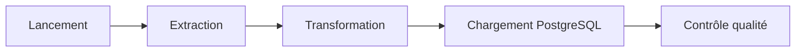
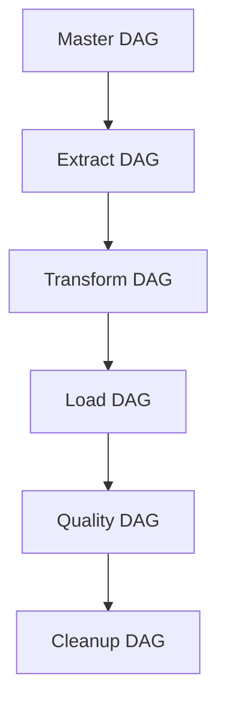

# Exécution du pipeline

## Présentation

Dans cette section, je présente les différentes méthodes utilisées pour exécuter le pipeline de **CheckIt.AI**.

Le projet a été conçu afin de pouvoir être exécuté aussi bien pendant le développement qu'au travers d'une orchestration complète avec Apache Airflow.

Cette organisation me permet de tester indépendamment chaque étape du pipeline tout en conservant une exécution entièrement automatisée lorsque le projet est déployé.

---

## Vue d'ensemble

L'exécution complète du projet suit les étapes suivantes.

Chaque étape produit les données nécessaires à la suivante.

---

## Modes d'exécution

J'utilise plusieurs modes d'exécution selon les besoins.

| Mode | Utilisation |
|---|---|
| Exécution locale | Développement et tests d'un composant. |
| Apache Airflow | Exécution complète du pipeline. |
| Docker | Exécution des services nécessaires au projet. |

Cette organisation me permet de développer chaque composant indépendamment avant de l'intégrer au pipeline complet.

---

## Exécution locale

Pendant le développement, j'exécute généralement un pipeline ou un composant précis afin de vérifier son fonctionnement.

Cette approche permet notamment de :

- tester un extracteur ;
- vérifier une transformation ;
- contrôler le téléchargement des images ;
- tester le chargement PostgreSQL ;
- corriger une erreur plus rapidement.

Le fait de pouvoir lancer chaque étape indépendamment facilite le débogage.

---

## Exécution avec Apache Airflow

L'orchestration du projet est assurée par Apache Airflow.

Chaque grande étape possède son propre DAG.

| DAG | Fonction |
|---|---|
| `checkit_master_pipeline` | Orchestration complète du projet. |
| `checkit_extract_dag` | Acquisition des données. |
| `checkit_transform_dag` | Transformation des articles. |
| `checkit_load_dag` | Chargement dans PostgreSQL. |
| `checkit_quality_dag` | Vérification de la qualité des données. |
| `checkit_cleanup_dag` | Nettoyage des anciens lots. |
| `checkit_database_setup` | Initialisation de la base PostgreSQL. |

Le DAG principal déclenche automatiquement les différentes étapes dans l'ordre prévu.

Cette organisation me permet de suivre précisément l'état d'avancement du pipeline.

---

## Déroulement d'une exécution

Lorsqu'une exécution démarre, le pipeline réalise successivement plusieurs opérations.

### 1. Chargement de la configuration

Les fichiers YAML sont lus afin d'identifier :

- les sources actives ;
- les paramètres d'extraction ;
- les politiques de validation ;
- les limites de collecte.

---

### 2. Exécution des extracteurs

Les extracteurs configurés sont exécutés.

Chaque famille de sources est traitée indépendamment :

- API ;
- RSS ;
- Scrapers ;
- Réseaux sociaux ;
- Datasets.

Les résultats sont regroupés dans un lot unique.

---

### 3. Préparation des articles

Les publications sont ensuite :

- normalisées ;
- nettoyées ;
- dédupliquées ;
- validées.

Les profils de préparation sont appliqués selon le rôle des données.

---

### 4. Téléchargement des images

Les images sont téléchargées lorsqu'elles sont disponibles.

Le pipeline contrôle notamment :

- le format ;
- les dimensions ;
- la taille ;
- l'intégrité du fichier.

Les métadonnées de l'image sont ajoutées à l'article.

---

### 5. Transformation

Les données sont ensuite harmonisées.

Les principales opérations concernent :

- les langues ;
- les catégories ;
- les labels ;
- les rôles ;
- les métadonnées.

Les caractéristiques calculées sont ensuite générées.

---

### 6. Chargement

Les données transformées sont insérées dans PostgreSQL.

Les différentes tables sont alimentées progressivement.

---

### 7. Contrôle qualité

Une dernière étape compare les données produites avec les données effectivement chargées.

Cette vérification permet de détecter rapidement une anomalie dans le pipeline.

---

## Suivi de l'exécution

Chaque exécution produit plusieurs informations de suivi.

Le pipeline enregistre notamment :

- le statut de chaque extracteur ;
- le nombre d'articles analysés ;
- le nombre d'articles conservés ;
- le nombre d'articles rejetés ;
- les motifs de rejet ;
- les erreurs rencontrées ;
- la durée des traitements.

Ces informations sont utilisées :

- dans les logs ;
- dans les rapports de transformation ;
- dans PostgreSQL ;
- dans le tableau de bord.

---

## Gestion des erreurs

Pendant l'exécution, les erreurs sont traitées à plusieurs niveaux.

Par exemple :

- un extracteur en erreur n'empêche pas les autres de continuer ;
- une image invalide n'entraîne pas forcément le rejet de l'article ;
- une erreur de transformation interrompt uniquement l'étape concernée ;
- une erreur de chargement est remontée à Airflow.

Cette organisation limite la propagation des erreurs dans le reste du pipeline.

---

## Exécution dans Docker

Le projet s'appuie sur Docker afin de fournir un environnement d'exécution identique entre les différentes machines.

Les principaux services démarrés sont :

- Apache Airflow ;
- PostgreSQL.

Docker garantit que le pipeline est exécuté dans un environnement maîtrisé, avec les mêmes dépendances que celles utilisées pendant le développement.

---

## Tableau de bord

Une fois le pipeline terminé, les résultats sont consultables depuis le tableau de bord Streamlit.

Le dashboard permet notamment de visualiser :

- l'état d'Airflow ;
- l'état de PostgreSQL ;
- le dernier pipeline exécuté ;
- les statistiques des articles ;
- les images téléchargées ;
- les labels ;
- les caractéristiques calculées.

Il constitue un outil de suivi complémentaire aux journaux d'exécution.

---

## Conclusion

L'exécution de **CheckIt.AI** repose sur une succession d'étapes indépendantes orchestrées par Apache Airflow.

Cette organisation me permet de développer chaque composant séparément, d'automatiser les traitements, de suivre précisément leur exécution et d'identifier rapidement les éventuelles anomalies.

La combinaison de Docker, PostgreSQL, Airflow et du tableau de bord Streamlit facilite également le déploiement, la supervision et le maintien du pipeline.