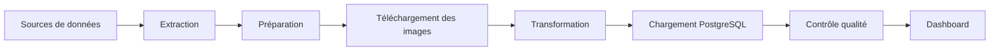
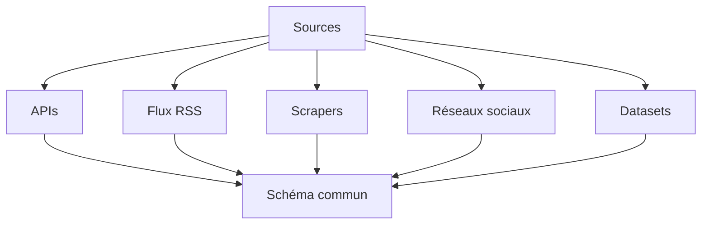
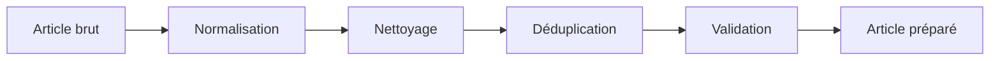
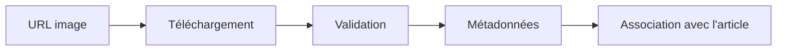
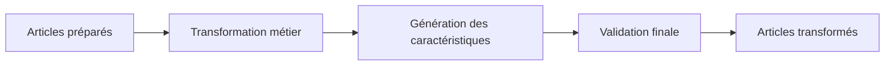
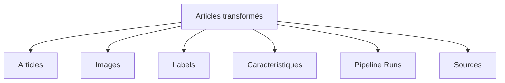
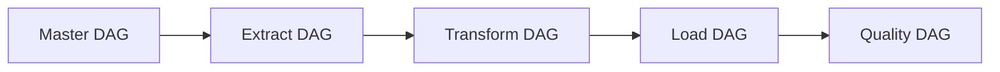
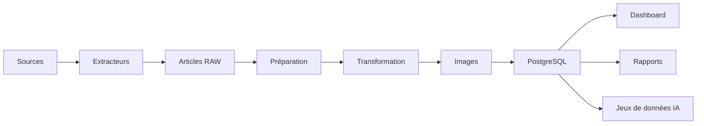

# Schéma du pipeline

## Présentation

Dans cette section, je regroupe les principaux schémas permettant de visualiser le fonctionnement général de **CheckIt.AI**.

Ces représentations complètent les chapitres précédents en illustrant la circulation des données entre les différents composants du projet.

---

# Vue d'ensemble

Le pipeline complet est organisé en plusieurs étapes successives.

Chaque étape produit les données nécessaires à la suivante.

---

# Organisation des extracteurs

Les publications sont collectées selon leur famille de sources.

Toutes les données sont converties vers le même modèle d'article avant de poursuivre le pipeline.

---

# Préparation des articles

Les publications suivent plusieurs traitements avant leur transformation.

Cette étape garantit que les traitements suivants manipulent des données homogènes.

---

# Traitement des images

Lorsqu'une publication possède une image, celle-ci suit un pipeline spécifique.

Les informations obtenues sont ensuite ajoutées aux métadonnées de la publication.

---

# Pipeline de transformation

Les données préparées sont enrichies avant leur chargement.

Cette étape produit un jeu de données homogène destiné au stockage.

---

# Chargement des données

Les données transformées sont ensuite réparties dans les différentes tables PostgreSQL.

Chaque table contient une partie des informations produites pendant le pipeline.

---

# Orchestration avec Apache Airflow

Les différentes étapes sont exécutées dans un ordre précis.

Le DAG principal orchestre automatiquement les différentes phases du projet.

---

# Vue globale de l'architecture

L'ensemble du projet peut être résumé par le schéma suivant.

Ce schéma met en évidence les principales étapes suivies par les données depuis leur collecte jusqu'à leur exploitation.

---

# Conclusion

Les différents schémas présentés dans cette section illustrent l'organisation générale du pipeline développé pour **CheckIt.AI**.

Ils montrent comment les données circulent entre les différents composants du projet, depuis leur acquisition jusqu'à leur stockage et leur exploitation.

Ces représentations complètent les descriptions détaillées des chapitres précédents et offrent une vision synthétique de l'architecture mise en œuvre.