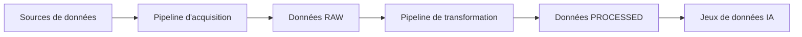
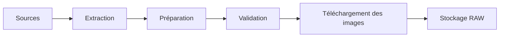
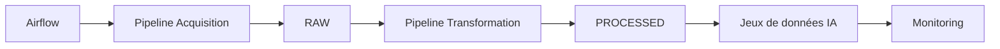

# Pipeline de traitement

## Objectif

Cette section décrit le fonctionnement des pipelines de traitement développés dans le cadre du projet **CheckIt.AI**.

Le projet repose sur deux pipelines complémentaires :

- un **pipeline d'acquisition**, chargé de collecter les données provenant de différentes sources ;
- un **pipeline de transformation**, chargé de produire un jeu de données homogène et exploitable par les futurs modèles d'intelligence artificielle.

Cette séparation permet de garantir la reproductibilité des traitements, de limiter les appels aux sources distantes et de faciliter l'orchestration avec Apache Airflow.

---

# Vue d'ensemble

Le traitement complet des données est organisé en deux pipelines successifs.

Les données brutes sont conservées afin de pouvoir rejouer les transformations sans devoir réinterroger les sources.

---

# Pipeline d'acquisition

Le premier pipeline est responsable de la collecte des données.

---

## 1. Extraction

Les différents extracteurs interrogent les sources configurées afin de récupérer les publications disponibles.

Les sources actuellement supportées sont :

- Flux RSS ;
- APIs d'actualité ;
- Réseaux sociaux ;
- Jeux de données académiques.

Les données récupérées comprennent notamment :

- le titre ;
- le contenu ;
- l'auteur ;
- la date de publication ;
- l'URL de l'article ;
- l'URL de l'image ;
- les métadonnées disponibles.

### Entrée

- Flux RSS
- APIs
- Réseaux sociaux
- Datasets

### Sortie

Articles bruts.

---

## 2. Préparation

Les publications extraites sont converties vers un schéma commun.

Cette étape comprend notamment :

- la normalisation des noms de champs ;
- la génération d'un identifiant unique ;
- la suppression des doublons éventuels.

Les données possèdent alors une structure homogène, quel que soit leur format d'origine.

---

## 3. Validation

Les données sont contrôlées avant leur stockage.

Les vérifications portent notamment sur :

- les champs obligatoires ;
- les URLs ;
- les longueurs minimales des textes ;
- les dates ;
- les métadonnées.

Les publications invalides sont rejetées et journalisées.

---

## 4. Téléchargement et validation des images

Lorsque l'article possède une image distante, celle-ci est téléchargée localement.

Le pipeline vérifie ensuite :

- la présence du fichier ;
- son format ;
- sa lisibilité ;
- son emplacement ;
- ses dimensions.

Cette étape permet de constituer un corpus multimodal exploitable.

---

## 5. Stockage RAW

Les données collectées sont enregistrées sans transformation métier.

Les formats utilisés sont :

- JSON ;
- CSV.

Les images sont stockées séparément dans un dossier dédié.

Ces données constituent une photographie fidèle des informations récupérées auprès des différentes sources.

---

# Pipeline de transformation

Une fois les données brutes disponibles, un second pipeline réalise les traitements nécessaires à leur exploitation.

---

## 1. Lecture

Le pipeline recharge les données précédemment stockées.

Cette approche évite de solliciter inutilement les sources distantes et garantit la reproductibilité des traitements.

---

## 2. Nettoyage

Les contenus textuels sont normalisés.

Les principales opérations réalisées sont :

- suppression du HTML ;
- décodage des entités HTML ;
- normalisation Unicode ;
- suppression des caractères invisibles ;
- normalisation des espaces.

---

## 3. Transformation métier

Les valeurs provenant des différentes sources sont harmonisées.

Les traitements comprennent notamment :

- normalisation des langues ;
- normalisation des catégories ;
- normalisation des labels ;
- harmonisation des rôles des jeux de données.

Cette étape garantit une représentation homogène des publications.

---

## 4. Génération des caractéristiques

Le pipeline enrichit les articles avec de nouvelles variables calculées.

Exemples :

- longueur du titre ;
- longueur du texte ;
- nombre de mots ;
- année de publication ;
- présence d'une image ;
- dimensions de l'image ;
- validation de l'association texte-image ;
- indicateur multimodal.

Ces variables faciliteront les futurs traitements de NLP et de vision par ordinateur.

---

## 5. Validation finale

Les articles transformés sont soumis à une dernière série de contrôles.

Les publications invalides sont rejetées et le motif de rejet est conservé afin d'assurer la traçabilité du pipeline.

---

## 6. Stockage PROCESSED

Les données transformées sont exportées dans un format directement exploitable.

Les formats actuellement utilisés sont :

- JSON ;
- CSV.

Le pipeline génère également un rapport de transformation contenant :

- les statistiques d'exécution ;
- le nombre d'articles traités ;
- les motifs de rejet ;
- les fichiers produits.

---

# Flux des données

| Étape | Entrée | Sortie |
|--------|---------|---------|
| Extraction | Sources externes | Articles bruts |
| Préparation | Articles bruts | Schéma commun |
| Validation | Schéma commun | Articles valides |
| Images | URLs d'images | Images locales |
| Stockage RAW | Articles validés | Données brutes |
| Lecture | Données RAW | Articles chargés |
| Nettoyage | Données RAW | Texte normalisé |
| Transformation métier | Données nettoyées | Valeurs harmonisées |
| Génération des caractéristiques | Articles transformés | Variables IA |
| Validation finale | Articles enrichis | Données validées |
| Stockage PROCESSED | Données finales | JSON et CSV |

---

# Orchestration avec Apache Airflow

L'architecture est conçue pour être automatisée avec **Apache Airflow**.

Chaque pipeline deviendra un DAG indépendant.

Cette organisation permettra notamment :

- la planification automatique des traitements ;
- la reprise après erreur ;
- le suivi des exécutions ;
- la production continue de jeux de données destinés aux modèles d'intelligence artificielle.

---

# Conclusion

Le traitement des données dans **CheckIt.AI** repose désormais sur une séparation claire entre l'acquisition des données et leur transformation.

Cette architecture améliore la modularité, la reproductibilité et la maintenabilité du projet tout en préparant son orchestration complète avec Apache Airflow.

Les jeux de données produits sont ainsi homogènes, traçables et directement exploitables pour des traitements de traitement automatique du langage, de vision par ordinateur et de classification multimodale.