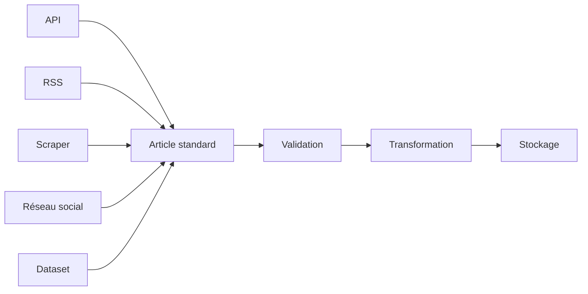
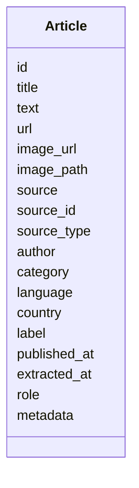
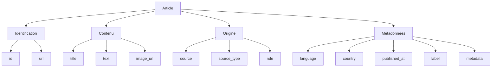
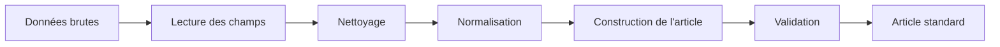
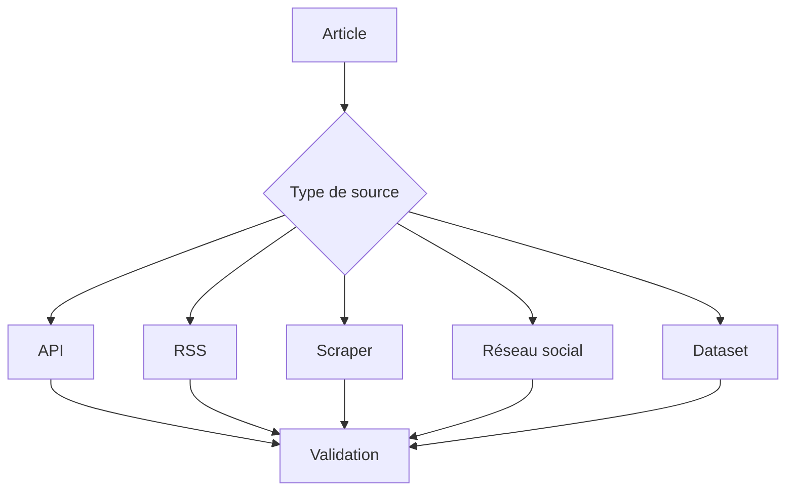
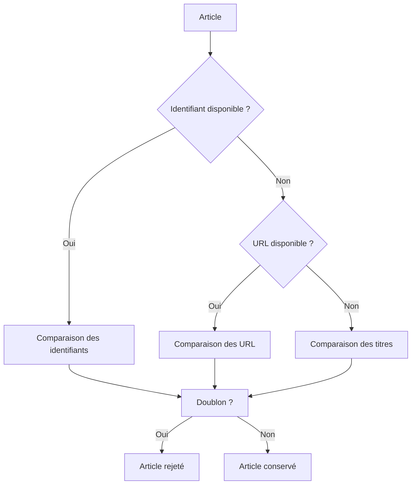
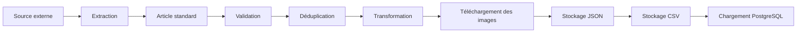
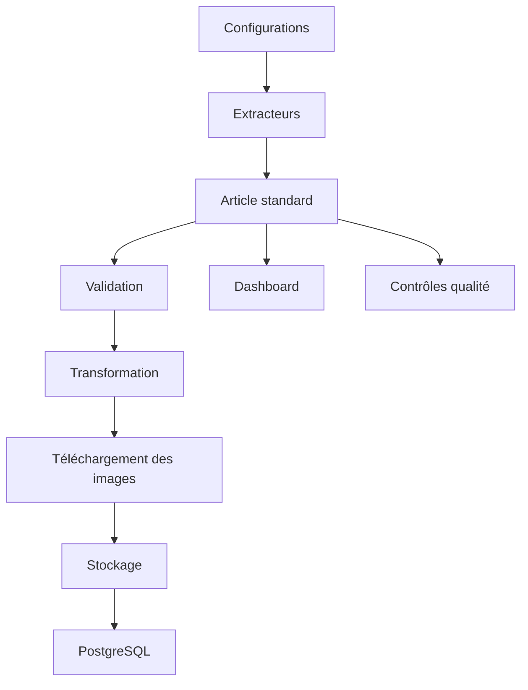

# Contrat standard des articles

## Présentation

Dans cette section, je présente le contrat standard utilisé pour représenter les articles dans **CheckIt.AI**.

L'objectif de ce contrat est de disposer d'une structure unique capable de représenter toutes les publications collectées par le pipeline, indépendamment de leur origine.

Les données manipulées par le projet proviennent en effet de plusieurs familles de sources :

- des API d'actualité ;
- des flux RSS ;
- des sites web analysés par scraping ;
- des réseaux sociaux ;
- des jeux de données académiques.

Chaque source possède son propre format de réponse. Une API retourne généralement des objets JSON, un flux RSS fournit des entrées XML, un scraper extrait des informations depuis du HTML et un dataset est souvent distribué sous forme de fichiers CSV ou JSON.

J'ai donc choisi de convertir toutes ces données vers une structure commune avant de lancer les différentes étapes de validation, de nettoyage, de transformation et de stockage.

Cette approche permet à l'ensemble du pipeline de manipuler les mêmes informations, quel que soit le fournisseur de données.

---

# Principe général

Le contrat standard constitue le cœur du pipeline.

Tous les extracteurs produisent exactement le même type d'objet.

Le fonctionnement général est représenté ci-dessous.



Grâce à cette normalisation, les modules de validation et de transformation n'ont pas besoin de connaître l'origine des données.

Ils manipulent uniquement des articles respectant le contrat défini par le projet.

---

# Structure générale d'un article

Le contrat commun repose sur un ensemble de champs standards.

Chaque article contient les informations principales permettant de représenter une publication, son origine ainsi que les métadonnées utiles au pipeline.



Dans le code, un article n'est pas représenté par une classe Python spécifique.

Il est manipulé sous la forme d'un dictionnaire Python contenant les différents champs normalisés.

Cette approche apporte davantage de souplesse tout en conservant un contrat commun pour tous les modules.

---

# Champs standards

Les champs utilisés par **CheckIt.AI** sont présentés ci-dessous.

| Champ | Description |
|--------|-------------|
| `id` | Identifiant unique de l'article |
| `title` | Titre de la publication |
| `text` | Contenu principal |
| `url` | Adresse de la publication |
| `image_url` | Adresse distante de l'image |
| `image_path` | Chemin local de l'image téléchargée |
| `source` | Identifiant technique de la source |
| `source_id` | Identifiant complémentaire fourni par la source |
| `source_type` | Famille de la source |
| `author` | Auteur lorsqu'il est disponible |
| `category` | Catégorie de la publication |
| `language` | Langue principale |
| `country` | Pays associé à la source |
| `label` | Label normalisé lorsqu'il existe |
| `published_at` | Date de publication |
| `extracted_at` | Date d'extraction |
| `role` | Rôle de la donnée dans le projet |
| `metadata` | Métadonnées complémentaires |

J'ai choisi de conserver un nombre limité de champs afin de rendre le modèle simple à manipuler tout en couvrant les besoins du pipeline.

Les informations spécifiques à certaines sources sont regroupées dans le champ `metadata`, ce qui évite de faire évoluer le contrat principal à chaque nouveau fournisseur.

---

# Champs obligatoires

Tous les champs du contrat ne sont pas obligatoires.

Le projet distingue les informations indispensables de celles qui dépendent des capacités de la source.

Les champs actuellement obligatoires sont :

- `id`
- `source`

Ces deux informations permettent d'identifier une publication et de connaître son origine.

Les autres champs restent facultatifs.

Ce choix est volontaire.

En effet, certaines sources ne fournissent pas d'auteur, d'image, de catégorie ou même d'URL.

Imposer ces informations empêcherait d'intégrer plusieurs fournisseurs pourtant utiles au projet.

Les contraintes supplémentaires sont donc définies au niveau des filtres propres à chaque source.

---

# Champs facultatifs

Tous les champs qui ne figurent pas dans la liste des champs obligatoires sont considérés comme facultatifs.

Selon les sources, un article peut par exemple :

- ne pas posséder d'image ;
- ne pas disposer d'auteur ;
- ne pas être associé à une catégorie ;
- ne pas contenir de label ;
- ne pas proposer d'URL publique.

Cette souplesse permet au pipeline de rester compatible avec des fournisseurs très différents tout en conservant un contrat unique.

---

# Organisation des informations

Les différents champs peuvent être regroupés en plusieurs catégories.



Cette organisation facilite la compréhension du contrat et permet de distinguer rapidement les différentes familles d'informations.

---

# Identifiant de l'article

Le champ `id` représente l'identifiant principal de l'article.

Lorsqu'une source fournit un identifiant stable, celui-ci est conservé.

Dans le cas contraire, le pipeline construit un identifiant à partir des informations disponibles.

Selon les fournisseurs, il peut notamment provenir :

- d'un identifiant fourni par une API ;
- du GUID d'un flux RSS ;
- d'un identifiant de publication sur un réseau social ;
- d'une combinaison construite à partir d'un dataset ;
- de l'URL lorsqu'aucun identifiant n'est disponible.

L'objectif est de disposer d'une valeur stable permettant d'identifier un article au cours des différentes exécutions du pipeline.

---

# Origine de la publication

Le contrat distingue plusieurs informations relatives à la provenance des données.

## Source

Le champ `source` contient l'identifiant technique de la source utilisée par le pipeline.

Quelques exemples :

- `newsdata`
- `guardian_api`
- `reddit`
- `rss`
- `fakeddit`
- `isot`

Cette information permet de retrouver rapidement quel extracteur a produit l'article.

## Source complémentaire

Le champ `source_id` peut contenir un identifiant supplémentaire fourni par la configuration ou par la source elle-même.

Il reste vide lorsqu'aucune information complémentaire n'est disponible.

## Type de source

Le champ `source_type` indique la famille technique de la source.

Les principales valeurs sont :

| Type | Description |
|--------|-------------|
| `api` | API d'actualité ou de fact-checking |
| `rss` | Flux RSS ou Atom |
| `dataset` | Jeu de données académique |
| `scraper` | Site web analysé en HTML |
| `social` | Réseau social |

Cette distinction est utilisée par plusieurs modules du pipeline afin d'adapter certains traitements.

---

# Contenu textuel

Le contenu principal d'un article repose sur deux champs.

## Le titre

Le champ `title` contient le titre de la publication.

Selon la configuration de la source, ce champ peut être :

- obligatoire ;
- soumis à une longueur minimale ;
- nettoyé avant validation.

Le titre est également utilisé lors de la déduplication.

## Le contenu

Le champ `text` contient le contenu principal de la publication.

Il peut provenir :

- du corps complet d'un article ;
- d'un résumé fourni par une API ;
- d'une description RSS ;
- d'un texte extrait depuis une page HTML ;
- d'un contenu issu d'un dataset ;
- d'un message provenant d'un réseau social.

Le pipeline applique ensuite plusieurs traitements afin de normaliser ce contenu avant son stockage.

---

# URL de la publication

Le champ `url` contient l'adresse de la publication d'origine.

Cette information joue un rôle important dans plusieurs étapes du pipeline.

Elle permet notamment :

- de retrouver l'article original ;
- de vérifier que la ressource est accessible ;
- de télécharger les images associées ;
- de détecter certains doublons ;
- de créer un lien vers la publication depuis le dashboard.

Lorsque plusieurs champs peuvent contenir une URL, le pipeline applique une normalisation afin de conserver uniquement le champ `url`.

Cette uniformisation évite aux modules suivants de devoir gérer plusieurs noms de champs différents.

---

# Images

L'une des particularités de **CheckIt.AI** est de constituer un jeu de données multimodal.

Les images occupent donc une place importante dans le contrat standard.

Deux champs principaux sont utilisés.

## Image distante

Le champ `image_url` contient l'adresse de l'image disponible sur Internet.

Selon la source, cette image peut provenir :

- d'une API ;
- d'un flux RSS ;
- d'une balise HTML ;
- d'une publication sociale ;
- d'un dataset.

Toutes les sources ne proposent pas d'image.

Le pipeline accepte donc que ce champ soit vide lorsque la configuration de la source ne rend pas l'image obligatoire.

## Image locale

Le champ `image_path` contient le chemin de l'image une fois téléchargée.

Au début du pipeline, cette valeur est généralement vide.

Elle est renseignée uniquement lorsque :

- l'image existe ;
- son téléchargement a réussi ;
- les validations techniques sont satisfaites.

Dans les autres cas, le champ reste vide.

Le téléchargement des images est volontairement séparé de l'extraction des articles afin de limiter les dépendances entre les différentes étapes du pipeline.

---

# Auteur

Le champ `author` contient le nom de l'auteur lorsqu'il est disponible.

Selon les fournisseurs, cette information peut représenter :

- un journaliste ;
- une rédaction ;
- une agence de presse ;
- un compte sur un réseau social.

Certaines sources ne fournissent aucun auteur.

Le pipeline accepte donc qu'il soit absent.

Avant son stockage, ce champ est nettoyé afin de supprimer les espaces inutiles et les valeurs incohérentes.

---

# Catégorie

Le champ `category` indique le domaine principal auquel appartient la publication.

Selon les fournisseurs, cette valeur peut être directement fournie ou imposée par la configuration.

Quelques catégories couramment utilisées sont :

- général ;
- politique ;
- économie ;
- technologie ;
- science ;
- santé ;
- environnement ;
- sport ;
- divertissement ;
- fact-checking.

Cette information facilite ensuite la réalisation de statistiques ou de filtres dans les traitements ultérieurs.

---

# Langue

Le champ `language` contient le code de langue de la publication.

Les principales langues actuellement utilisées dans le projet sont :

- `fr`
- `en`

Selon les cas, cette valeur peut :

- être fournie par la source ;
- être définie dans la configuration ;
- être imposée par un dataset.

La langue est utilisée pour faciliter les traitements de préparation des données et les futures étapes d'entraînement des modèles.

---

# Pays

Le champ `country` représente le pays associé à la publication ou à la source.

Cette information permet notamment :

- d'identifier l'origine géographique des données ;
- de filtrer certaines API ;
- de distinguer plusieurs éditions d'un même média ;
- de réaliser des statistiques par pays.

Toutes les sources ne renseignent pas cette information.

Elle peut alors être héritée directement de la configuration de la source.

---

# Dates

Le contrat distingue deux dates différentes.

## Date de publication

Le champ `published_at` représente la date de publication de l'article.

Lorsque cela est possible, cette date est convertie vers un format ISO afin de garantir une représentation homogène dans tout le pipeline.

Cette date permet notamment :

- de filtrer les articles anciens ;
- d'identifier les dates incohérentes ;
- de construire des statistiques temporelles.

## Date d'extraction

Le champ `extracted_at` correspond au moment où l'article est récupéré par **CheckIt.AI**.

Cette information est différente de la date de publication.

Un article publié plusieurs jours auparavant peut être extrait aujourd'hui.

Conserver ces deux dates améliore la traçabilité du pipeline.

---

# Labels

Le champ `label` est principalement utilisé pour les datasets annotés et les sources de fact-checking.

Toutes les publications ne possèdent pas de label.

Lorsque cette information est disponible, le pipeline applique une normalisation afin d'obtenir des valeurs homogènes.

Les principaux labels utilisés sont :

| Label | Signification |
|--------|---------------|
| `true` | Information considérée comme vraie |
| `false` | Information considérée comme fausse |
| `not_classified` | Verdict indisponible ou ambigu |

Cette étape de normalisation permet de réunir des sources utilisant des nomenclatures très différentes.

Par exemple, certaines utilisent :

- `fake` ;
- `real` ;
- `0` ;
- `1` ;
- des verdicts textuels.

Toutes ces valeurs sont ensuite converties vers un nombre réduit de labels communs.

---

# Rôle de la donnée

Le champ `role` décrit le rôle joué par une source dans le projet.

Contrairement au champ `source_type`, qui indique la famille technique de la source, ce champ décrit son objectif fonctionnel.

Les principales valeurs sont les suivantes.

| Rôle | Description |
|--------|-------------|
| `acquisition` | Collecte continue d'articles |
| `social_reference` | Publications issues des réseaux sociaux |
| `fact_check_reference` | Sources spécialisées dans le fact-checking |
| `labeled_reference` | Dataset annoté |
| `multimodal_reference` | Dataset contenant du texte et des images |

Ce champ est utilisé par plusieurs règles de validation afin d'adapter les contraintes selon la nature des données.

---

# Métadonnées

Le champ `metadata` rassemble toutes les informations spécifiques à une source qui ne font pas partie du contrat principal.

J'ai choisi cette approche afin d'éviter de faire évoluer constamment le modèle métier lorsqu'une nouvelle source apporte des informations particulières.

Ce champ peut notamment contenir :

- des identifiants internes ;
- des statistiques sociales ;
- des informations de pagination ;
- des données techniques ;
- des informations utiles à la traçabilité.

Le contrat principal reste ainsi stable, tandis que les informations spécifiques continuent d'être conservées.

---

# Représentation simplifiée

Les informations contenues dans un article peuvent être regroupées en quatre grandes familles.


Cette organisation est utilisée dans plusieurs modules du projet afin de distinguer les informations métier des informations techniques.

---

# Construction d'un article standard

Les données récupérées par les différents extracteurs ne sont pas directement exploitables.

Chaque fournisseur utilise en effet sa propre structure de données, ses propres noms de champs et parfois même des formats différents pour représenter les mêmes informations.

J'ai donc choisi de construire un article standard avant toute autre opération.

Le principe général est illustré ci-dessous.



Cette étape constitue le point de convergence de l'ensemble des extracteurs.

À partir de ce moment, toutes les données possèdent exactement la même structure.

---

# Normalisation des données

Lors de la construction d'un article, plusieurs opérations de normalisation sont réalisées.

Selon les informations disponibles, le pipeline peut notamment :

- supprimer les espaces inutiles ;
- convertir les valeurs nulles ;
- nettoyer le contenu HTML ;
- harmoniser les dates ;
- convertir les labels vers un format commun ;
- uniformiser les URL ;
- supprimer les caractères parasites.

Ces traitements sont volontairement réalisés une seule fois afin d'éviter de reproduire le même code dans chaque extracteur.

---

# Validation des articles

Une fois l'article construit, il est soumis à plusieurs règles de validation.

Ces contrôles permettent de supprimer les publications incomplètes ou incohérentes avant qu'elles ne poursuivent leur parcours dans le pipeline.

Les principales vérifications concernent :

- la présence du titre ;
- la présence du texte ;
- la présence de l'URL ;
- la présence éventuelle d'une image ;
- la présence éventuelle d'un label ;
- la longueur minimale du titre ;
- la longueur minimale du texte ;
- la longueur totale du contenu ;
- la validité des URL ;
- la suppression des contenus supprimés ;
- la détection des doublons.

Toutes ces règles ne sont pas appliquées systématiquement.

Elles dépendent de la configuration propre à chaque source.

Par exemple, un dataset annoté peut exiger un label alors qu'un flux RSS n'en possède généralement pas.

---

# Validation selon les sources

Le pipeline adapte automatiquement les contrôles selon la nature des données.



Cette approche permet de conserver un contrat unique tout en appliquant des règles adaptées à chaque famille de source.

---

# Déduplication

Plusieurs fournisseurs peuvent diffuser exactement le même article.

Le pipeline cherche donc à détecter les doublons avant le stockage.

La déduplication s'appuie principalement sur plusieurs informations.

Par ordre de priorité :

1. l'identifiant de l'article ;
2. son URL ;
3. son titre.

Le fonctionnement général est représenté ci-dessous.



Cette étape limite les répétitions et améliore la qualité des jeux de données produits.

---

# Compatibilité avec les différentes sources

L'un des principaux objectifs du contrat standard est de rendre l'ajout de nouvelles sources aussi simple que possible.

Pour intégrer un nouveau fournisseur, il suffit principalement de :

1. récupérer les données brutes ;
2. construire un article standard ;
3. appliquer les validations existantes.

Les modules situés en aval n'ont alors besoin d'aucune modification.

Cette architecture limite fortement les dépendances entre les différents composants du projet.

---

# Exemple d'article standard

L'exemple ci-dessous illustre la structure générale obtenue après normalisation.

```json
{
  "id": "article_001",
  "title": "Exemple de publication",
  "text": "Contenu principal de la publication.",
  "url": "https://example.org/article",
  "image_url": "https://example.org/image.jpg",
  "image_path": "",
  "source": "newsdata",
  "source_id": "",
  "source_type": "api",
  "author": "Auteur",
  "category": "general",
  "language": "fr",
  "country": "fr",
  "label": "",
  "published_at": "2026-07-25T10:00:00+00:00",
  "extracted_at": "2026-07-25T10:05:00+00:00",
  "role": "acquisition",
  "metadata": {}
}
```

Tous les champs ne sont pas obligatoirement renseignés.

En revanche, leur organisation reste identique pour tous les articles produits par le pipeline.

---

# Cycle de vie d'un article

Une fois construit, un article suit plusieurs étapes avant d'être définitivement enregistré dans la base de données.

Chaque étape apporte des contrôles ou des enrichissements supplémentaires.

Le fonctionnement général est représenté ci-dessous.



Cette organisation permet de séparer clairement les responsabilités de chaque composant du pipeline.

Les extracteurs sont responsables de la collecte des données, tandis que les étapes suivantes assurent leur qualité et leur préparation avant le stockage.

---

# Avantages du contrat standard

L'utilisation d'un contrat commun présente plusieurs avantages.

Tout d'abord, elle simplifie considérablement le développement des nouveaux extracteurs.

Chaque nouvel extracteur doit uniquement convertir les données brutes vers le format standard du projet.

Les autres traitements restent alors inchangés.

Cette approche apporte également une meilleure maintenabilité.

Les modules de validation, de transformation ou de stockage ne dépendent plus des spécificités d'une API ou d'un site particulier.

Ils manipulent uniquement des articles conformes au contrat commun.

Enfin, cette organisation facilite les évolutions futures du pipeline.

L'ajout d'une nouvelle source nécessite généralement peu de modifications dans le reste de l'application.

---

# Limites du modèle

Même si ce contrat couvre les besoins actuels du projet, il présente quelques limites.

Certaines sources possèdent des informations très spécifiques qui ne trouvent pas naturellement leur place dans le modèle standard.

C'est notamment le cas :

- des statistiques propres aux réseaux sociaux ;
- des informations détaillées de fact-checking ;
- des données spécifiques à certaines API ;
- des métadonnées particulières de certains datasets.

Pour conserver ces informations sans complexifier le contrat principal, j'ai choisi de les regrouper dans le champ `metadata`.

Cette approche permet de conserver un modèle simple tout en restant suffisamment flexible pour intégrer de nouvelles sources.

---

# Évolutions possibles

Le contrat standard a été conçu pour évoluer progressivement.

Plusieurs améliorations pourront être envisagées par la suite.

Par exemple :

- ajouter de nouveaux champs liés aux images ;
- intégrer davantage de métadonnées sur les publications ;
- conserver des informations sur les auteurs ou les médias ;
- enrichir les données avec des informations géographiques ;
- ajouter des indicateurs de qualité calculés automatiquement.

Grâce à l'organisation actuelle, ces évolutions pourront être réalisées sans remettre en cause le fonctionnement global du pipeline.

---

# Place du contrat dans l'architecture

Le contrat standard occupe une position centrale dans l'architecture de **CheckIt.AI**.

Tous les composants du pipeline l'utilisent à un moment ou à un autre.



Cette centralisation constitue l'un des principes d'architecture les plus importants du projet.

Elle limite fortement les dépendances entre les différents modules.

---

# Principes retenus

Lors de la conception de ce contrat, j'ai retenu plusieurs principes.

- utiliser une seule structure pour toutes les sources ;
- limiter le nombre de champs obligatoires ;
- séparer les informations métier des informations techniques ;
- conserver un modèle suffisamment simple pour rester facilement maintenable ;
- permettre l'ajout de nouvelles sources sans modifier les autres composants ;
- centraliser les opérations de validation et de normalisation ;
- garantir une représentation homogène des données dans l'ensemble du pipeline.

Ces choix contribuent à rendre le projet plus robuste et plus évolutif.

---

# Conclusion

Le contrat standard des articles constitue la structure de données centrale de **CheckIt.AI**.

J'ai choisi de convertir toutes les données collectées vers un format unique afin de simplifier les traitements réalisés par le pipeline.

Cette normalisation facilite la validation, la déduplication, la transformation, le téléchargement des images et le stockage des données.

Elle réduit également les dépendances entre les différents modules et permet d'intégrer de nouvelles sources avec un minimum de modifications.

Le contrat standard représente ainsi le point de convergence de l'ensemble des extracteurs et constitue l'un des éléments fondamentaux de l'architecture du projet.

La section suivante présente les modèles utilisés pour décrire la configuration des différentes sources de données.