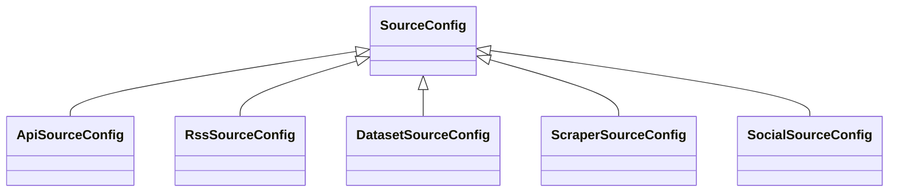
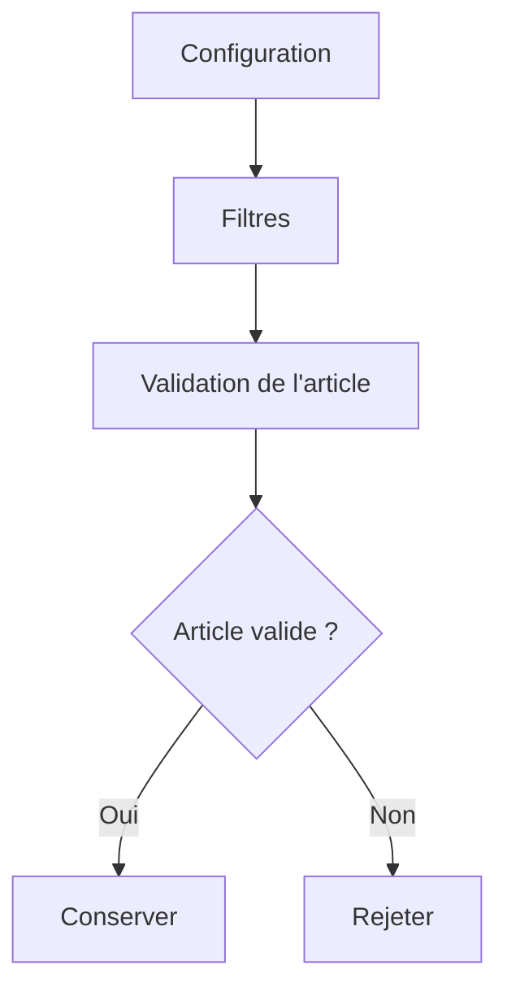
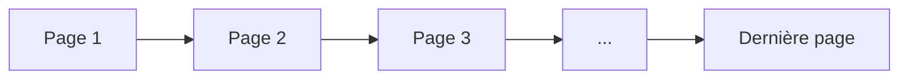
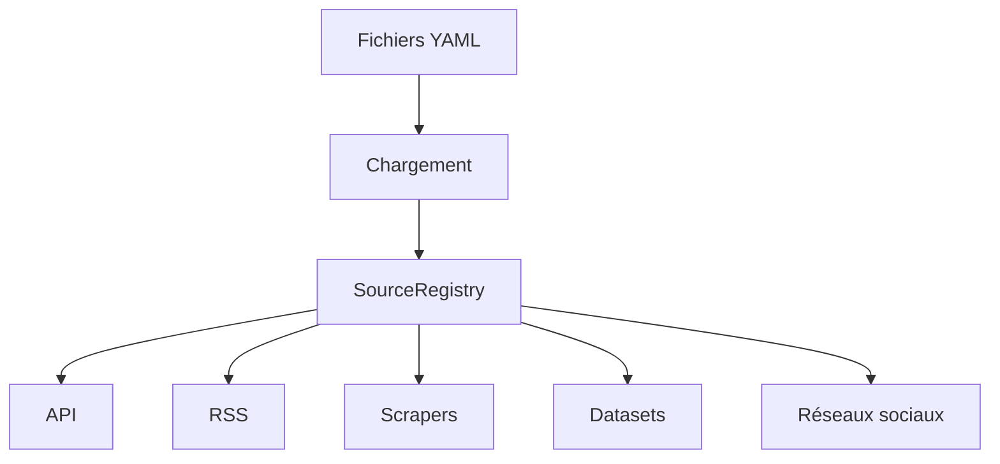
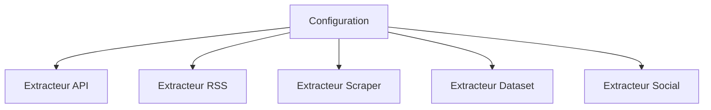
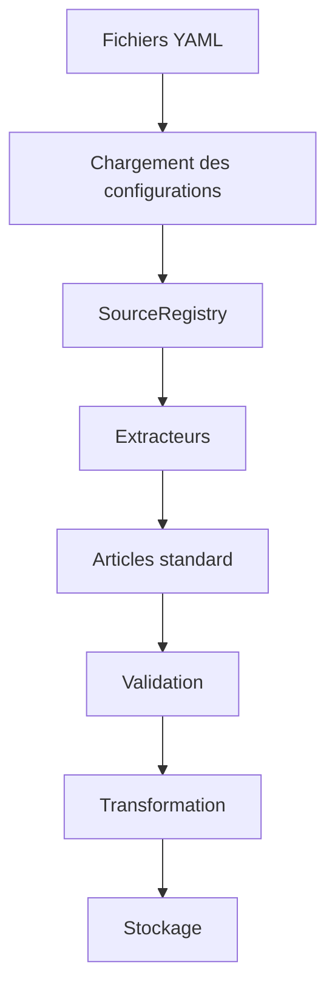

# Configuration des sources

## Présentation

Dans cette section, je présente les modèles de configuration utilisés dans **CheckIt.AI**.

Le pipeline est conçu pour collecter des données provenant de nombreuses sources différentes, comme des API, des flux RSS, des sites web, des réseaux sociaux ou encore des jeux de données académiques.

Même si ces sources poursuivent le même objectif, elles possèdent chacune leurs propres paramètres de fonctionnement. Certaines nécessitent une clé API, d'autres utilisent une URL RSS, tandis que les datasets sont simplement lus depuis des fichiers locaux.

J'ai donc choisi de centraliser l'ensemble de ces paramètres dans un système de configuration commun afin de rendre le pipeline plus modulaire, plus facile à maintenir et plus simple à faire évoluer.

---

# Pourquoi utiliser des modèles de configuration ?

Au début du projet, il aurait été possible de définir directement les paramètres dans le code de chaque extracteur.

Cette approche présente cependant plusieurs inconvénients.

À chaque ajout ou modification d'une source, il aurait fallu modifier le code Python, avec un risque plus important d'introduire des erreurs ou des régressions.

J'ai préféré adopter une architecture pilotée par la configuration.

Dans cette approche, les extracteurs contiennent uniquement la logique métier tandis que toutes les informations propres aux sources sont décrites dans des fichiers YAML.

Cette séparation présente plusieurs avantages :

- limiter les modifications du code ;
- faciliter l'ajout de nouvelles sources ;
- rendre les paramètres plus lisibles ;
- permettre une validation centralisée ;
- homogénéiser le fonctionnement des extracteurs.

---

# Principe général

Le fonctionnement général est illustré ci-dessous.

Les fichiers YAML constituent la description des différentes sources.

Lors du démarrage du pipeline, ces fichiers sont lus puis convertis en objets Python représentant les configurations des différentes sources.

Les extracteurs utilisent ensuite ces objets pour réaliser les différentes opérations de collecte.

Cette organisation permet de séparer complètement les données de configuration du code chargé d'effectuer les traitements.

---

# Organisation des configurations

Les différentes configurations reposent sur un modèle commun.

Chaque famille de source possède ensuite une spécialisation adaptée à ses besoins.

Cette hiérarchie permet de partager un grand nombre de propriétés communes tout en laissant chaque type de source définir ses paramètres spécifiques.

Par exemple, une API possède généralement une clé d'authentification, tandis qu'un flux RSS utilise principalement une URL.

Malgré ces différences, toutes les configurations restent manipulées de manière uniforme par le reste du pipeline.

---

# Le modèle commun : SourceConfig

La classe `SourceConfig` constitue la base de toutes les configurations.

Elle rassemble les informations communes à l'ensemble des sources.

On y retrouve notamment :

- le nom de la source ;
- son identifiant ;
- son état d'activation ;
- son rôle dans le projet ;
- son type ;
- les langues concernées ;
- les pays associés ;
- les catégories ;
- les paramètres de filtrage ;
- les paramètres de pagination lorsque cela est nécessaire.

Grâce à cette classe commune, les extracteurs peuvent accéder aux informations essentielles sans avoir besoin de connaître le type exact de la source utilisée.

---

# Les spécialisations

À partir de `SourceConfig`, plusieurs modèles spécialisés permettent de représenter les différentes familles de sources.

Les principales spécialisations sont :

| Modèle | Utilisation |
|---------|-------------|
| `ApiSourceConfig` | Configuration des API |
| `RssSourceConfig` | Configuration des flux RSS |
| `DatasetSourceConfig` | Configuration des datasets |
| `ScraperSourceConfig` | Configuration des scrapers HTML |
| `SocialSourceConfig` | Configuration des réseaux sociaux |

Chaque spécialisation ajoute uniquement les informations qui lui sont propres.

Par exemple, une configuration d'API peut contenir le nom d'un secret correspondant à une clé d'authentification, tandis qu'une configuration RSS décrit principalement les flux à analyser.

Cette organisation permet de limiter la duplication de code tout en conservant des modèles simples à comprendre.

---

# Une architecture facilement extensible

L'un des principaux objectifs de cette organisation est de faciliter l'ajout de nouvelles sources.

Lorsqu'un nouveau fournisseur doit être intégré, il suffit généralement :

1. d'ajouter sa description dans un fichier YAML ;
2. de charger cette configuration ;
3. d'utiliser l'extracteur adapté.

Le fonctionnement du reste du pipeline reste inchangé.

Cette approche rend l'architecture particulièrement évolutive et limite les modifications nécessaires lors de l'intégration de nouvelles sources de données.

---

# Les paramètres de configuration

Au-delà des informations générales décrivant une source, chaque configuration contient un ensemble de paramètres qui permettent d'adapter le comportement des extracteurs.

J'ai choisi de regrouper ces paramètres directement dans les modèles de configuration afin que chaque extracteur puisse être piloté sans modification du code.

Selon le type de source, une configuration peut notamment définir :

- les langues à collecter ;
- les pays concernés ;
- les catégories d'articles ;
- le nombre maximal d'articles à récupérer ;
- les paramètres de pagination ;
- les règles de validation ;
- les délais entre les requêtes ;
- les options propres à une API ou à un scraper.

L'ensemble de ces paramètres est chargé automatiquement lors de l'initialisation du pipeline.

---

# Les filtres de validation

Toutes les sources ne produisent pas des données de qualité identique.

Afin d'éviter de stocker des publications incomplètes ou inutilisables, j'ai intégré un système de filtres directement dans les modèles de configuration.

Ces filtres permettent notamment de définir :

- si un titre est obligatoire ;
- si un texte est obligatoire ;
- si une URL est obligatoire ;
- si une image est obligatoire ;
- si un label est obligatoire ;
- la longueur minimale d'un titre ;
- la longueur minimale d'un texte ;
- les labels autorisés ;
- la suppression des doublons ;
- la suppression des contenus supprimés.

Le fonctionnement général est illustré ci-dessous.

Cette approche permet d'utiliser les mêmes fonctions de validation pour toutes les sources tout en adaptant les critères aux caractéristiques de chacune.

---

# La pagination

Certaines API limitent le nombre d'articles retournés lors d'une requête.

Pour récupérer plusieurs centaines de publications, il est donc nécessaire de parcourir plusieurs pages de résultats.

J'ai choisi de regrouper ces paramètres dans un modèle dédié afin d'éviter de dupliquer cette logique dans chaque extracteur.

Les principaux paramètres sont :

- le numéro de la première page ;
- le nombre maximal de pages ;
- le nombre d'éléments par page.

Le fonctionnement est représenté ci-dessous.

Cette organisation permet aux extracteurs de parcourir automatiquement l'ensemble des résultats disponibles tout en respectant les limites définies par la configuration.

---

# Les configurations spécifiques

Même si toutes les configurations héritent d'un modèle commun, certaines possèdent des paramètres propres à leur famille de source.

Par exemple, une API peut nécessiter :

- une clé d'authentification ;
- un point d'accès (`endpoint`) ;
- une liste de requêtes ;
- des paramètres spécifiques au fournisseur.

Un flux RSS décrit principalement :

- une ou plusieurs URL de flux ;
- leur langue ;
- leur catégorie ;
- leur fréquence d'actualisation.

Les scrapers HTML peuvent quant à eux définir :

- l'adresse de départ ;
- les sélecteurs CSS ;
- les règles de navigation ;
- les éléments à extraire.

Enfin, les datasets décrivent généralement :

- l'emplacement des fichiers ;
- leur format ;
- les colonnes contenant les informations utiles.

Cette spécialisation permet de conserver des modèles simples tout en couvrant les besoins très différents des diverses familles de sources.

---

# Le registre des sources

Une fois les fichiers YAML chargés, les différentes configurations sont regroupées dans un registre commun.

Ce registre constitue le point d'entrée utilisé par les extracteurs pour accéder aux sources disponibles.

Le principe est présenté ci-dessous.

Grâce à cette organisation, les extracteurs n'ont pas besoin de parcourir directement les fichiers YAML.

Ils récupèrent simplement les configurations dont ils ont besoin à partir du registre.

Cette centralisation facilite également les contrôles réalisés au démarrage du pipeline, notamment la détection des configurations incomplètes ou invalides.

---

# Chargement des configurations

Au démarrage du pipeline, la première étape consiste à charger l'ensemble des fichiers de configuration.

J'ai choisi de réaliser cette opération une seule fois afin d'éviter que chaque extracteur ne relise les fichiers YAML de manière indépendante.

Cette approche présente plusieurs avantages :

- réduire le nombre de lectures sur le disque ;
- garantir que tous les extracteurs utilisent les mêmes paramètres ;
- détecter rapidement les erreurs de configuration ;
- centraliser la validation des fichiers.

Le fonctionnement général est présenté ci-dessous.

Une fois cette étape terminée, les extracteurs disposent immédiatement de toutes les informations nécessaires à leur fonctionnement.

---

# Validation des configurations

Avant qu'une configuration puisse être utilisée, plusieurs contrôles sont réalisés.

L'objectif est de détecter les erreurs le plus tôt possible afin d'éviter qu'elles ne provoquent des échecs pendant l'extraction.

Les vérifications portent notamment sur :

- la présence des champs obligatoires ;
- la cohérence des paramètres ;
- la validité des chemins de fichiers ;
- la présence des secrets nécessaires aux API ;
- les valeurs numériques ;
- les paramètres de pagination ;
- les options propres à chaque famille de source.

Lorsqu'une anomalie est détectée, la configuration concernée est rejetée et un message explicite est enregistré dans les journaux.

Cette validation précoce facilite le diagnostic des erreurs et améliore la fiabilité globale du pipeline.

---

# Une configuration commune pour tous les extracteurs

L'un des objectifs de cette architecture est que tous les extracteurs soient pilotés de la même manière.

Quel que soit le type de source, un extracteur reçoit toujours un objet de configuration décrivant son comportement.

Cette uniformisation simplifie considérablement le développement des différents moteurs d'extraction.

Chaque extracteur retrouve les mêmes propriétés générales, auxquelles viennent simplement s'ajouter quelques paramètres spécifiques.

---

# Séparation entre configuration et logique métier

J'ai volontairement séparé les paramètres de configuration de la logique métier.

Les modèles de configuration décrivent **ce qu'il faut faire**, tandis que les extracteurs décrivent **comment le faire**.

Cette séparation présente plusieurs avantages.

Elle permet notamment :

- de modifier les paramètres sans toucher au code ;
- de limiter les risques de régression ;
- de rendre les extracteurs plus simples ;
- de faciliter les tests unitaires ;
- d'améliorer la lisibilité de l'architecture.

Cette organisation est largement utilisée dans les projets logiciels de grande taille, car elle réduit le couplage entre les composants.

---

# Ajout d'une nouvelle source

Grâce à cette architecture, l'intégration d'une nouvelle source suit toujours le même principe.

Dans la majorité des cas, il suffit de compléter la configuration et d'utiliser l'extracteur adapté.

Les autres composants du pipeline continuent à fonctionner sans modification.

Cette approche rend l'application beaucoup plus évolutive et facilite son enrichissement progressif.

---

# Les avantages de cette architecture

L'organisation retenue pour les modèles de configuration constitue l'un des fondements de l'architecture de **CheckIt.AI**.

En séparant les paramètres de fonctionnement de la logique métier, j'ai obtenu un pipeline plus simple à maintenir et plus facile à faire évoluer.

Cette approche présente plusieurs avantages.

Tout d'abord, elle réduit fortement la duplication du code. Les extracteurs partagent un comportement commun et se contentent d'utiliser les paramètres fournis par leur configuration.

Elle améliore également la lisibilité du projet. Les paramètres d'une source sont regroupés au même endroit, ce qui facilite leur consultation et leur modification.

Enfin, cette architecture favorise l'évolutivité du pipeline. L'ajout d'une nouvelle source nécessite généralement uniquement une nouvelle configuration et, lorsque cela est nécessaire, un adaptateur capable d'interpréter les données récupérées.

---

# Évolutions possibles

Même si les modèles de configuration répondent aux besoins actuels du projet, plusieurs améliorations pourront être envisagées par la suite.

Par exemple, il serait possible :

- d'ajouter de nouveaux paramètres spécifiques à certaines API ;
- d'étendre les règles de validation ;
- de prendre en charge de nouveaux formats de sources ;
- d'ajouter des mécanismes de configuration dynamiques ;
- de permettre le rechargement des configurations sans redémarrer le pipeline.

L'architecture actuelle a justement été pensée pour faciliter ce type d'évolution sans remettre en cause les composants existants.

---

# Place des configurations dans l'architecture

Les modèles de configuration interviennent dès le démarrage du pipeline et accompagnent l'ensemble des extracteurs pendant leur exécution.

Ils constituent le point d'entrée des différentes familles de sources.

Le schéma suivant résume leur rôle dans l'architecture globale.

Les configurations n'interviennent donc pas directement dans les traitements réalisés sur les articles.

Leur rôle consiste à décrire les paramètres nécessaires au fonctionnement des extracteurs, qui produisent ensuite les articles standard utilisés par le reste du pipeline.

---

# Bilan

J'ai choisi de construire une architecture pilotée par la configuration afin de limiter les dépendances entre les différents composants du projet.

Les modèles de configuration décrivent les caractéristiques des sources, tandis que les extracteurs utilisent ces informations pour réaliser les opérations de collecte.

Cette séparation améliore la lisibilité du code, facilite les évolutions futures et réduit le risque d'erreur lors de l'ajout d'une nouvelle source.

Elle permet également de conserver un comportement homogène entre les différentes familles d'extracteurs, malgré la diversité des fournisseurs de données.

---

# Conclusion

Les modèles de configuration constituent la première étape du fonctionnement de **CheckIt.AI**.

Ils permettent de représenter de manière uniforme des sources pourtant très différentes et fournissent aux extracteurs toutes les informations nécessaires à leur exécution.

Grâce à cette organisation, les paramètres de fonctionnement restent indépendants de la logique métier, ce qui rend le pipeline plus robuste, plus modulaire et plus facile à maintenir.

Une fois les configurations chargées, les extracteurs peuvent utiliser ces modèles pour récupérer les données brutes et les convertir vers le contrat d'article présenté dans la section précédente.

Le chapitre suivant présente justement les adaptateurs et les extracteurs, qui constituent le lien entre les sources de données et le modèle d'article standard.