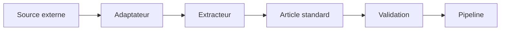
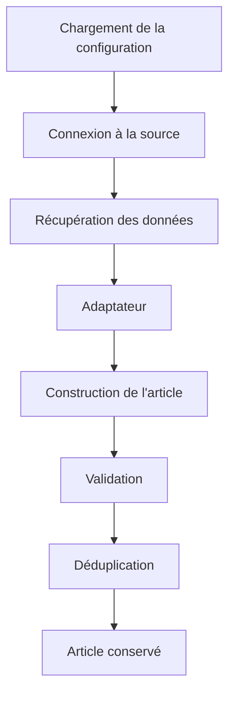
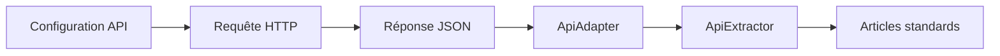
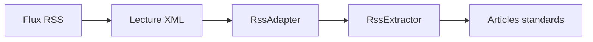
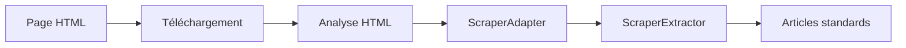
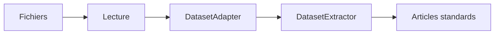
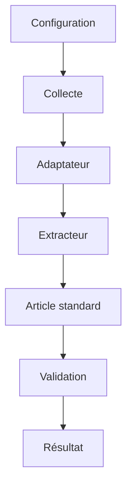
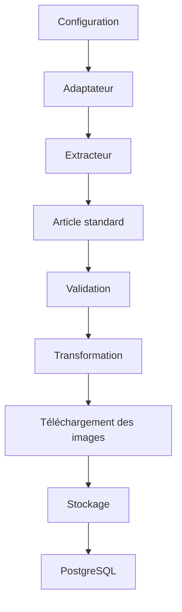

# Adaptateurs et extracteurs

## Présentation

Une fois les sources de données configurées, le pipeline doit être capable de récupérer les informations provenant de fournisseurs très différents.

Même si toutes les sources poursuivent le même objectif, leurs formats de données sont rarement compatibles entre eux.

Par exemple :

- une API renvoie généralement des objets JSON ;
- un flux RSS fournit des entrées XML ;
- un scraper extrait des éléments HTML ;
- un réseau social possède son propre format de publication ;
- un dataset est souvent constitué de fichiers CSV ou JSON.

J'ai donc choisi de séparer cette étape en deux niveaux :

- les adaptateurs ;
- les extracteurs.

Cette séparation constitue l'un des principaux choix d'architecture de **CheckIt.AI**.

---

# Principe général

Les adaptateurs et les extracteurs travaillent ensemble afin de transformer des données brutes en articles conformes au contrat standard présenté dans la section précédente.

Le fonctionnement général est illustré ci-dessous.



Les deux composants possèdent des responsabilités bien distinctes.

L'adaptateur connaît le format de la source.

L'extracteur connaît le fonctionnement du pipeline.

Cette séparation permet de limiter les dépendances entre les différentes parties du projet.

---

# Pourquoi séparer les responsabilités ?

Au début du développement, il aurait été possible d'intégrer directement tout le traitement dans chaque extracteur.

Cette approche aurait rapidement conduit à une forte duplication du code.

Chaque nouveau fournisseur aurait dû :

- récupérer les données ;
- interpréter leur structure ;
- construire les articles ;
- appliquer les validations ;
- gérer les erreurs ;
- produire les rapports d'exécution.

J'ai préféré répartir ces responsabilités afin que chaque composant possède un rôle clairement défini.

Cette organisation facilite les évolutions futures et améliore la lisibilité du projet.

---

# Les adaptateurs

Les adaptateurs constituent la première couche d'abstraction entre les sources externes et le pipeline.

Leur rôle consiste principalement à interpréter les données renvoyées par une source.

Ils connaissent :

- les noms des champs ;
- la structure des réponses ;
- les informations utiles à conserver.

En revanche, ils ne réalisent pas les opérations de validation, de déduplication ou de stockage.

Ils se limitent à préparer les informations nécessaires à la construction d'un article standard.

---

# Les différents adaptateurs

Le projet utilise plusieurs familles d'adaptateurs.

```mermaid
classDiagram

ApiAdapter

RssAdapter

DatasetAdapter

ScraperAdapter

SocialAdapter
```

Chaque adaptateur est spécialisé dans une famille de sources.

Cette organisation permet de partager une logique commune entre plusieurs fournisseurs utilisant le même type de données.

Par exemple, toutes les API d'actualité présentent des structures relativement proches, même si leurs champs diffèrent légèrement.

---

# Les extracteurs

Les extracteurs constituent le second niveau de traitement.

Contrairement aux adaptateurs, ils connaissent le fonctionnement global du pipeline.

Ils sont responsables notamment :

- de parcourir les sources ;
- d'utiliser les adaptateurs ;
- de construire les articles standards ;
- d'appliquer les validations ;
- de supprimer les doublons ;
- de produire les rapports d'exécution.

Ils représentent donc le lien entre les sources de données et le reste du pipeline.

---

# Les différentes familles d'extracteurs

Le projet distingue plusieurs familles d'extracteurs.

```mermaid
classDiagram

ApiExtractor

RssExtractor

DatasetExtractor

ScraperExtractor

SocialExtractor
```

Chaque famille possède ses propres contraintes techniques.

Par exemple :

- une API nécessite souvent une authentification ;
- un flux RSS doit analyser un document XML ;
- un scraper télécharge des pages HTML ;
- un dataset parcourt des fichiers ;
- un réseau social interroge des publications.

Malgré ces différences, tous produisent exactement le même résultat : un ensemble d'articles conformes au contrat standard.

---

# Une architecture modulaire

Cette séparation entre adaptateurs et extracteurs rend l'architecture particulièrement modulaire.

Chaque couche peut évoluer indépendamment de l'autre.

Par exemple, si une API modifie uniquement le nom de certains champs, il suffit généralement de mettre à jour son adaptateur.

À l'inverse, une évolution de la logique métier du pipeline concerne principalement les extracteurs.

Cette modularité constitue l'un des principaux avantages de cette architecture.

---

# Fonctionnement d'un adaptateur

Chaque famille de sources possède un adaptateur chargé d'interpréter les données brutes.

J'ai choisi d'utiliser ce niveau d'abstraction afin que les extracteurs ne dépendent jamais directement du format renvoyé par une source.

Le rôle d'un adaptateur est relativement simple.

Il consiste à :

- parcourir les données reçues ;
- identifier les informations utiles ;
- convertir les différents champs vers un format compréhensible par le pipeline ;
- transmettre ces informations à l'extracteur.

Le fonctionnement général est présenté ci-dessous.


Cette approche évite que chaque extracteur contienne des traitements spécifiques à chaque fournisseur.

---

# Fonctionnement d'un extracteur

Une fois les données interprétées par un adaptateur, l'extracteur prend le relais.

Il applique les traitements communs utilisés par l'ensemble du pipeline.

Parmi ses principales responsabilités figurent :

- l'exécution des requêtes ;
- la récupération des éléments ;
- la construction des articles standards ;
- l'application des règles de validation ;
- la suppression des doublons ;
- la production des statistiques d'exécution.

Les extracteurs ne connaissent donc pas les détails du format des données.

Ils manipulent uniquement les informations préparées par les adaptateurs.

---

# Déroulement d'une extraction

Le fonctionnement général d'un extracteur est similaire quelle que soit la famille de source.



Chaque étape possède une responsabilité clairement définie.

Cette organisation facilite la maintenance du projet et simplifie l'ajout de nouvelles sources.

---

# Construction de l'article standard

L'un des rôles principaux des extracteurs consiste à produire un article respectant le contrat commun du projet.

Pour cela, ils utilisent les informations préparées par l'adaptateur afin de construire une structure homogène.

Les principales informations renseignées sont notamment :

- le titre ;
- le contenu textuel ;
- l'URL ;
- l'image ;
- la source ;
- la langue ;
- la catégorie ;
- les dates ;
- le rôle de la donnée.

Une fois cette étape terminée, les modules suivants manipulent tous exactement la même structure de données.

---

# Validation des données

Les extracteurs appliquent ensuite les règles de validation définies dans la configuration de la source.

Ces contrôles permettent notamment de vérifier :

- la présence des champs obligatoires ;
- la longueur du titre ;
- la longueur du texte ;
- la présence éventuelle d'une image ;
- la présence d'un label lorsque cela est nécessaire ;
- la validité des URL ;
- la cohérence des informations récupérées.

Les articles qui ne respectent pas ces critères sont rejetés avant d'atteindre les étapes suivantes du pipeline.

Cette validation précoce améliore la qualité des données produites.

---

# Gestion des erreurs

L'extraction de données peut rencontrer de nombreuses difficultés.

Par exemple :

- une API peut être temporairement indisponible ;
- un flux RSS peut être invalide ;
- une page HTML peut avoir changé de structure ;
- un dataset peut être incomplet ;
- une connexion réseau peut échouer.

J'ai choisi de centraliser la gestion de ces situations afin que les extracteurs continuent à fonctionner même lorsqu'une source rencontre un problème.

Les erreurs sont enregistrées dans les journaux d'exécution et intégrées aux rapports produits par le pipeline.

Cette stratégie améliore la robustesse de l'application et facilite le diagnostic des incidents.

---

# Réutilisation du code

L'un des principaux objectifs de cette architecture est de favoriser la réutilisation du code.

Les différentes familles d'extracteurs partagent une grande partie de leur fonctionnement.

Par exemple :

- la validation des articles ;
- la construction du contrat standard ;
- la déduplication ;
- la production des rapports ;
- la gestion des erreurs.

Chaque extracteur se concentre ainsi uniquement sur les traitements spécifiques à sa famille de source.

Cette approche réduit la duplication du code et facilite les évolutions futures.

---

# Les moteurs d'extraction spécialisés

Même si tous les extracteurs poursuivent le même objectif, chacun doit répondre à des contraintes propres à sa famille de sources.

J'ai donc choisi de développer plusieurs moteurs spécialisés partageant une architecture commune.

Cette organisation me permet de mutualiser une grande partie du code tout en conservant la flexibilité nécessaire pour gérer les spécificités de chaque source.

Les principales familles d'extracteurs sont :

| Famille | Rôle principal |
|---------|----------------|
| API | Interroger des services web et récupérer des réponses JSON |
| RSS | Lire et analyser des flux RSS ou Atom |
| Scraper | Extraire des informations depuis des pages HTML |
| Dataset | Parcourir des fichiers locaux contenant des données |
| Social | Collecter des publications issues des réseaux sociaux |

Cette séparation rend le projet plus lisible et facilite l'évolution indépendante de chaque moteur.

---

# Les extracteurs d'API

Les API constituent l'une des principales sources d'information du projet.

Elles permettent de récupérer rapidement un grand nombre d'articles récents tout en bénéficiant d'une structure relativement homogène.

Le fonctionnement général est le suivant :



L'adaptateur interprète la réponse JSON tandis que l'extracteur applique les traitements communs du pipeline.

Cette organisation permet de prendre en charge plusieurs fournisseurs d'API avec un minimum de duplication de code.

---

# Les extracteurs RSS

Les flux RSS représentent une autre source importante de données.

Contrairement aux API, ils reposent sur des documents XML contenant une liste de publications.

Le fonctionnement est similaire à celui des API.



L'extracteur parcourt les différentes entrées du flux puis construit progressivement les articles destinés au reste du pipeline.

---

# Les extracteurs HTML

Certaines informations ne sont disponibles qu'à travers des pages web.

Dans ce cas, le pipeline utilise un scraper chargé d'analyser le contenu HTML.

Le fonctionnement général est présenté ci-dessous.



Cette famille d'extracteurs est plus sensible aux évolutions des sites web, car une modification de leur structure peut nécessiter une adaptation des sélecteurs utilisés.

---

# Les extracteurs de datasets

Le projet exploite également plusieurs jeux de données académiques.

Contrairement aux autres familles de sources, ces données sont déjà disponibles localement.

L'extracteur parcourt les fichiers puis transforme chaque enregistrement vers le contrat standard du projet.



Cette approche permet de traiter les datasets de la même manière que les autres sources, malgré leur mode d'accès différent.

---

# Les extracteurs des réseaux sociaux

Les publications issues des réseaux sociaux possèdent souvent des caractéristiques particulières.

Leur contenu est généralement plus court et peut contenir des informations propres à la plateforme utilisée.

Le fonctionnement reste toutefois identique aux autres familles.


Cette homogénéisation permet ensuite d'appliquer les mêmes règles de validation que pour les autres sources.

---

# Une architecture commune

Même si chaque famille possède ses propres contraintes techniques, toutes suivent finalement le même enchaînement d'étapes.



Cette architecture commune constitue l'un des principaux atouts de **CheckIt.AI**.

Elle permet d'intégrer facilement de nouvelles sources sans remettre en cause le fonctionnement général du pipeline.

---

# Les bénéfices de cette architecture

La séparation entre les adaptateurs et les extracteurs constitue l'un des choix de conception les plus importants de **CheckIt.AI**.

En distinguant clairement les responsabilités de chaque composant, j'ai obtenu une architecture plus modulaire et plus simple à faire évoluer.

Les adaptateurs sont responsables de l'interprétation des données propres à chaque fournisseur.

Les extracteurs, quant à eux, pilotent le déroulement général de la collecte et appliquent les traitements communs du pipeline.

Cette répartition présente plusieurs avantages.

Tout d'abord, elle réduit fortement la duplication du code. Les traitements de validation, de normalisation ou de déduplication ne sont écrits qu'une seule fois et sont réutilisés par l'ensemble des extracteurs.

Elle améliore également la lisibilité du projet. Chaque module possède une responsabilité clairement identifiée, ce qui facilite la compréhension de l'architecture.

Enfin, cette organisation simplifie l'ajout de nouvelles sources. Lorsqu'un nouveau fournisseur doit être intégré, il suffit généralement de développer un nouvel adaptateur ou d'étendre un adaptateur existant, sans modifier le reste du pipeline.

---

# Évolutions possibles

L'architecture actuelle répond aux besoins du projet, mais elle reste suffisamment souple pour évoluer.

Plusieurs pistes d'amélioration pourront être envisagées par la suite.

Par exemple :

- ajouter de nouvelles familles d'extracteurs ;
- prendre en charge d'autres formats de données ;
- enrichir les adaptateurs avec des mécanismes de transformation plus avancés ;
- paralléliser davantage certaines phases d'extraction ;
- intégrer de nouveaux fournisseurs sans modifier les composants existants.

Grâce à la séparation entre les différentes couches, ces évolutions pourront être réalisées progressivement sans remettre en cause le fonctionnement général de l'application.

---

# Place des adaptateurs et des extracteurs dans le pipeline

Les adaptateurs et les extracteurs constituent le lien entre les sources de données et le reste de l'application.

Ils transforment des informations hétérogènes en articles respectant le contrat commun présenté précédemment.

Le schéma suivant résume leur position dans l'architecture globale.



Une fois les articles produits, les étapes suivantes du pipeline deviennent totalement indépendantes de leur source d'origine.

Cette homogénéité constitue l'un des principaux objectifs de cette architecture.

---

# Bilan

J'ai choisi d'organiser le pipeline autour d'une distinction claire entre les adaptateurs et les extracteurs.

Les adaptateurs assurent l'interprétation des données provenant des différentes sources tandis que les extracteurs orchestrent les opérations de collecte, de validation et de normalisation.

Cette architecture me permet de mutualiser une grande partie du code, de limiter les dépendances entre les composants et de simplifier l'ajout de nouvelles sources.

Elle améliore également la maintenabilité du projet en évitant que les spécificités de chaque fournisseur ne se propagent dans l'ensemble de l'application.

---

# Conclusion

Les adaptateurs et les extracteurs constituent le cœur du mécanisme d'acquisition de **CheckIt.AI**.

En séparant l'interprétation des données de la logique métier, j'ai obtenu une architecture plus modulaire, plus robuste et plus évolutive.

Cette organisation garantit que toutes les sources, qu'il s'agisse d'API, de flux RSS, de scrapers, de réseaux sociaux ou de jeux de données, produisent des articles respectant le même contrat standard.

Le chapitre suivant présente les contextes d'exécution et les différents objets utilisés pour suivre le déroulement des traitements et produire les rapports d'exécution du pipeline.