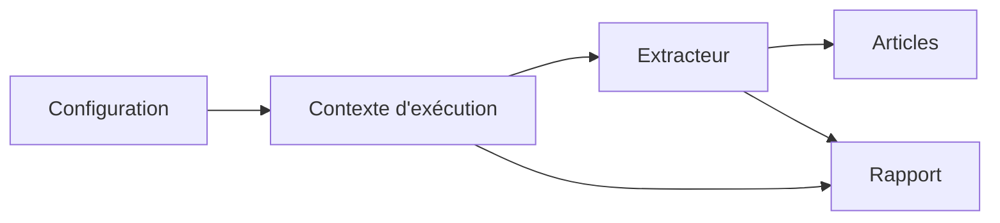
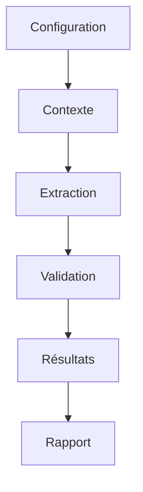
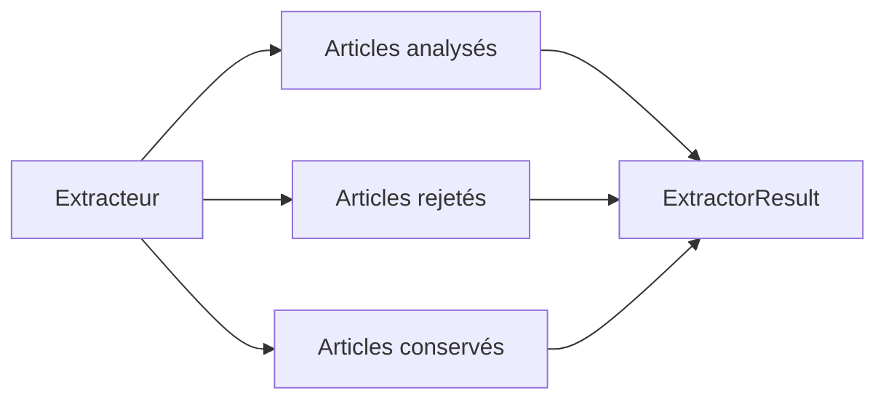
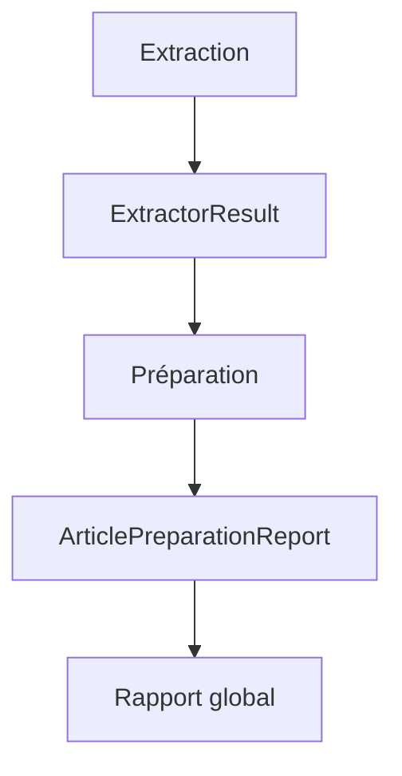
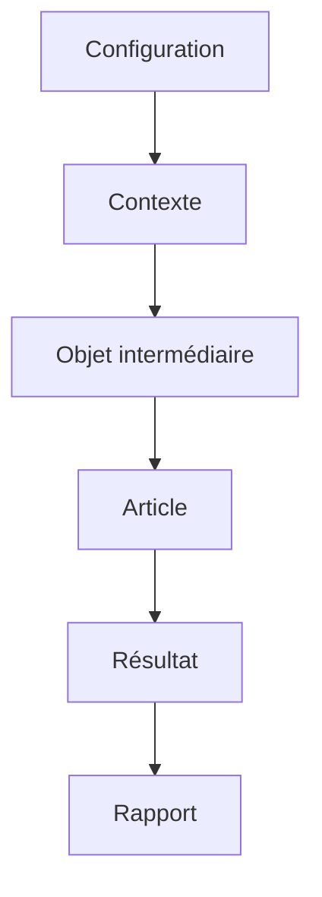
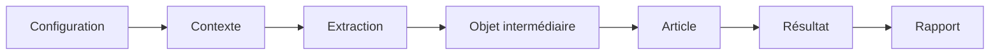
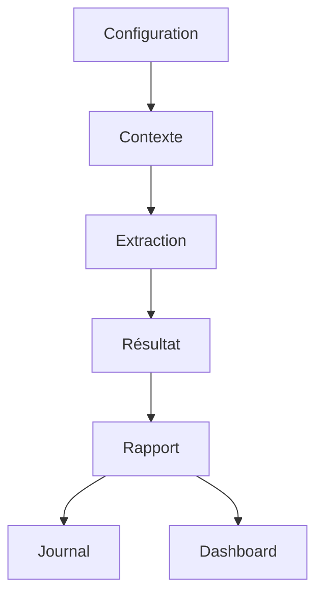

# Contextes d'exécution et résultats

## Présentation

Les chapitres précédents ont présenté le contrat standard des articles ainsi que les mécanismes permettant de les extraire depuis différentes sources.

Cependant, produire des articles ne constitue qu'une partie du fonctionnement du pipeline.

Il est également nécessaire de suivre le déroulement des traitements, de conserver certaines informations temporaires et de produire des rapports décrivant le résultat des différentes opérations.

J'ai donc mis en place plusieurs modèles dédiés au suivi de l'exécution.

Ces objets ne représentent pas des données métier comme les articles, mais des informations techniques permettant de piloter le pipeline et d'assurer sa traçabilité.

---

# Pourquoi utiliser des contextes d'exécution ?

Une extraction ne consiste pas uniquement à parcourir une source de données.

Pendant son exécution, le pipeline doit conserver de nombreuses informations temporaires.

Par exemple :

- la configuration utilisée ;
- les articles déjà rencontrés ;
- les doublons détectés ;
- les erreurs rencontrées ;
- les statistiques de traitement ;
- les informations nécessaires à la reprise de certaines opérations.

J'ai choisi de regrouper ces informations dans des contextes d'exécution plutôt que de les disperser entre plusieurs fonctions.

Cette approche améliore la lisibilité du code et facilite le partage des informations entre les différents modules.

---

# Principe général

Le fonctionnement peut être résumé de la manière suivante.

Le contexte accompagne l'extracteur pendant toute son exécution.

Il conserve les informations nécessaires au bon déroulement des traitements et participe à la construction du rapport final.

---

# Les différents contextes

Le projet utilise plusieurs contextes spécialisés.

Ils correspondent chacun à une famille de sources ou à un type de traitement particulier.

Les principaux contextes sont :

| Contexte | Utilisation |
|----------|-------------|
| `DatasetExtractionContext` | Extraction des datasets |
| `RssExtractionContext` | Lecture des flux RSS |
| `RssBatchContext` | Traitement d'un ensemble de flux RSS |
| `ScraperExtractionContext` | Analyse des pages HTML |
| `SocialExtractionContext` | Collecte des réseaux sociaux |

Même si leurs contenus diffèrent légèrement, tous poursuivent le même objectif : conserver les informations temporaires nécessaires pendant une extraction.

---

# Une mémoire temporaire

Contrairement aux articles ou aux fichiers stockés dans PostgreSQL, les contextes d'exécution sont temporaires.

Ils n'ont pas vocation à être enregistrés de manière permanente.

Ils existent uniquement pendant le déroulement d'un traitement.

Une fois l'extraction terminée, ils peuvent être libérés puisque les informations importantes ont déjà été transférées dans les rapports ou dans les données produites.

Cette approche limite la consommation mémoire tout en simplifiant l'organisation du pipeline.

---

# Les informations conservées

Selon le type d'extraction, un contexte peut notamment contenir :

- la configuration utilisée ;
- les paramètres d'exécution ;
- les articles déjà rencontrés ;
- les identifiants utilisés pour la déduplication ;
- les erreurs rencontrées ;
- les différentes statistiques de traitement.

Toutes ces informations sont accessibles aux différentes étapes de l'extraction sans qu'il soit nécessaire de les transmettre entre chaque fonction.

Cette centralisation facilite le développement des extracteurs et améliore la lisibilité du code.

---

# Une organisation commune

Même si chaque famille de source possède son propre contexte, leur fonctionnement reste similaire.

Cette organisation permet d'utiliser les mêmes principes de fonctionnement pour l'ensemble des moteurs d'extraction tout en conservant les spécificités propres à chaque famille de sources.

---

# Les résultats d'exécution

À la fin d'une extraction, le pipeline doit être capable de résumer précisément ce qui s'est produit.

Pour cela, j'ai choisi d'utiliser plusieurs objets dédiés aux résultats d'exécution.

Leur rôle est de conserver les informations utiles une fois le traitement terminé.

Contrairement aux contextes d'exécution, ces objets représentent un état final et peuvent être transmis aux autres modules du pipeline.

Ils servent notamment à produire les journaux, les tableaux de bord et les indicateurs de suivi.

---

# Les différents résultats

Le projet utilise plusieurs modèles décrivant les différentes étapes de l'exécution.

Les principaux sont les suivants.

| Modèle | Rôle |
|---------|------|
| `ExtractorResult` | Résultat produit par un extracteur |
| `ExtractorExecution` | Informations sur l'exécution d'un extracteur |
| `ExtractionResult` | Résultat global d'une extraction |
| `ArticlePreparationResult` | Résultat de la préparation d'un article |
| `ArticlePreparationReport` | Rapport détaillé de préparation |

Chaque modèle possède un objectif précis et intervient à une étape différente du pipeline.

Cette séparation permet de conserver une architecture claire et d'éviter qu'un même objet ne remplisse plusieurs responsabilités.

---

# Le résultat d'un extracteur

Chaque extracteur produit un objet résumant son exécution.

Celui-ci contient notamment :

- le statut final ;
- le nombre d'articles analysés ;
- le nombre d'articles conservés ;
- le nombre d'articles rejetés ;
- la durée d'exécution ;
- les éventuels messages d'erreur.

Le fonctionnement général est présenté ci-dessous.

Cette structure permet de suivre précisément le comportement de chaque extracteur sans avoir à analyser les journaux d'exécution.

---

# Les statuts d'exécution

Chaque résultat est associé à un statut décrivant l'issue du traitement.

Les principaux statuts utilisés dans le projet sont :

| Statut | Signification |
|---------|---------------|
| `success` | Extraction réalisée avec succès |
| `partial_success` | Extraction partiellement réussie |
| `empty` | Aucun article valide n'a été produit |
| `failed` | L'extraction a échoué |
| `disabled` | La source est désactivée |

Cette classification facilite la lecture des rapports d'exécution et permet au pipeline d'adapter son comportement en fonction du résultat obtenu.

Par exemple, un extracteur désactivé n'est pas considéré comme une erreur, contrairement à un extracteur ayant échoué.

---

# Les statistiques d'exécution

Au-delà du statut final, chaque résultat rassemble plusieurs indicateurs utiles.

Parmi les principaux indicateurs figurent :

- le nombre d'articles parcourus ;
- le nombre d'articles extraits ;
- le nombre de rejets ;
- la durée totale du traitement ;
- le nombre d'erreurs rencontrées.

Ces statistiques permettent de mesurer rapidement la qualité d'une extraction et de détecter d'éventuelles anomalies.

Par exemple, une forte augmentation du nombre de rejets peut révéler une modification du format d'une source ou un problème de configuration.

---

# Les rapports de préparation

Après l'extraction, plusieurs traitements sont réalisés avant le stockage définitif des données.

Cette étape produit également ses propres rapports.

Ils permettent notamment de connaître :

- le nombre d'articles préparés ;
- les transformations réalisées ;
- les validations appliquées ;
- les éventuels rejets ;
- les erreurs rencontrées.

Ces informations complètent les résultats produits par les extracteurs et offrent une vision plus précise du déroulement du pipeline.

---

# Une traçabilité complète

L'utilisation de résultats spécialisés permet de conserver une trace des différentes étapes du traitement.

Grâce à cette organisation, il est possible d'identifier rapidement l'origine d'un problème sans avoir à examiner l'ensemble des journaux d'exécution.

Les différents rapports jouent ainsi un rôle important dans le suivi et le débogage du pipeline.

---

# Les objets intermédiaires

En complément des contextes et des rapports d'exécution, le projet utilise plusieurs objets intermédiaires.

Ces modèles ne représentent ni des données métier, ni des résultats définitifs.

Ils servent uniquement à transporter certaines informations pendant une étape précise du pipeline.

Cette approche permet de limiter la complexité des extracteurs en leur évitant de manipuler directement des structures hétérogènes.

---

# Les éléments temporaires

Lors d'une extraction, certaines informations doivent être conservées uniquement pendant quelques instants.

C'est notamment le cas :

- d'un flux RSS téléchargé ;
- d'une publication provenant d'un réseau social ;
- d'une réponse intermédiaire d'une API ;
- d'informations nécessaires à une transformation.

Ces données sont encapsulées dans des objets temporaires qui disparaissent une fois leur traitement terminé.

Leur durée de vie est donc limitée à l'exécution en cours.

---

# Une séparation des responsabilités

J'ai volontairement distingué plusieurs catégories d'objets.

Leur rôle peut être résumé de la manière suivante.

Chaque niveau possède une responsabilité bien définie.

Cette séparation limite les dépendances entre les différents modules et facilite leur maintenance.

---

# Les contextes et les résultats

Même si leurs noms sont proches, les contextes d'exécution et les résultats répondent à des besoins différents.

Les contextes accompagnent l'exécution.

Ils permettent aux extracteurs de partager des informations pendant leur fonctionnement.

Les résultats, en revanche, décrivent ce qui s'est réellement produit une fois le traitement terminé.

Cette distinction simplifie le développement des extracteurs et évite de mélanger les informations temporaires avec les données destinées au suivi du pipeline.

---

# Les rapports d'exécution

À la fin de chaque traitement, les différents résultats sont regroupés afin de produire un rapport synthétique.

Ces rapports permettent notamment de connaître :

- les sources traitées ;
- les extracteurs exécutés ;
- les articles analysés ;
- les articles conservés ;
- les articles rejetés ;
- les erreurs rencontrées ;
- la durée des traitements.

Ces informations sont utilisées aussi bien par les journaux que par le tableau de bord de supervision.

---

# Une vision globale de l'exécution

Le fonctionnement général peut être résumé par le schéma suivant.

Chaque étape enrichit progressivement les informations disponibles jusqu'à produire un rapport complet décrivant le déroulement de l'exécution.

---

# Une architecture orientée suivi

L'utilisation de contextes, d'objets intermédiaires et de résultats spécialisés me permet de suivre précisément chaque étape du pipeline.

Cette organisation facilite :

- le débogage ;
- la supervision ;
- l'analyse des performances ;
- la détection des anomalies ;
- la production d'indicateurs de qualité.

Elle constitue ainsi un élément important de la fiabilité globale de **CheckIt.AI**.

---

# Les bénéfices de cette organisation

L'utilisation de contextes d'exécution et de modèles de résultats constitue un élément important de l'architecture de **CheckIt.AI**.

J'ai choisi de distinguer clairement les données temporaires des données finales afin de rendre le fonctionnement du pipeline plus lisible.

Cette séparation présente plusieurs avantages.

Tout d'abord, elle simplifie le développement des extracteurs. Les informations nécessaires pendant l'exécution sont regroupées dans un même objet, ce qui évite de multiplier les paramètres entre les fonctions.

Elle améliore également la maintenance du projet. Chaque modèle possède une responsabilité bien définie et peut évoluer indépendamment des autres.

Enfin, cette organisation facilite la supervision du pipeline en produisant des rapports homogènes pour toutes les familles d'extracteurs.

---

# Contribution au suivi du pipeline

Les modèles de résultats ne servent pas uniquement à produire des statistiques.

Ils jouent également un rôle important dans le suivi quotidien du pipeline.

Les informations qu'ils contiennent permettent notamment :

- de mesurer les performances des extracteurs ;
- de suivre l'évolution du nombre d'articles collectés ;
- de détecter une augmentation des rejets ;
- de repérer rapidement une source devenue indisponible ;
- d'identifier les traitements les plus longs.

Ces indicateurs sont ensuite exploités par les journaux d'exécution et par le tableau de bord du projet.

---

# Une architecture orientée observabilité

Au-delà de la simple extraction des données, j'ai souhaité que le pipeline soit capable d'expliquer son propre fonctionnement.

Les différents modèles utilisés pendant l'exécution contribuent ainsi à rendre chaque étape observable.

Cette approche facilite l'identification des anomalies et permet de comprendre rapidement le comportement du pipeline sans avoir à analyser directement le code.

---

# Évolutions possibles

L'organisation actuelle répond aux besoins du projet, mais elle pourra évoluer avec l'ajout de nouvelles fonctionnalités.

Par exemple, il sera possible :

- d'enrichir les rapports avec de nouveaux indicateurs ;
- de conserver un historique plus détaillé des exécutions ;
- d'ajouter des métriques de performance ;
- d'intégrer des informations de supervision plus fines ;
- de produire des rapports adaptés à différents profils d'utilisateurs.

La séparation entre contextes, résultats et rapports facilitera ces évolutions sans remettre en cause le fonctionnement général du pipeline.

---

# Bilan

J'ai choisi d'utiliser plusieurs modèles spécialisés afin de suivre le déroulement des traitements sans mélanger les données métier avec les informations techniques.

Les contextes accompagnent les extracteurs pendant leur exécution, les objets intermédiaires facilitent certaines étapes du traitement et les résultats résument les opérations réalisées.

Cette organisation améliore la lisibilité de l'architecture et facilite la maintenance du projet.

Elle contribue également à produire des informations fiables pour le suivi, le diagnostic et la supervision du pipeline.

---

# Conclusion

Les contextes d'exécution et les modèles de résultats complètent l'architecture présentée dans les chapitres précédents.

Ils permettent d'organiser les traitements, de suivre leur déroulement et de produire des rapports homogènes pour l'ensemble des extracteurs.

Grâce à cette approche, **CheckIt.AI** ne se contente pas de collecter des données : il est également capable de mesurer, d'expliquer et de tracer chacune des étapes de son fonctionnement.

Le chapitre suivant est consacré aux modèles utilisés pour la gestion des labels, des images et des règles liées au fichier **robots.txt**, qui participent à la validation et à l'enrichissement des données collectées.