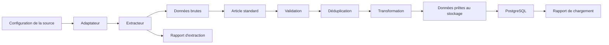

# Structures de données et modèles du projet

# Présentation

Dans cette section, je présente les principales structures de données utilisées dans **CheckIt.AI**.

L'objectif est d'expliquer comment les informations sont représentées et organisées tout au long du pipeline, depuis la configuration des sources jusqu'à la production des données prêtes à être stockées.

Les différentes structures décrites dans cette partie constituent le contrat de communication entre les différents modules du projet. Elles garantissent une représentation homogène des données, quel que soit leur mode d'acquisition.

---

# Organisation de cette section

Cette partie est organisée autour de quatre familles de structures.

1. **Structure d'un article** : description du contrat commun utilisé par l'ensemble des extracteurs.
2. **Structures de configuration** : présentation des fichiers de configuration décrivant les différentes sources de données.
3. **Adaptateurs des extracteurs** : fonctionnement des adaptateurs permettant de convertir les données provenant de chaque type de source vers le format standard du projet.
4. **Contextes et résultats d'exécution** : structures utilisées pour suivre l'état des traitements, les statistiques et les rapports générés par le pipeline.

---

# Vue d'ensemble

Le pipeline repose sur un contrat d'article commun. Chaque famille de source possède ensuite sa propre configuration ainsi qu'un adaptateur chargé de convertir les données collectées vers ce modèle unique.

Bien que les API, les flux RSS, les scrapers HTML, les réseaux sociaux et les jeux de données utilisent des mécanismes d'acquisition différents, ils produisent tous des articles respectant le même schéma.

Cette standardisation simplifie les étapes de validation, de transformation et de stockage tout en limitant les traitements spécifiques à chaque source.

---

# Conclusion

Les structures présentées dans cette section constituent le socle du pipeline CheckIt.AI.

Le contrat d'article garantit l'homogénéité des données collectées, les configurations décrivent les différentes sources, les adaptateurs assurent la conversion des formats externes et les contextes d'exécution permettent de suivre précisément le déroulement des traitements.

Cette organisation facilite l'évolution du projet en permettant d'ajouter de nouvelles sources ou de nouveaux traitements sans remettre en cause les autres composants du pipeline.