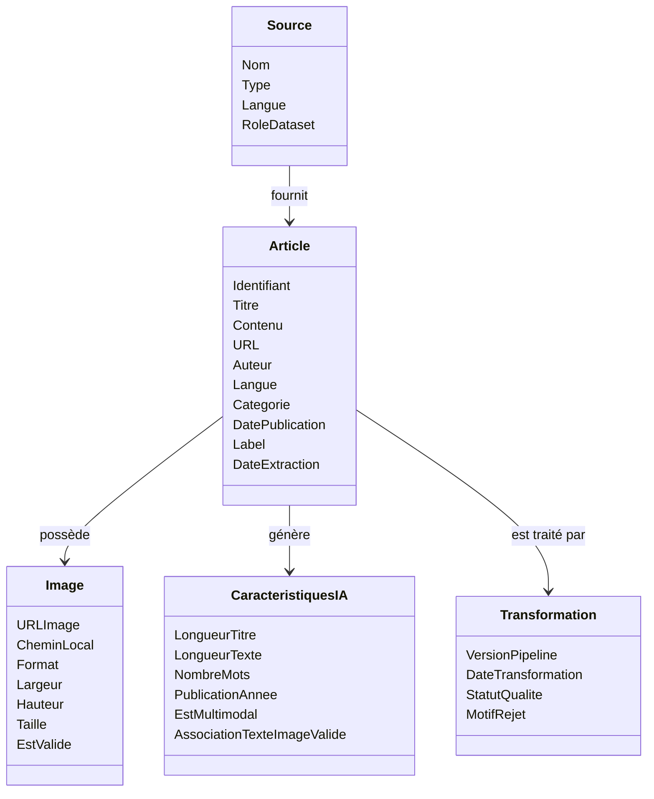
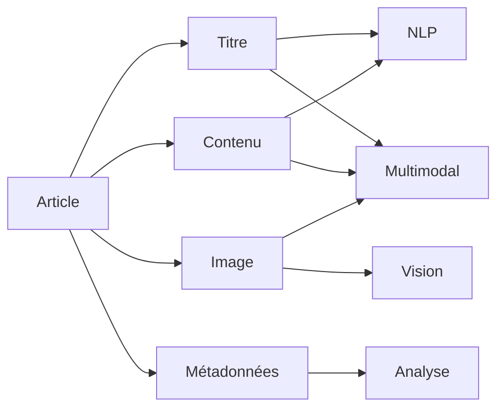
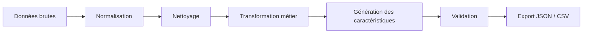

# Schéma des structures de données

## Objectif

Cette section décrit le modèle conceptuel des données manipulées par le pipeline **CheckIt.AI**.

L'objectif est de représenter les informations utiles au projet indépendamment de toute technologie de stockage (base de données, CSV ou JSON).

Contrairement à un schéma physique, ce modèle se concentre sur les objets métier, leurs relations et leur rôle dans le pipeline de préparation des données destiné aux futurs traitements d'intelligence artificielle.

---

# Vue d'ensemble

Le pipeline transforme des données hétérogènes provenant de plusieurs sources afin de produire un jeu de données homogène exploitable pour des modèles de NLP, de vision par ordinateur et d'analyse multimodale.

---

# Description des entités

## Source

Une **source** représente l'origine d'une publication.

Elle peut correspondre à :

- un flux RSS ;
- une API d'actualité ;
- un site web ;
- un réseau social ;
- un jeu de données académique.

### Principaux attributs

| Champ | Description |
|--------|-------------|
| Nom | Nom de la source |
| Type | RSS, API, HTML, Reddit, Dataset... |
| Langue | Langue principale |
| RoleDataset | Nature de la source (actualité, référence, dataset...) |

---

## Article

L'article constitue l'entité centrale du projet.

Toutes les données extraites sont converties vers ce schéma commun, quel que soit leur format d'origine.

### Principaux attributs

| Champ | Description |
|--------|-------------|
| Identifiant | Identifiant unique |
| Titre | Titre de la publication |
| Contenu | Texte principal |
| URL | Adresse de la publication |
| Auteur | Auteur lorsque disponible |
| Langue | Langue détectée |
| Catégorie | Domaine ou thème |
| DatePublication | Date de publication |
| Label | Vérité terrain pour les jeux de données supervisés |
| DateExtraction | Date de collecte |

---

## Image

Une publication peut être associée à une image.

Le pipeline télécharge cette image, la valide puis stocke ses métadonnées.

### Principaux attributs

| Champ | Description |
|--------|-------------|
| URLImage | URL distante |
| CheminLocal | Emplacement après téléchargement |
| Format | PNG, JPEG, WebP... |
| Largeur | Largeur de l'image |
| Hauteur | Hauteur de l'image |
| Taille | Taille du fichier |
| EstValide | Résultat de la validation |

---

## Caractéristiques IA

Cette entité regroupe les variables calculées pendant la phase de transformation.

Elles ne proviennent pas directement des sources mais sont générées automatiquement par le pipeline.

### Exemples

| Variable | Description |
|-----------|-------------|
| LongueurTitre | Nombre de caractères |
| LongueurTexte | Nombre de caractères |
| NombreMots | Nombre total de mots |
| PublicationAnnee | Année de publication |
| EstMultimodal | Présence simultanée d'un texte et d'une image |
| AssociationTexteImageValide | Vérification de la cohérence texte-image |

---

## Transformation

Cette entité décrit la traçabilité des traitements appliqués aux données.

Elle permet d'assurer la reproductibilité du pipeline.

### Principaux attributs

| Champ | Description |
|--------|-------------|
| VersionPipeline | Version de la chaîne de transformation |
| DateTransformation | Date d'exécution |
| StatutQualite | Validation finale |
| MotifRejet | Cause éventuelle d'exclusion |

---

# Relations entre les entités

Le modèle conceptuel suit les relations suivantes :

- une **Source** fournit plusieurs **Articles** ;
- un **Article** peut être associé à une **Image** ;
- un **Article** génère un ensemble de **Caractéristiques IA** lors de sa transformation ;
- un **Article** est lié à une **Transformation** décrivant les traitements appliqués.

---

# Utilisation des données par l'IA

Les informations produites par le pipeline sont destinées à plusieurs cas d'usage.

---

# Rôle des principaux champs

| Champ | Type conceptuel | Utilisation IA |
|--------|-----------------|----------------|
| Titre | Texte | Analyse NLP |
| Contenu | Texte | Analyse NLP |
| Langue | Texte | Filtrage linguistique |
| Catégorie | Catégorie | Classification |
| Label | Catégorie | Apprentissage supervisé |
| DatePublication | Date | Analyse temporelle |
| Image | Média | Vision par ordinateur |
| Largeur / Hauteur | Entier | Contrôle qualité |
| NombreMots | Entier | Préparation NLP |
| EstMultimodal | Booléen | Sélection des données multimodales |
| AssociationTexteImageValide | Booléen | Vérification de cohérence |
| VersionPipeline | Texte | Reproductibilité |

---

# Cycle de transformation

Le pipeline applique les transformations suivantes avant la production du jeu de données final.

---

# Conclusion

Le modèle conceptuel adopté permet d'unifier les différentes sources de données au sein d'un schéma unique.

Cette représentation facilite :

- la reproductibilité du pipeline ;
- la maintenance des modules de transformation ;
- l'ajout de nouvelles sources de données ;
- la préparation de jeux de données pour des modèles de NLP, de vision par ordinateur ou de classification multimodale.

Le modèle reste volontairement indépendant de toute technologie de stockage afin de décrire uniquement les concepts manipulés par le pipeline.