## Schéma relationnel PostgreSQL

Le schéma PostgreSQL `checkit` centralise les articles collectés, leurs
images, leurs labels, les caractéristiques destinées aux modèles d'IA,
les prédictions et les informations de suivi du pipeline.

```mermaid
erDiagram

    SOURCES {
        BIGINT id PK
        VARCHAR source_key UK
        VARCHAR display_name
        VARCHAR source_type
        TEXT base_url
        VARCHAR default_language
        NUMERIC reliability_score
        BOOLEAN is_active
        BOOLEAN requires_api_key
        INTEGER refresh_interval_minutes
        INTEGER max_articles_per_run
        JSONB configuration
        TIMESTAMPTZ last_successful_run
        TIMESTAMPTZ last_failed_run
        TEXT last_error
        TIMESTAMPTZ created_at
        TIMESTAMPTZ updated_at
    }

    PIPELINE_RUNS {
        UUID id PK
        VARCHAR dag_id
        VARCHAR airflow_run_id
        VARCHAR pipeline_name
        VARCHAR pipeline_version
        VARCHAR code_version
        VARCHAR airflow_version
        VARCHAR status
        TIMESTAMPTZ started_at
        TIMESTAMPTZ finished_at
        NUMERIC extraction_duration_seconds
        NUMERIC transformation_duration_seconds
        NUMERIC load_duration_seconds
        NUMERIC duration_seconds
        INTEGER extracted_count
        INTEGER transformed_count
        INTEGER valid_count
        INTEGER rejected_count
        INTEGER loaded_count
        INTEGER images_downloaded_count
        INTEGER images_valid_count
        INTEGER images_invalid_count
        NUMERIC peak_memory_mb
        NUMERIC average_cpu_percent
        TEXT error_message
        JSONB run_metadata
        TIMESTAMPTZ created_at
        TIMESTAMPTZ updated_at
    }

    ARTICLES {
        VARCHAR id PK
        BIGINT source_id FK
        UUID pipeline_run_id FK
        TEXT external_id
        TEXT title
        TEXT content
        TEXT original_url
        TEXT canonical_url
        TEXT author
        VARCHAR language
        NUMERIC language_confidence
        TEXT category
        TIMESTAMPTZ published_at
        TIMESTAMPTZ extracted_at
        TIMESTAMPTZ transformed_at
        VARCHAR dataset_role
        INTEGER title_length
        INTEGER content_length
        INTEGER total_text_length
        INTEGER title_word_count
        INTEGER content_word_count
        INTEGER total_word_count
        NUMERIC reading_time_minutes
        BOOLEAN has_publication_date
        BOOLEAN has_author
        BOOLEAN has_url
        BOOLEAN has_image
        BOOLEAN is_multimodal
        NUMERIC duplicate_score
        VARCHAR data_quality_status
        TEXT rejection_reason
        VARCHAR transformation_version
        VARCHAR title_hash
        VARCHAR content_hash
        VARCHAR canonical_url_hash
        JSONB raw_payload
        TIMESTAMPTZ created_at
        TIMESTAMPTZ updated_at
    }

    IMAGES {
        BIGINT id PK
        VARCHAR article_id FK
        TEXT remote_url
        TEXT local_path
        TEXT file_name
        VARCHAR file_extension
        VARCHAR file_format
        VARCHAR mime_type
        INTEGER width
        INTEGER height
        NUMERIC aspect_ratio
        BIGINT size_bytes
        VARCHAR file_hash
        VARCHAR perceptual_hash
        INTEGER download_duration_ms
        INTEGER image_position
        BOOLEAN is_primary
        NUMERIC blur_score
        NUMERIC brightness_score
        NUMERIC entropy_score
        BOOLEAN is_valid
        VARCHAR validation_status
        TEXT validation_error
        VARCHAR association_status
        NUMERIC association_score
        VARCHAR association_method
        TIMESTAMPTZ downloaded_at
        TIMESTAMPTZ validated_at
        TIMESTAMPTZ associated_at
        JSONB image_metadata
        TIMESTAMPTZ created_at
        TIMESTAMPTZ updated_at
    }

    ARTICLE_LABELS {
        BIGINT id PK
        VARCHAR article_id FK
        VARCHAR label
        VARCHAR label_type
        VARCHAR label_source
        VARCHAR annotator
        VARCHAR annotation_method
        NUMERIC confidence
        BOOLEAN is_ground_truth
        BOOLEAN is_active
        TEXT notes
        JSONB label_metadata
        TIMESTAMPTZ labeled_at
        TIMESTAMPTZ created_at
        TIMESTAMPTZ updated_at
    }

    ARTICLE_FEATURES {
        BIGINT id PK
        VARCHAR article_id FK
        BIGINT image_id FK
        UUID pipeline_run_id FK
        VARCHAR feature_group
        VARCHAR feature_name
        VARCHAR feature_type
        VARCHAR feature_version
        VARCHAR producer_name
        VARCHAR producer_version
        NUMERIC numeric_value
        TEXT text_value
        BOOLEAN boolean_value
        JSONB json_value
        TEXT vector_path
        INTEGER vector_dimension
        NUMERIC confidence
        JSONB feature_metadata
        TIMESTAMPTZ computed_at
        TIMESTAMPTZ created_at
        TIMESTAMPTZ updated_at
    }

    MODEL_PREDICTIONS {
        BIGINT id PK
        VARCHAR article_id FK
        BIGINT image_id FK
        UUID pipeline_run_id FK
        VARCHAR model_name
        VARCHAR model_version
        VARCHAR task_type
        VARCHAR feature_set_version
        VARCHAR predicted_label
        NUMERIC confidence
        NUMERIC decision_threshold
        JSONB probabilities
        JSONB explanation
        VARCHAR prediction_status
        TEXT error_message
        TIMESTAMPTZ predicted_at
        TIMESTAMPTZ created_at
        TIMESTAMPTZ updated_at
    }

    PIPELINE_METRICS {
        BIGINT id PK
        UUID pipeline_run_id FK
        VARCHAR metric_name
        NUMERIC metric_value
        VARCHAR metric_unit
        VARCHAR component
        JSONB metric_metadata
        TIMESTAMPTZ measured_at
    }

    ETL_LOGS {
        BIGINT id PK
        UUID pipeline_run_id FK
        VARCHAR log_level
        VARCHAR component
        TEXT message
        VARCHAR error_type
        JSONB error_details
        TIMESTAMPTZ created_at
    }

    DATASET_VERSIONS {
        UUID id PK
        VARCHAR version_name UK
        UUID pipeline_run_id FK
        TEXT description
        INTEGER article_count
        INTEGER image_count
        INTEGER label_count
        TEXT dataset_path
        VARCHAR checksum
        TIMESTAMPTZ created_at
    }

    PIPELINE_CONFIGURATION {
        BIGINT id PK
        VARCHAR configuration_key UK
        JSONB configuration_value
        TEXT description
        BOOLEAN is_sensitive
        BOOLEAN is_active
        TIMESTAMPTZ created_at
        TIMESTAMPTZ updated_at
    }


    SOURCES ||--o{ ARTICLES : "fournit"

    PIPELINE_RUNS o|--o{ ARTICLES : "produit"

    ARTICLES ||--o{ IMAGES : "possède"

    ARTICLES ||--o{ ARTICLE_LABELS : "reçoit"

    ARTICLES ||--o{ ARTICLE_FEATURES : "possède"

    IMAGES o|--o{ ARTICLE_FEATURES : "alimente"

    PIPELINE_RUNS o|--o{ ARTICLE_FEATURES : "calcule"

    ARTICLES ||--o{ MODEL_PREDICTIONS : "est analysé par"

    IMAGES o|--o{ MODEL_PREDICTIONS : "est analysée par"

    PIPELINE_RUNS o|--o{ MODEL_PREDICTIONS : "exécute"

    PIPELINE_RUNS ||--o{ PIPELINE_METRICS : "mesure"

    PIPELINE_RUNS ||--o{ ETL_LOGS : "journalise"

    PIPELINE_RUNS o|--o{ DATASET_VERSIONS : "génère"
```

