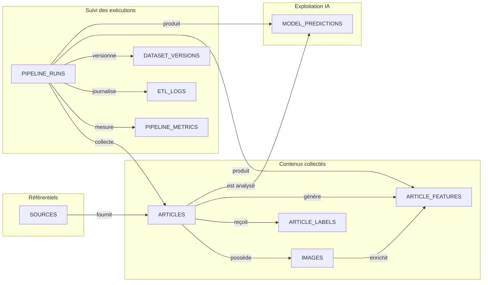

# Tables SQL

## Objectif

Cette section présente le schéma physique de la base PostgreSQL utilisée par **CheckIt.AI**.

Contrairement au modèle conceptuel, qui décrit les entités métier et leurs relations de manière abstraite, le schéma physique précise la manière dont les données sont réellement stockées dans PostgreSQL.

Il décrit notamment :

- les tables ;
- les colonnes principales ;
- les types de données ;
- les clés primaires ;
- les clés étrangères ;
- les contraintes ;
- les index ;
- les vues ;
- les fonctions et procédures utilisées par le pipeline.

La base est conçue pour stocker les articles collectés, leurs images, les labels de référence, les caractéristiques calculées, les prédictions produites par les futurs modèles d’intelligence artificielle et les informations de suivi du pipeline Airflow.

---

# Vue d’ensemble du schéma



---

# Organisation générale

Le schéma PostgreSQL utilisé par le projet est nommé :

```text
checkit
```

Il contient les tables suivantes :

| Table | Rôle |
|---|---|
| `sources` | Référentiel des sources de données |
| `pipeline_runs` | Historique des exécutions locales et Airflow |
| `pipeline_metrics` | KPI détaillés des exécutions |
| `pipeline_configuration` | Paramètres fonctionnels du pipeline |
| `dataset_versions` | Versions des jeux de données produits |
| `etl_logs` | Journalisation structurée des événements |
| `articles` | Données textuelles et métadonnées des publications |
| `images` | Métadonnées et qualité des images |
| `article_labels` | Vérités terrain et annotations |
| `article_features` | Variables calculées pour l’IA |
| `model_predictions` | Résultats produits par les modèles |

# Conclusion

Le schéma SQL de **CheckIt.AI** sépare clairement les données observées, les images, les labels, les features et les prédictions.

Cette organisation permet :

- de conserver la traçabilité des traitements ;
- de comparer plusieurs modèles ;
- de distinguer vérité terrain et prédiction ;
- de suivre les exécutions Airflow ;
- de produire des KPI ;
- de préparer les données pour les futurs travaux de NLP, de vision et de classification multimodale.