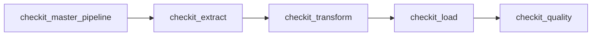
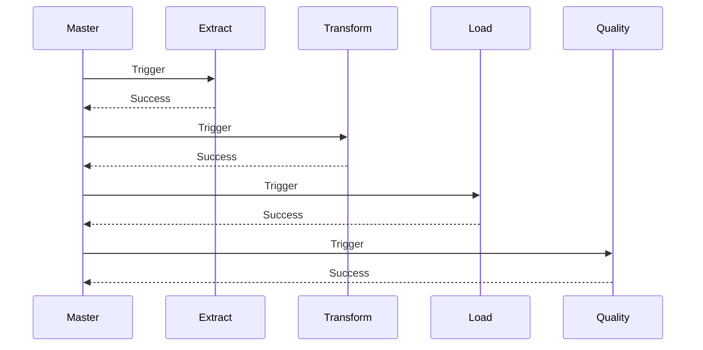

# DAG maître

## Objectif

Le DAG **`checkit_master_pipeline`** constitue le point d'entrée principal du pipeline **CheckIt.AI**.

Contrairement aux autres DAGs, il ne réalise aucun traitement sur les données. Son unique responsabilité est d'orchestrer les différentes étapes du pipeline en déclenchant successivement les DAGs spécialisés.

J'ai choisi cette architecture afin de séparer complètement l'orchestration des traitements métier. Chaque DAG possède ainsi une responsabilité bien définie, ce qui facilite le développement, les tests et la maintenance de l'application.

Le DAG maître ne manipule jamais directement les articles, les images ou les données stockées dans PostgreSQL. Il coordonne uniquement l'exécution des différentes étapes du pipeline.

---

## Responsabilités

Le DAG maître assure plusieurs fonctions essentielles.

Il :

- initialise une nouvelle exécution du pipeline ;
- génère un identifiant de lot unique (*batch_id*) ;
- transmet une configuration commune aux DAGs enfants ;
- déclenche les différentes étapes dans le bon ordre ;
- attend la fin de chaque DAG avant de poursuivre ;
- contrôle le succès ou l'échec de chaque étape ;
- interrompt immédiatement le pipeline lorsqu'un DAG enfant échoue.

Cette approche garantit que chaque étape travaille sur des données cohérentes produites par l'étape précédente.

---

## Architecture

Le pipeline est organisé autour de quatre DAGs spécialisés exécutés successivement.



Chaque DAG possède une responsabilité unique.

Les données ne transitent pas directement entre les DAGs. Elles sont échangées via le répertoire partagé du lot en cours de traitement.

---

## Identifiant de lot

Chaque exécution reçoit un identifiant unique appelé **batch_id**.

Cet identifiant correspond directement au `run_id` du DAG maître.

Par exemple :

```text
manual__2026-07-15T08_31_32.412871+00:00
```

Le DAG maître transmet cet identifiant à l'ensemble des DAGs enfants.

Selon les besoins du pipeline, cet identifiant peut ensuite être adapté afin d'être utilisé comme nom de dossier compatible avec le système de fichiers.

Tous les DAGs utilisent le même identifiant afin de retrouver les données appartenant à une exécution donnée.

---

## Répertoire partagé

Les différents DAGs échangent leurs données via un répertoire partagé.

```text
/opt/airflow/shared/lots/
└── <batch_id>/
```

Chaque exécution possède son propre dossier.

Par exemple :

```text
/opt/airflow/shared/lots/

└── manual__2026-07-15T08_31_32_412871_00_00/
```

Les différents fichiers produits par le pipeline sont stockés dans ce répertoire.

Cette organisation permet d'isoler les données de chaque exécution et d'éviter toute collision entre plusieurs lots.

---

## Configuration transmise

Le DAG maître transmet aux DAGs enfants une configuration JSON légère contenant uniquement les informations nécessaires à leur exécution.

Les principaux paramètres transmis sont les suivants.

| Paramètre | Description |
|------------|-------------|
| `batch_id` | identifiant unique du lot |
| `parent_dag_id` | identifiant du DAG maître |
| `parent_run_id` | identifiant de l'exécution du DAG maître |
| `logical_date` | date logique de l'exécution, lorsqu'elle est disponible |
| `triggered_at` | date à laquelle l'exécution peut démarrer |

Des paramètres complémentaires sont ajoutés selon le DAG déclenché.

Par exemple :

- le DAG d'extraction reçoit le paramètre `require_image` ;
- le DAG qualité reçoit les seuils de validation utilisés lors des contrôles.

Cette approche permet à chaque DAG de recevoir uniquement les informations dont il a besoin.

---

## Déclenchement des DAGs

Chaque DAG enfant est lancé grâce à un **`TriggerDagRunOperator`**.

Le DAG maître attend systématiquement la fin du DAG déclenché avant de poursuivre l'exécution.

Le fonctionnement est donc entièrement séquentiel.



Le DAG maître est configuré pour attendre explicitement la fin de chaque étape (`wait_for_completion=True`).

Ainsi, une étape ne démarre jamais tant que la précédente n'a pas terminé avec succès.

---

## Gestion des erreurs

Le DAG maître ne tente jamais de corriger les erreurs rencontrées par les DAGs enfants.

Si une étape échoue :

- le pipeline est immédiatement interrompu ;
- les étapes suivantes ne sont pas exécutées ;
- les fichiers déjà produits restent disponibles dans le dossier partagé ;
- l'erreur est propagée à Airflow.

Cette stratégie facilite le diagnostic en évitant de poursuivre le traitement avec des données incomplètes ou incohérentes.

---

## Gestion des délais d'exécution

Afin d'éviter qu'un traitement ne reste bloqué indéfiniment, chaque DAG possède une durée maximale d'exécution.

Le DAG maître dispose d'une durée maximale de quatre heures.

Les DAGs spécialisés disposent également de leurs propres limites :

| DAG | Durée maximale |
|------|----------------|
| `checkit_extract` | 90 minutes |
| `checkit_transform` | 45 minutes |
| `checkit_load` | 30 minutes |
| `checkit_quality` | 30 minutes |

Le DAG maître est également configuré pour effectuer une nouvelle tentative en cas d'échec temporaire, avec un délai d'une minute entre deux essais.

---

## Avantages de cette architecture

Le découpage du pipeline en plusieurs DAGs présente de nombreux avantages.

Il permet notamment :

- de confier une responsabilité unique à chaque DAG ;
- de conserver des traitements indépendants ;
- de simplifier les tests ;
- de faciliter la maintenance ;
- de mesurer précisément les temps d'exécution de chaque étape ;
- d'obtenir des journaux Airflow plus lisibles ;
- de relancer facilement une étape sans modifier l'organisation générale du pipeline.

Cette architecture rend également le projet plus évolutif puisqu'il devient possible d'ajouter ou de modifier une étape sans remettre en cause les autres DAGs.

---

## Résumé

Le DAG **`checkit_master_pipeline`** constitue le chef d'orchestre du pipeline **CheckIt.AI**.

J'ai choisi de lui confier uniquement les responsabilités liées à l'orchestration afin de conserver une séparation claire entre la coordination des traitements et les traitements métier.

Il transmet une configuration commune aux DAGs spécialisés, déclenche successivement les différentes étapes, attend leur exécution complète et interrompt immédiatement le pipeline lorsqu'une erreur est détectée.

Cette organisation garantit une exécution séquentielle, reproductible et facilement maintenable tout en conservant une forte indépendance entre les différents composants du pipeline.