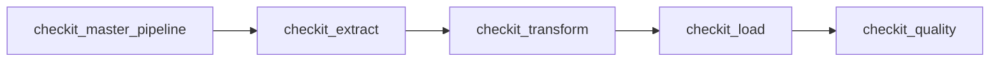
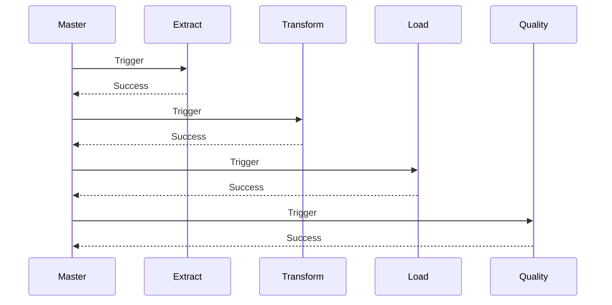

# DAG maître

## Objectif

Le DAG **`checkit_master_pipeline`** constitue le point d'entrée principal du pipeline CheckIt.AI.

Contrairement aux autres DAGs, il ne réalise aucun traitement sur les données. Son unique responsabilité est d'orchestrer les différentes étapes du pipeline en déclenchant successivement les DAGs spécialisés.

Cette séparation permet de conserver des traitements indépendants, facilement testables et réutilisables.

---

## Responsabilités

Le DAG maître assure plusieurs fonctions.

Il :

- initialise une nouvelle exécution du pipeline ;
- génère un identifiant de lot unique ;
- transmet une configuration commune à tous les DAGs enfants ;
- déclenche les différentes étapes dans le bon ordre ;
- attend la fin de chaque étape ;
- interrompt le pipeline dès qu'une étape échoue.

Le DAG ne manipule jamais directement les articles ou les images.

---

## Architecture



Chaque DAG possède une responsabilité unique et communique avec le suivant uniquement par l'intermédiaire du dossier partagé du lot.

---

## Identifiant de lot

Chaque exécution reçoit un identifiant unique appelé **batch_id**.

Cet identifiant correspond au `run_id` du DAG maître.

Exemple :

```text
manual__2026-07-15T08_31_32.412871+00:00
```

Cet identifiant est normalisé afin de produire un nom de dossier compatible avec le système de fichiers.

Tous les DAGs utilisent ensuite ce même identifiant pour retrouver les fichiers du pipeline.

---

## Répertoire partagé

Toutes les étapes échangent leurs données via un dossier commun.

```text
/opt/airflow/shared/lots/
└── <batch_id>/
```

Chaque exécution possède donc son propre répertoire.

Exemple :

```text
/opt/airflow/shared/lots/

└── manual__2026-07-15T08_31_32_412871_00_00/
```

Cette organisation permet d'exécuter plusieurs lots indépendants sans risque de collision.

---

## Configuration transmise

Le DAG maître transmet aux DAGs enfants un ensemble de paramètres communs.

Les principaux sont :

| Paramètre | Description |
|------------|-------------|
| batch_id | identifiant unique du lot |
| parent_run_id | identifiant du DAG maître |
| execution_date | date logique du pipeline |
| extractors | liste des extracteurs à utiliser |
| require_image | conservation uniquement des articles possédant une image valide |
| quality_thresholds | seuils utilisés par le DAG qualité |

Tous les DAGs disposent ainsi exactement du même contexte d'exécution.

---

## Déclenchement des DAGs

Chaque étape est lancée grâce à un `TriggerDagRunOperator`.

Le DAG maître attend systématiquement la fin du DAG enfant avant de poursuivre l'exécution.

Le fonctionnement est donc strictement séquentiel.



Cette stratégie garantit qu'une étape ne démarre jamais tant que la précédente n'a pas terminé correctement.

---

## Gestion des erreurs

Le DAG maître ne tente jamais de corriger une erreur.

Si un DAG enfant échoue :

- le pipeline est immédiatement interrompu ;
- les DAGs suivants ne sont pas exécutés ;
- les fichiers déjà produits restent disponibles pour l'analyse.

Cette approche simplifie considérablement le diagnostic des erreurs.

---

## Avantages de cette architecture

Le découpage du pipeline en plusieurs DAGs présente plusieurs avantages.

- chaque étape possède une responsabilité unique ;
- les traitements restent indépendants ;
- une étape peut être relancée sans réexécuter tout le pipeline ;
- les temps d'exécution sont plus faciles à mesurer ;
- les journaux Airflow restent plus lisibles ;
- la maintenance est simplifiée.

---

## Résumé

Le DAG maître constitue uniquement un orchestrateur.

Il ne transforme aucune donnée mais garantit que l'ensemble des étapes du pipeline sont exécutées dans le bon ordre avec une configuration commune et un identifiant de lot partagé.