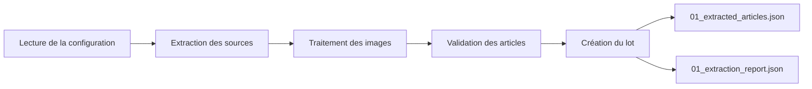

# DAG d'extraction

## Objectif

Le DAG **`checkit_extract`** constitue la première étape du pipeline CheckIt.AI.

Son rôle est de collecter les données provenant des différentes sources configurées, de préparer les articles pour les étapes suivantes puis de produire le premier lot partagé du pipeline.

Cette étape réalise également le téléchargement et la validation des images afin de garantir que seules les données exploitables poursuivent leur traitement.

---

## Responsabilités

Le DAG d'extraction est responsable des opérations suivantes :

- lecture de la configuration transmise par le DAG maître ;
- sélection des extracteurs à exécuter ;
- collecte des articles ;
- téléchargement des images associées ;
- validation des fichiers téléchargés ;
- suppression éventuelle des articles incomplets ;
- génération des premiers fichiers du lot.

Le DAG ne réalise aucune transformation destinée à la base PostgreSQL.

---

## Architecture



---

## Entrées

Le DAG reçoit les paramètres transmis par le DAG maître.

Les principaux paramètres utilisés sont :

| Paramètre | Description |
|------------|-------------|
| batch_id | identifiant unique du lot |
| extractors | liste des extracteurs à exécuter |
| require_image | indique si une image valide est obligatoire |
| execution_date | date logique du pipeline |

Ces paramètres sont accessibles via `dag_run.conf`.

---

## Extraction des données

Le service d'extraction interroge successivement les différentes sources configurées.

Selon la configuration, plusieurs familles de sources peuvent être utilisées :

- flux RSS ;
- API d'actualité ;
- sites web ;
- réseaux sociaux ;
- jeux de données de référence.

Chaque extracteur retourne une collection d'articles normalisés partageant la même structure de données.

---

## Traitement des images

Après l'extraction des articles, le DAG lance le service de traitement des images.

Les opérations réalisées sont les suivantes :

1. vérification des images locales déjà référencées ;
2. suppression des chemins invalides ;
3. téléchargement des images manquantes ;
4. validation des fichiers téléchargés ;
5. conservation ou rejet des articles selon la configuration.

Lorsque le paramètre `require_image` est activé, seuls les articles possédant une image valide sont conservés.

---

## Production du lot

Une fois les traitements terminés, le DAG crée un dossier correspondant au lot courant.

```text
/opt/airflow/shared/lots/

└── <batch_id>/
```

Deux fichiers sont alors produits.

### Articles extraits

```text
01_extracted_articles.json
```

Ce fichier contient l'ensemble des articles retenus après le traitement des images.

Chaque article possède une structure homogène comprenant notamment :

- les informations textuelles ;
- les métadonnées ;
- l'image locale validée ;
- les informations nécessaires aux étapes suivantes.

---

### Rapport d'extraction

```text
01_extraction_report.json
```

Ce rapport contient les informations relatives à l'exécution :

- nombre d'articles extraits ;
- nombre d'articles conservés ;
- nombre d'articles rejetés ;
- extracteurs exécutés ;
- extracteurs en erreur ;
- chemins des fichiers produits.

Il facilite le suivi du pipeline et le diagnostic des éventuelles anomalies.

---

## Gestion des erreurs

Chaque extracteur est exécuté indépendamment.

Une erreur provenant d'une source externe n'interrompt pas nécessairement l'ensemble du pipeline.

Les erreurs sont enregistrées dans le rapport d'extraction afin de permettre une analyse ultérieure.

En revanche, lorsqu'aucun article exploitable n'est produit, le DAG échoue afin d'éviter la poursuite du pipeline avec un lot vide.

---

## Sorties

Le DAG produit les fichiers suivants :

```text
01_extracted_articles.json
01_extraction_report.json
```

Ces fichiers constituent les entrées du DAG de transformation.

---

## Avantages

Cette organisation présente plusieurs avantages.

- Les traitements d'acquisition sont isolés des traitements métier.
- Les images sont validées dès le début du pipeline.
- Les données transmises aux étapes suivantes sont homogènes.
- Les erreurs provenant des sources externes sont clairement identifiées.
- Chaque lot possède son propre historique d'exécution.

---

## Résumé

Le DAG d'extraction constitue la porte d'entrée du pipeline.

Il collecte les données, prépare les images, élimine les articles non exploitables et génère le premier lot partagé qui sera utilisé par le DAG de transformation.