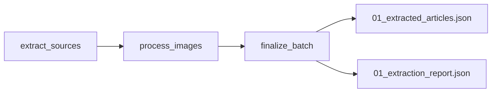

# DAG d'extraction

## Objectif

Le DAG **`checkit_extract`** constitue la première étape du pipeline **CheckIt.AI**.

Son rôle est de collecter les données provenant des différentes sources configurées, de traiter les images associées, puis de produire le premier lot partagé qui sera utilisé par les étapes suivantes.

J'ai volontairement découpé ce DAG en plusieurs tâches indépendantes afin de rendre son exécution plus lisible dans Airflow, de faciliter les reprises sur erreur et de limiter les échanges de données entre les tâches.

Les articles ne transitent jamais dans les XCom. Seuls de petits manifestes contenant les chemins des fichiers et quelques indicateurs sont échangés entre les différentes tâches.

---

## Responsabilités

Le DAG d'extraction est responsable des opérations suivantes :

- lecture de la configuration transmise par le DAG maître ;
- sélection des extracteurs à exécuter ;
- collecte des articles ;
- traitement et téléchargement des images ;
- validation des images ;
- suppression éventuelle des articles selon la configuration ;
- création du premier lot partagé ;
- production du rapport d'extraction.

En revanche, ce DAG ne réalise aucune transformation destinée au stockage PostgreSQL.

---

## Architecture

Le DAG est composé de trois tâches principales.



Chaque tâche possède une responsabilité unique.

Cette organisation simplifie le suivi des traitements dans Airflow et facilite la reprise en cas d'échec.

---

## Paramètres reçus

Le DAG reçoit une configuration JSON transmise par le DAG maître.

Les principaux paramètres utilisés sont :

| Paramètre | Description |
|------------|-------------|
| `batch_id` | identifiant unique du lot |
| `parent_dag_id` | identifiant du DAG maître |
| `parent_run_id` | identifiant de l'exécution du DAG maître |
| `logical_date` | date logique de l'exécution |
| `triggered_at` | date de déclenchement |
| `extractors` | liste éventuelle des extracteurs à exécuter |
| `require_image` | indique si une image valide est obligatoire |

Ces paramètres sont accessibles via `dag_run.conf`.

Si aucun extracteur n'est explicitement fourni, le DAG utilise automatiquement l'ensemble des extracteurs configurés.

---

## Étape 1 : extraction des données

La première tâche lance le service d'extraction.

Les différentes familles de sources peuvent être interrogées :

- flux RSS ;
- API d'actualité ;
- scrapers HTML ;
- réseaux sociaux ;
- jeux de données.

Chaque extracteur produit une collection d'articles respectant le modèle standard du projet.

Les articles extraits sont ensuite enregistrés dans un premier fichier intermédiaire :

```text
00_raw_extracted_articles.json
```

Un premier rapport est également généré :

```text
00_raw_extraction_report.json
```

Ces fichiers sont uniquement utilisés pendant le déroulement du DAG.

---

## Étape 2 : traitement des images

Une fois les articles extraits, la deuxième tâche traite les images associées.

Les principales opérations réalisées sont :

1. lecture des articles extraits ;
2. vérification des images déjà disponibles ;
3. téléchargement des images manquantes ;
4. validation des fichiers téléchargés ;
5. suppression éventuelle des articles selon la configuration.

Lorsque le paramètre `require_image` est activé, seuls les articles possédant une image valide sont conservés.

À la fin de cette étape, un nouveau fichier est produit :

```text
01_extracted_articles.json
```

Ce fichier contient les articles définitivement retenus pour la suite du pipeline.

---

## Étape 3 : finalisation du lot

La dernière tâche rassemble les informations produites par les étapes précédentes.

Elle :

- construit le rapport final d'extraction ;
- calcule différentes statistiques ;
- supprime les fichiers intermédiaires devenus inutiles ;
- prépare le manifeste destiné au DAG suivant.

À l'issue de cette étape, seuls les fichiers utiles au reste du pipeline sont conservés.

---

## Répertoire partagé

Tous les fichiers sont enregistrés dans le dossier partagé du lot.

```text
/opt/airflow/shared/lots/

└── <batch_id>/
```

Le `batch_id` transmis par le DAG maître est normalisé afin de produire un nom de dossier compatible avec le système de fichiers.

Chaque exécution possède ainsi son propre répertoire.

---

## Fichiers produits

À la fin du DAG, les deux fichiers suivants sont disponibles.

### Articles extraits

```text
01_extracted_articles.json
```

Ce fichier contient les articles validés qui seront utilisés par le DAG de transformation.

Chaque article possède notamment :

- les informations textuelles ;
- les métadonnées ;
- les informations relatives aux images ;
- les champs nécessaires aux traitements suivants.

---

### Rapport d'extraction

```text
01_extraction_report.json
```

Ce rapport rassemble les principales informations de l'exécution :

- statut du traitement ;
- nombre d'articles extraits ;
- nombre d'articles conservés ;
- nombre d'articles rejetés ;
- nombre d'images valides ;
- nombre d'articles sans image valide ;
- extracteurs exécutés ;
- extracteurs ayant échoué ;
- durée des différentes étapes ;
- chemins des fichiers produits.

Ce rapport facilite le suivi du pipeline ainsi que le diagnostic des éventuelles anomalies.

---

## Gestion des erreurs

Les extracteurs sont exécutés de manière indépendante.

Une erreur provenant d'une source externe n'interrompt pas nécessairement l'ensemble du pipeline.

Le service d'extraction isole les erreurs des sources individuelles afin qu'une source indisponible ne bloque pas inutilement le traitement des autres.

En revanche, le DAG échoue dans plusieurs situations critiques, par exemple :

- aucun article n'a été extrait ;
- aucun article exploitable ne subsiste après le traitement des images ;
- un fichier intermédiaire est manquant ou invalide.

Cette stratégie garantit que les étapes suivantes travaillent uniquement sur un lot valide.

---

## Communication entre les tâches

Les articles ne sont jamais transmis via les XCom d'Airflow.

J'ai choisi d'échanger uniquement un manifeste léger contenant :

- l'identifiant du lot ;
- les chemins des fichiers ;
- quelques indicateurs d'exécution.

Cette approche réduit fortement la taille des données échangées et évite de surcharger la base de données d'Airflow.

---

## Avantages

Cette organisation présente plusieurs avantages.

- Les responsabilités sont clairement séparées.
- Les traitements sont plus lisibles dans Airflow.
- Les reprises sur erreur sont facilitées.
- Les articles ne transitent jamais dans les XCom.
- Les images sont validées avant les étapes suivantes.
- Les données produites sont homogènes.
- Les fichiers intermédiaires sont automatiquement nettoyés en fin d'exécution.

---

## Résumé

Le DAG **`checkit_extract`** constitue la porte d'entrée du pipeline **CheckIt.AI**.

J'ai choisi de le découper en trois tâches spécialisées afin de séparer clairement l'extraction des données, le traitement des images et la finalisation du lot.

À l'issue de son exécution, le pipeline dispose d'un premier lot d'articles validés ainsi que d'un rapport détaillé qui serviront de point de départ au DAG de transformation.