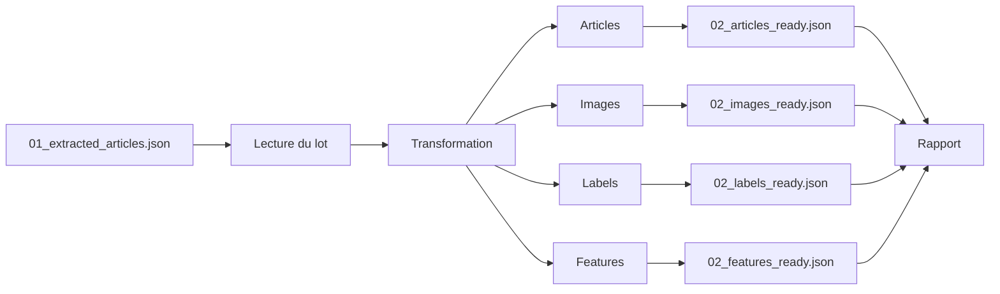

# DAG de transformation

## Objectif

Le DAG **`checkit_transform`** constitue la deuxième étape du pipeline CheckIt.AI.

Son rôle est de transformer les articles extraits en un ensemble de structures adaptées au modèle de données PostgreSQL.

Contrairement au DAG d'extraction, cette étape ne collecte aucune nouvelle donnée. Elle restructure les informations existantes afin de préparer leur insertion en base de données.

Le résultat de cette étape est un ensemble de fichiers JSON correspondant aux différentes tables de la base PostgreSQL.

---

## Responsabilités

Le DAG de transformation réalise les opérations suivantes :

- lecture des articles extraits ;
- nettoyage et normalisation des données ;
- génération des différentes structures métier ;
- séparation des informations par table PostgreSQL ;
- contrôle de cohérence des données produites ;
- génération du rapport de transformation.

Cette étape ne réalise aucun accès à PostgreSQL.

---

## Architecture



---

## Entrées

Le DAG lit le dossier partagé créé par le DAG d'extraction.

```
/opt/airflow/shared/lots/<batch_id>/
```

Le principal fichier utilisé est :

```
01_extracted_articles.json
```

Il contient l'ensemble des articles validés après le traitement des images.

---

## Transformation des données

Chaque article est analysé afin de répartir les informations dans les différentes structures correspondant au modèle relationnel.

Cette séparation permet de limiter la redondance des informations et de respecter les principes de normalisation d'une base de données relationnelle.

Le traitement est entièrement réalisé par le **database transformer**.

---

## Génération des articles

Les informations textuelles sont extraites afin d'alimenter la table **articles**.

Par exemple :

- titre ;
- contenu ;
- auteur ;
- langue ;
- catégorie ;
- date de publication ;
- indicateurs de qualité ;
- informations multimodales.

Chaque article reçoit un identifiant unique qui permettra de relier les autres tables.

---

## Génération des images

Les informations relatives aux images sont ensuite séparées.

Parmi les informations produites :

- chemin local ;
- URL distante ;
- dimensions ;
- taille du fichier ;
- statut de validation ;
- format ;
- informations techniques.

Chaque image reste associée à son article grâce à l'identifiant de celui-ci.

---

## Génération des labels

Lorsque des annotations sont disponibles, elles sont regroupées dans une structure indépendante.

Cette séparation facilite l'ajout futur :

- de labels humains ;
- de vérités terrain ;
- de pseudo-labels ;
- de classifications automatiques.

Le pipeline peut ainsi gérer plusieurs sources d'annotation sans modifier la structure principale des articles.

---

## Génération des caractéristiques

Le pipeline prépare également une structure destinée aux futures caractéristiques calculées.

Ces informations pourront contenir par exemple :

- caractéristiques NLP ;
- caractéristiques visuelles ;
- embeddings ;
- scores calculés ;
- indicateurs multimodaux.

Cette architecture permet d'enrichir progressivement les articles sans modifier les autres tables.

---

## Contrôles réalisés

Avant la génération des fichiers, plusieurs vérifications sont effectuées.

Le DAG contrôle notamment :

- la présence des identifiants ;
- la cohérence des références entre les différentes structures ;
- la présence des informations obligatoires ;
- la conformité des types de données.

Ces contrôles permettent de détecter les incohérences avant le chargement dans PostgreSQL.

---

## Fichiers produits

Le DAG génère les fichiers suivants.

### Articles

```
02_articles_ready.json
```

Contient les données destinées à la table **articles**.

---

### Images

```
02_images_ready.json
```

Contient les données destinées à la table **images**.

---

### Labels

```
02_labels_ready.json
```

Contient les informations destinées à la table **article_labels**.

---

### Features

```
02_features_ready.json
```

Contient les données destinées à la table **article_features**.

---

### Rapport

```
02_transformation_report.json
```

Le rapport récapitule notamment :

- le nombre d'articles transformés ;
- le nombre d'images produites ;
- le nombre de labels ;
- le nombre de caractéristiques ;
- les chemins des fichiers générés.

---

## Gestion des erreurs

Le DAG interrompt immédiatement son exécution lorsqu'une erreur critique est détectée.

Par exemple :

- fichier d'entrée absent ;
- structure JSON invalide ;
- identifiants incohérents ;
- données incompatibles avec le modèle relationnel.

Cette stratégie garantit que seules des données cohérentes pourront être chargées dans PostgreSQL.

---

## Sorties

Le DAG produit l'ensemble des fichiers nécessaires au chargement de la base de données.

```
02_articles_ready.json

02_images_ready.json

02_labels_ready.json

02_features_ready.json

02_transformation_report.json
```

Ces fichiers constituent les entrées du DAG de chargement.

---

## Avantages

Cette architecture présente plusieurs avantages.

- Les données sont adaptées au modèle relationnel.
- Les informations sont normalisées.
- Les références entre tables sont préparées avant le chargement.
- Les futures évolutions du modèle de données sont facilitées.
- Les erreurs sont détectées avant toute insertion en base.

---

## Résumé

Le DAG de transformation assure la transition entre les données extraites et le modèle relationnel PostgreSQL.

Il transforme un lot d'articles homogène en plusieurs structures spécialisées correspondant aux différentes tables de la base de données. Cette étape garantit la cohérence des données avant leur insertion et constitue le lien entre l'acquisition des données et leur stockage définitif.