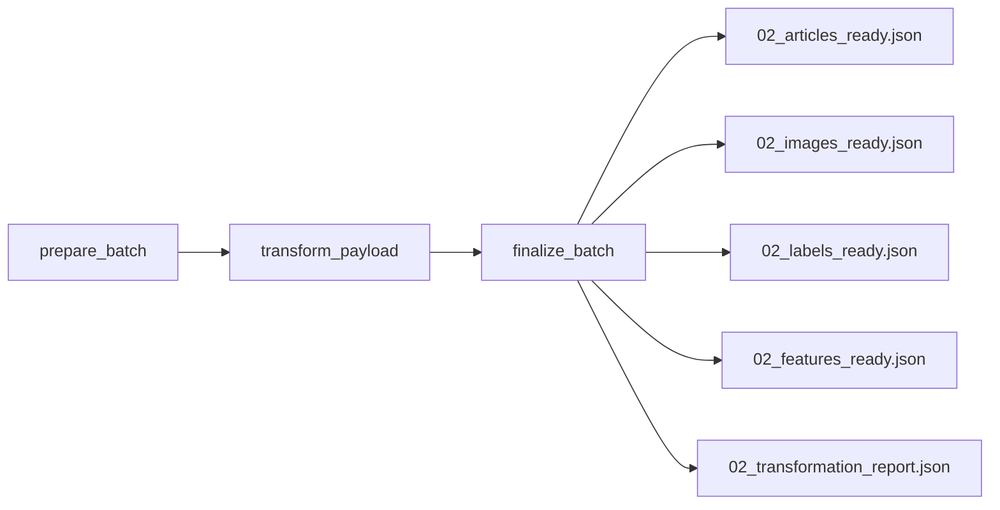

# DAG de transformation

## Objectif

Le DAG **`checkit_transform`** constitue la deuxième étape du pipeline **CheckIt.AI**.

Son rôle est de transformer les articles produits par le DAG d'extraction en un ensemble de collections directement compatibles avec le modèle relationnel PostgreSQL.

Contrairement au DAG d'extraction, cette étape ne collecte aucune nouvelle donnée. Elle restructure uniquement les informations déjà extraites afin de préparer leur chargement dans la base de données.

J'ai choisi de découper ce DAG en plusieurs tâches spécialisées afin de rendre son exécution plus lisible dans Airflow, de simplifier les reprises sur erreur et de limiter les échanges de données entre les tâches.

Comme pour le DAG d'extraction, les données métier volumineuses restent dans le dossier partagé du lot. Seuls des manifestes légers sont échangés via les XCom. :contentReference[oaicite:0]{index=0}

---

## Responsabilités

Le DAG de transformation réalise les opérations suivantes :

- lecture des articles extraits ;
- contrôle du lot reçu ;
- transformation des articles vers les entités PostgreSQL ;
- validation de la cohérence des collections produites ;
- génération des différents fichiers JSON ;
- production du rapport de transformation.

Cette étape ne réalise aucun accès direct à PostgreSQL.

---

## Architecture

Le DAG est organisé en trois tâches principales.



Chaque tâche possède une responsabilité unique.

Cette organisation améliore la lisibilité du pipeline dans Airflow tout en facilitant la reprise d'une étape en cas d'erreur.

---

## Paramètres reçus

Le DAG reçoit les informations transmises par le DAG maître.

Les principaux paramètres utilisés sont :

| Paramètre | Description |
|------------|-------------|
| `batch_id` | identifiant unique du lot |
| `parent_dag_id` | identifiant du DAG maître |
| `parent_run_id` | identifiant de l'exécution du DAG maître |
| `logical_date` | date logique de l'exécution |
| `triggered_at` | date de déclenchement |
| `articles_file` | chemin du fichier d'entrée (optionnel) |

Lorsque le chemin du fichier d'entrée n'est pas fourni, le DAG utilise automatiquement :

```text
01_extracted_articles.json
```

présent dans le dossier partagé du lot. :contentReference[oaicite:1]{index=1}

---

## Étape 1 : préparation du lot

La première tâche prépare la transformation.

Elle réalise notamment :

- la récupération du `batch_id` ;
- la préparation du dossier partagé ;
- la recherche du fichier d'entrée ;
- la lecture des articles ;
- la vérification de la structure JSON ;
- le comptage des éventuels éléments ignorés.

Si aucun article exploitable n'est présent dans le fichier d'entrée, le DAG s'interrompt immédiatement.

À la fin de cette étape, seul un manifeste léger est transmis à la tâche suivante.

---

## Étape 2 : transformation des données

La deuxième tâche réalise la transformation principale.

Chaque article est converti vers le modèle relationnel utilisé par PostgreSQL grâce au **Database Transformer**.

Les informations sont réparties dans plusieurs collections :

- articles ;
- images ;
- labels ;
- caractéristiques (*features*).

Cette séparation permet de limiter la redondance des données et de respecter la structure de la base relationnelle.

Durant cette étape, plusieurs statistiques sont également calculées, notamment :

- le nombre d'articles transformés ;
- le nombre d'articles supprimés ;
- le nombre d'images téléchargées ;
- le nombre d'images valides ;
- le nombre d'images invalides ;
- le nombre d'images en attente ;
- le nombre de labels ;
- le nombre de caractéristiques ;
- le nombre d'articles multimodaux.

Les collections produites sont enregistrées dans un fichier intermédiaire temporaire avant leur validation complète. :contentReference[oaicite:2]{index=2}

---

## Validation des données

Avant de produire les fichiers définitifs, plusieurs contrôles sont réalisés.

Le DAG vérifie notamment :

- la présence de toutes les collections attendues ;
- le type de chaque collection ;
- la présence d'identifiants d'articles valides ;
- l'absence de références orphelines entre les différentes collections.

Ces contrôles permettent de détecter les incohérences avant toute tentative de chargement dans PostgreSQL.

---

## Étape 3 : finalisation

Une fois la transformation validée, la dernière tâche écrit les différents fichiers définitifs.

Chaque collection est enregistrée dans son propre fichier JSON.

Le document intermédiaire est ensuite supprimé afin de ne conserver que les fichiers nécessaires au reste du pipeline.

Cette étape génère également le rapport complet de transformation.

---

## Répertoire partagé

Les fichiers sont enregistrés dans le dossier partagé du lot.

```text
/opt/airflow/shared/lots/

└── <batch_id>/
```

Chaque lot possède ainsi son propre espace de travail.

Cette organisation simplifie les échanges entre les DAGs sans utiliser les XCom pour transporter les données métier.

---

## Fichiers produits

À la fin du DAG, cinq fichiers sont disponibles.

### Articles

```text
02_articles_ready.json
```

Contient les données destinées à la table **articles**.

---

### Images

```text
02_images_ready.json
```

Contient les données destinées à la table **images**.

---

### Labels

```text
02_labels_ready.json
```

Contient les données destinées à la table **article_labels**.

---

### Features

```text
02_features_ready.json
```

Contient les données destinées à la table **article_features**.

---

### Rapport

```text
02_transformation_report.json
```

Ce rapport contient notamment :

- le statut de la transformation ;
- le nombre d'articles en entrée ;
- le nombre d'articles produits ;
- le nombre d'articles supprimés ;
- le nombre d'éléments ignorés ;
- le nombre d'images ;
- le nombre d'images téléchargées ;
- le nombre d'images valides ;
- le nombre d'images invalides ;
- le nombre d'images en attente ;
- le nombre de labels ;
- le nombre de caractéristiques ;
- le nombre d'articles multimodaux ;
- les durées des différentes tâches ;
- les chemins des fichiers produits.

Il permet de suivre précisément le déroulement de la transformation.

---

## Gestion des erreurs

Le DAG interrompt immédiatement son exécution lorsqu'une erreur critique est détectée.

Par exemple :

- fichier d'entrée absent ;
- document JSON invalide ;
- structure incorrecte ;
- aucune donnée exploitable ;
- collection obligatoire manquante ;
- identifiants d'articles absents ;
- références orphelines entre les collections.

Cette stratégie garantit que seules des données cohérentes pourront être transmises au DAG de chargement.

---

## Communication entre les tâches

Les articles transformés ne transitent jamais dans les XCom.

J'ai choisi de transmettre uniquement un manifeste contenant :

- les chemins des fichiers ;
- les principaux compteurs ;
- les informations nécessaires à la tâche suivante.

Cette approche limite fortement la quantité de données stockées par Airflow et améliore les performances du pipeline.

---

## Avantages

Cette architecture présente plusieurs avantages.

- Les responsabilités sont clairement séparées.
- Les données sont adaptées au modèle relationnel PostgreSQL.
- Les contrôles de cohérence sont réalisés avant le chargement.
- Les références entre les différentes collections sont validées.
- Les statistiques de transformation sont produites automatiquement.
- Les données volumineuses restent dans le stockage partagé.
- Les fichiers intermédiaires sont supprimés une fois la transformation terminée.

---

## Résumé

Le DAG **`checkit_transform`** assure la transition entre les données extraites et le modèle relationnel PostgreSQL.

J'ai choisi de le découper en trois tâches spécialisées afin de distinguer la préparation du lot, la transformation des données et la finalisation des collections produites.

À l'issue de cette étape, le pipeline dispose de plusieurs fichiers JSON directement compatibles avec les différentes tables PostgreSQL ainsi que d'un rapport détaillé qui servira au DAG de chargement.