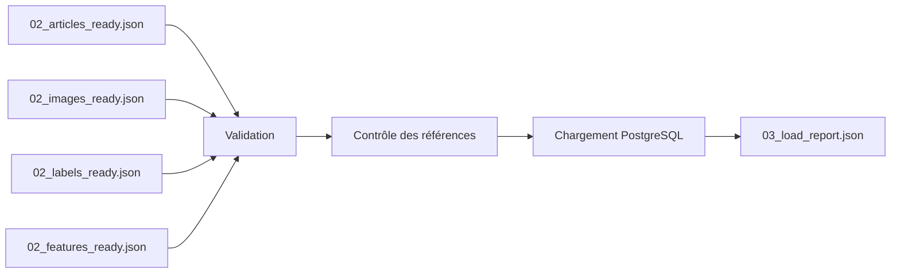
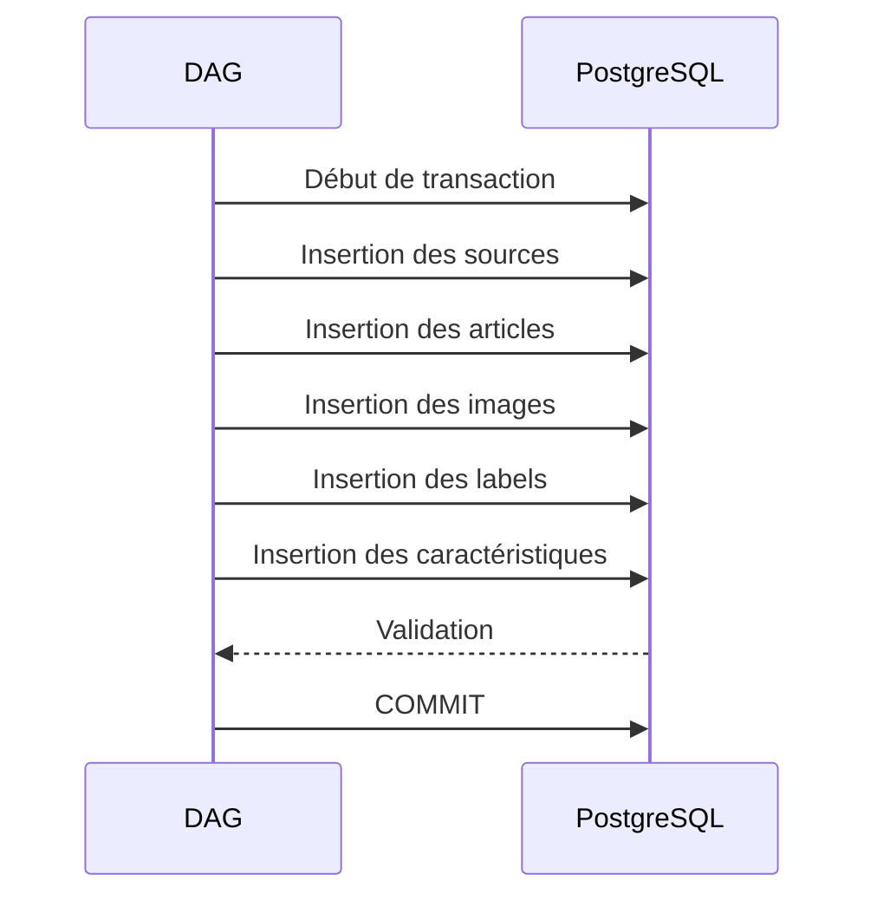

# DAG de chargement

## Objectif

Le DAG **`checkit_load`** constitue la troisième étape du pipeline CheckIt.AI.

Son rôle est d'insérer dans PostgreSQL les données produites par le DAG de transformation.

Avant toute insertion, le DAG réalise plusieurs contrôles de cohérence afin de garantir que les données respectent le modèle relationnel de la base.

Cette étape constitue le point de transition entre les fichiers intermédiaires du pipeline et le stockage définitif des données.

---

## Responsabilités

Le DAG de chargement réalise les opérations suivantes :

- lecture des fichiers produits par le DAG de transformation ;
- validation des structures JSON ;
- contrôle des références entre les différentes tables ;
- vérification des données avant insertion ;
- chargement transactionnel dans PostgreSQL ;
- génération du rapport de chargement.

Aucune transformation métier supplémentaire n'est réalisée durant cette étape.

---

## Architecture



---

## Entrées

Le DAG lit les fichiers présents dans le dossier partagé du lot.

```
/opt/airflow/shared/lots/<batch_id>/
```

Les fichiers utilisés sont :

```
02_articles_ready.json

02_images_ready.json

02_labels_ready.json

02_features_ready.json
```

Ces fichiers sont produits par le DAG de transformation.

---

## Validation des structures

Avant toute insertion, chaque fichier est contrôlé.

Les vérifications portent notamment sur :

- la présence des champs obligatoires ;
- le type des données ;
- la validité des structures JSON ;
- la cohérence des listes d'enregistrements.

Cette étape permet de détecter rapidement une erreur de transformation.

---

## Contrôle des références

Le DAG vérifie ensuite la cohérence des relations entre les différentes structures.

Par exemple :

- chaque image doit référencer un article existant ;
- chaque label doit être associé à un article ;
- chaque caractéristique doit appartenir à un article valide.

Ces contrôles garantissent que les contraintes d'intégrité de PostgreSQL pourront être respectées.

---

## Chargement transactionnel

Le chargement est réalisé à l'intérieur d'une transaction PostgreSQL.

Le principe est le suivant :



Si une erreur survient pendant le chargement :

- la transaction est annulée ;
- aucune donnée partielle n'est conservée ;
- le pipeline s'interrompt.

Cette stratégie garantit la cohérence de la base de données.

---

## Alimentation des tables

Le DAG alimente successivement les principales tables du schéma relationnel.

| Table | Contenu |
|---------|----------|
| sources | Référentiel des sources de données |
| pipeline_runs | Informations sur l'exécution du pipeline |
| articles | Contenu textuel des articles |
| images | Informations techniques des images |
| article_labels | Labels et annotations |
| article_features | Caractéristiques calculées |

Chaque insertion respecte les contraintes de clés étrangères définies dans PostgreSQL.

---

## Rapport de chargement

À la fin du traitement, le DAG génère :

```
03_load_report.json
```

Ce rapport contient notamment :

- l'identifiant du lot ;
- l'identifiant de l'exécution PostgreSQL ;
- le nombre d'articles chargés ;
- le nombre d'images ;
- le nombre de labels ;
- le nombre de caractéristiques ;
- les éventuelles erreurs rencontrées.

Ce document sera utilisé par le DAG de contrôle qualité.

---

## Gestion des erreurs

Le DAG interrompt immédiatement son exécution lorsqu'une erreur critique est détectée.

Les principales causes d'échec sont :

- fichier JSON absent ;
- structure invalide ;
- référence incohérente ;
- violation d'une contrainte PostgreSQL ;
- erreur de connexion à la base de données.

Dans chacun de ces cas, la transaction est annulée afin d'éviter toute insertion partielle.

---

## Sorties

Le DAG produit uniquement un rapport d'exécution.

```
03_load_report.json
```

Toutes les données métier sont désormais stockées dans PostgreSQL.

Le DAG suivant interrogera directement la base de données pour calculer les indicateurs de qualité.

---

## Avantages

Le chargement est volontairement isolé dans un DAG spécifique.

Cette organisation présente plusieurs avantages :

- séparation claire entre transformation et stockage ;
- validation avant insertion ;
- intégrité référentielle garantie ;
- transactions atomiques ;
- possibilité de relancer uniquement le chargement en cas d'échec ;
- suivi précis des performances d'insertion.

---

## Résumé

Le DAG de chargement assure l'insertion des données préparées dans PostgreSQL.

Grâce aux validations réalisées avant l'insertion et au chargement transactionnel, il garantit la cohérence de la base de données et constitue la dernière étape de stockage avant le contrôle qualité.