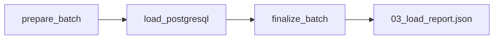

# DAG de chargement

## Objectif

Le DAG **`checkit_load`** constitue la troisième étape du pipeline **CheckIt.AI**.

Son rôle est de charger dans PostgreSQL les différentes collections produites par le DAG de transformation.

Contrairement au DAG précédent, cette étape ne modifie plus les données métier. Elle vérifie leur cohérence, prépare les métadonnées d'exécution, réalise le chargement dans PostgreSQL puis génère un rapport détaillé.

J'ai choisi de séparer complètement cette étape du reste du pipeline afin de distinguer clairement la transformation des données de leur stockage définitif.

Comme pour les autres DAGs, les données volumineuses restent dans le dossier partagé du lot. Seuls des manifestes légers sont échangés entre les tâches via les XCom. :contentReference[oaicite:0]{index=0}

---

## Responsabilités

Le DAG de chargement réalise les opérations suivantes :

- lecture des collections produites par le DAG de transformation ;
- validation des structures JSON ;
- contrôle de la cohérence des données ;
- validation des relations entre les différentes collections ;
- préparation des métadonnées du pipeline ;
- chargement dans PostgreSQL ;
- génération du rapport de chargement.

Aucune transformation métier supplémentaire n'est réalisée durant cette étape.

---

## Architecture

Le DAG est organisé en trois tâches principales.



Chaque tâche possède une responsabilité unique.

Cette organisation améliore la lisibilité du pipeline et facilite les reprises en cas d'échec.

---

## Paramètres reçus

Le DAG reçoit les informations transmises par le DAG maître.

Les principaux paramètres utilisés sont :

| Paramètre | Description |
|------------|-------------|
| `batch_id` | identifiant unique du lot |
| `parent_dag_id` | identifiant du DAG maître |
| `parent_run_id` | identifiant de l'exécution |
| `logical_date` | date logique |
| `triggered_at` | date de déclenchement |
| `articles_file` | chemin des articles (optionnel) |
| `images_file` | chemin des images (optionnel) |
| `labels_file` | chemin des labels (optionnel) |
| `features_file` | chemin des caractéristiques (optionnel) |

Lorsque ces chemins ne sont pas fournis, le DAG utilise automatiquement les fichiers présents dans le dossier partagé du lot. :contentReference[oaicite:1]{index=1}

---

## Fichiers utilisés

Le DAG lit les fichiers produits par le DAG de transformation.

```text
02_articles_ready.json

02_images_ready.json

02_labels_ready.json

02_features_ready.json

02_transformation_report.json
```

Lorsque le rapport d'extraction est disponible, il est également utilisé afin de compléter les statistiques du pipeline.

---

## Étape 1 : préparation du lot

La première tâche prépare le chargement.

Elle réalise notamment :

- la récupération du lot partagé ;
- la lecture des différentes collections ;
- la lecture des rapports précédents ;
- la validation des identifiants de lot ;
- la vérification des références entre les collections ;
- la validation des statuts des images ;
- le calcul de plusieurs indicateurs.

Les différentes statistiques calculées concernent notamment :

- le nombre d'articles ;
- le nombre d'images ;
- le nombre d'images téléchargées ;
- le nombre d'images valides ;
- le nombre d'images invalides ;
- le nombre d'images en attente ;
- le nombre de labels ;
- le nombre de caractéristiques.

À la fin de cette étape, seul un manifeste léger est transmis à la tâche suivante.

---

## Validation des données

Avant tout chargement, plusieurs contrôles sont réalisés.

Le DAG vérifie notamment :

- la présence des articles ;
- l'unicité des identifiants ;
- la présence des champs obligatoires ;
- les références entre les différentes collections ;
- la cohérence des statuts des images ;
- la correspondance des identifiants de lot présents dans les rapports.

Ces contrôles permettent de détecter une incohérence avant toute écriture dans PostgreSQL.

---

## Préparation des métadonnées

Avant le chargement, le DAG construit également un ensemble de métadonnées décrivant l'exécution du pipeline.

Ces informations comprennent notamment :

- le nombre d'articles extraits ;
- le nombre d'articles transformés ;
- le nombre d'articles rejetés ;
- les statistiques des images ;
- les temps d'exécution des étapes précédentes ;
- différents indicateurs techniques.

Ces métadonnées seront enregistrées dans PostgreSQL afin d'assurer le suivi des exécutions du pipeline.

---

## Étape 2 : chargement PostgreSQL

La deuxième tâche réalise le chargement des collections dans PostgreSQL.

Les données sont transmises au service de chargement qui se charge d'insérer les différentes entités dans les tables correspondantes.

Le chargement concerne notamment :

- les articles ;
- les images ;
- les labels ;
- les caractéristiques.

Le service retourne ensuite un résumé contenant :

- l'identifiant de l'exécution du pipeline ;
- le statut du chargement ;
- le nombre d'articles insérés ;
- le nombre d'images insérées ;
- le nombre de labels insérés ;
- le nombre de caractéristiques insérées.

Ces informations sont enregistrées dans un fichier intermédiaire utilisé par la dernière tâche. :contentReference[oaicite:2]{index=2}

---

## Étape 3 : finalisation

La dernière tâche produit le rapport définitif du chargement.

Elle :

- relit le résultat intermédiaire ;
- construit le rapport final ;
- calcule les durées d'exécution ;
- rassemble les statistiques du chargement ;
- supprime le fichier intermédiaire devenu inutile.

À la fin de cette étape, seul le rapport définitif est conservé.

---

## Rapport de chargement

Le DAG génère le fichier suivant.

```text
03_load_report.json
```

Ce rapport contient notamment :

- l'identifiant du lot ;
- l'identifiant de l'exécution PostgreSQL ;
- le statut du chargement ;
- les nombres d'articles, d'images, de labels et de caractéristiques ;
- les statistiques détaillées des images ;
- les métadonnées du pipeline ;
- les durées des différentes tâches.

Ce rapport servira ensuite au DAG de contrôle qualité.

---

## Gestion des erreurs

Le DAG interrompt immédiatement son exécution lorsqu'une erreur critique est détectée.

Par exemple :

- fichier JSON absent ;
- structure JSON invalide ;
- identifiants dupliqués ;
- références orphelines ;
- statuts d'images incohérents ;
- identifiant de lot incorrect ;
- erreur retournée par le service PostgreSQL.

Cette stratégie garantit que seules des données cohérentes sont chargées dans la base.

---

## Communication entre les tâches

Les collections complètes ne transitent jamais dans les XCom.

J'ai choisi d'échanger uniquement un manifeste contenant :

- les chemins des fichiers ;
- les principaux compteurs ;
- les identifiants nécessaires au suivi du pipeline.

Cette approche limite fortement la quantité de données stockées par Airflow tout en améliorant les performances du pipeline.

---

## Sorties

À l'issue du DAG, les données sont stockées dans PostgreSQL.

Le seul fichier produit est :

```text
03_load_report.json
```

Il constitue l'entrée principale du DAG de contrôle qualité.

---

## Avantages

Cette architecture présente plusieurs avantages.

- Le stockage est totalement séparé de la transformation.
- Les données sont contrôlées avant leur insertion.
- Les références entre collections sont vérifiées.
- Les statistiques d'exécution sont centralisées.
- Les métadonnées du pipeline sont enregistrées.
- Les fichiers intermédiaires sont automatiquement supprimés.
- Les échanges entre les tâches restent très légers.

---

## Résumé

Le DAG **`checkit_load`** assure la transition entre les fichiers produits par le pipeline et leur stockage définitif dans PostgreSQL.

J'ai choisi de le découper en trois tâches spécialisées afin de distinguer la préparation du lot, le chargement dans la base de données et la génération du rapport final.

À l'issue de cette étape, les données sont enregistrées dans PostgreSQL, les métadonnées du pipeline sont sauvegardées et un rapport complet est produit pour alimenter le DAG de contrôle qualité.