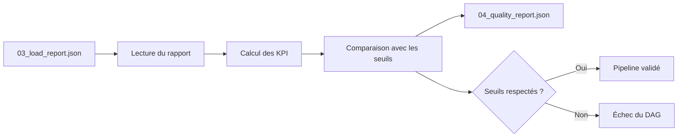

# DAG de contrôle qualité

## Objectif

Le DAG **`checkit_quality`** constitue la dernière étape du pipeline CheckIt.AI.

Son rôle est d'évaluer la qualité des données chargées dans PostgreSQL en calculant différents indicateurs de performance (KPI) et en les comparant à des seuils prédéfinis.

Contrairement aux étapes précédentes, ce DAG ne modifie aucune donnée. Il analyse uniquement les informations présentes dans la base afin de déterminer si le lot satisfait les exigences de qualité fixées par le projet.

---

## Responsabilités

Le DAG de contrôle qualité réalise les opérations suivantes :

- lecture du rapport de chargement ;
- récupération des informations de l'exécution du pipeline ;
- calcul des indicateurs de qualité ;
- comparaison avec les seuils définis ;
- génération d'un rapport qualité ;
- validation ou rejet du lot.

Le DAG intervient uniquement après le chargement complet des données dans PostgreSQL.

---

## Architecture



---

## Entrées

Le DAG utilise principalement deux sources d'information.

### Rapport de chargement

```
03_load_report.json
```

Ce document fournit notamment :

- l'identifiant du lot ;
- l'identifiant de l'exécution PostgreSQL ;
- les informations générales sur le chargement.

---

### Base PostgreSQL

Les indicateurs sont calculés directement à partir des tables de la base de données.

Les principales tables interrogées sont :

- pipeline_runs ;
- articles ;
- images ;
- article_labels ;
- article_features ;
- sources.

Le calcul des KPI repose donc sur les données réellement chargées et non sur les fichiers intermédiaires du pipeline.

---

## Calcul des indicateurs

Le DAG calcule plusieurs indicateurs permettant d'évaluer la qualité globale du lot.

Parmi les principaux KPI :

- nombre total d'articles ;
- nombre d'articles valides ;
- nombre d'images valides ;
- nombre d'images invalides ;
- nombre de labels ;
- nombre de caractéristiques calculées ;
- répartition des langues ;
- répartition des sources.

Des pourcentages sont également calculés afin de faciliter l'interprétation des résultats.

---

## Contrôle des seuils

Chaque indicateur est comparé à une valeur minimale ou maximale définie dans la configuration du pipeline.

Les principaux seuils sont les suivants.

| Contrôle | Objectif |
|----------|----------|
| Nombre minimal d'articles | éviter un lot vide |
| Taux minimal d'articles valides | garantir la qualité globale |
| Taux maximal de titres manquants | assurer la qualité documentaire |
| Taux maximal de contenu manquant | garantir la richesse des données |
| Taux maximal de doublons | limiter les redondances |
| Taux maximal d'images invalides | garantir le caractère multimodal |

Ces seuils peuvent être adaptés sans modifier le fonctionnement du DAG.

---

## Exemple de calcul

Le taux d'articles valides est calculé selon la formule suivante :

```text
Articles valides
──────────────────────── × 100
Nombre total d'articles
```

Le même principe est appliqué aux autres indicateurs.

Cette approche permet de comparer facilement plusieurs lots indépendamment de leur taille.

---

## Rapport qualité

À la fin du traitement, le DAG génère :

```
04_quality_report.json
```

Ce rapport contient :

- les indicateurs calculés ;
- les seuils utilisés ;
- le résultat des contrôles ;
- les éventuelles violations détectées ;
- la date de génération.

Il constitue le document de référence permettant d'évaluer la qualité d'un lot.

---

## Gestion des erreurs

Lorsque l'un des seuils n'est pas respecté, le DAG est volontairement interrompu.

Par exemple :

- nombre d'articles insuffisant ;
- trop de contenus manquants ;
- trop de doublons ;
- taux d'images invalides supérieur au seuil autorisé.

Le pipeline est alors considéré comme non conforme.

Cette stratégie permet d'éviter qu'un jeu de données de mauvaise qualité soit utilisé pour entraîner ou évaluer des modèles d'intelligence artificielle.

---

## Sorties

Le DAG produit le fichier suivant :

```
04_quality_report.json
```

Ce document synthétise l'ensemble des indicateurs de qualité calculés au cours du traitement.

---

## Avantages

Le contrôle qualité constitue une étape essentielle du pipeline.

Il permet notamment :

- d'évaluer objectivement la qualité des données ;
- de détecter rapidement les anomalies ;
- de suivre l'évolution de la qualité au fil des exécutions ;
- de produire des indicateurs exploitables ;
- de garantir la fiabilité du jeu de données final.

---

## Résumé

Le DAG **`checkit_quality`** clôt le pipeline CheckIt.AI en évaluant la qualité des données stockées dans PostgreSQL.

Grâce au calcul automatique de plusieurs indicateurs et à la comparaison avec des seuils configurables, il garantit que seuls les lots respectant les exigences du projet sont considérés comme conformes.

Cette étape constitue un mécanisme de validation essentiel avant toute exploitation des données par les futurs modèles d'intelligence artificielle.