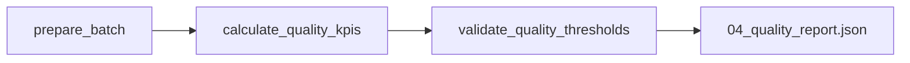

# DAG de contrôle qualité

## Objectif

Le DAG **`checkit_quality`** constitue la dernière étape du pipeline **CheckIt.AI**.

Son rôle est d'évaluer la qualité des données chargées dans PostgreSQL en calculant différents indicateurs (KPI), puis de comparer ces résultats aux seuils de qualité définis pour le pipeline.

Contrairement aux étapes précédentes, ce DAG ne modifie aucune donnée métier. Il analyse uniquement les informations présentes dans PostgreSQL afin de déterminer si le lot respecte les exigences de qualité du projet.

J'ai choisi de séparer cette étape du reste du pipeline afin d'isoler complètement les contrôles qualité des traitements d'acquisition, de transformation et de chargement.

Comme pour les autres DAGs, les données volumineuses restent dans le dossier partagé du lot. Seuls les identifiants, les chemins des fichiers et quelques manifestes légers transitent via les XCom. :contentReference[oaicite:0]{index=0}

---

## Responsabilités

Le DAG de contrôle qualité réalise les opérations suivantes :

- lecture du rapport de chargement ;
- récupération de l'identifiant d'exécution PostgreSQL ;
- calcul des indicateurs de qualité ;
- comparaison des résultats avec les seuils configurés ;
- génération du rapport qualité ;
- validation ou rejet du lot.

Cette étape intervient uniquement une fois le chargement PostgreSQL terminé.

---

## Architecture

Le DAG est organisé en trois tâches principales.



Chaque tâche possède une responsabilité bien définie.

Cette organisation facilite la lecture des traitements dans Airflow et permet d'identifier rapidement l'étape responsable d'une éventuelle erreur.

---

## Paramètres reçus

Le DAG reçoit les informations transmises par le DAG maître.

Les principaux paramètres utilisés sont :

| Paramètre | Description |
|------------|-------------|
| `batch_id` | identifiant unique du lot |
| `parent_dag_id` | identifiant du DAG maître |
| `parent_run_id` | identifiant de l'exécution |
| `logical_date` | date logique |
| `triggered_at` | date de déclenchement |
| `quality_thresholds` | seuils qualité à appliquer |

Lorsque les seuils ne sont pas explicitement fournis, le DAG utilise automatiquement ses seuils de qualité par défaut. :contentReference[oaicite:1]{index=1}

---

## Sources utilisées

Le DAG exploite deux sources d'information.

### Rapport de chargement

Le rapport produit par le DAG précédent :

```text
03_load_report.json
```

Ce document fournit notamment :

- l'identifiant du lot ;
- l'identifiant de l'exécution PostgreSQL (`pipeline_run_id`) ;
- le statut du chargement.

---

### Base PostgreSQL

Les indicateurs sont calculés directement à partir des données présentes dans PostgreSQL.

Le DAG interroge notamment les tables :

- `pipeline_runs` ;
- `articles` ;
- `images` ;
- `article_labels` ;
- `article_features` ;
- `sources`.

Les KPI reposent donc sur les données réellement enregistrées dans la base et non sur les fichiers intermédiaires du pipeline.

---

## Étape 1 : préparation du lot

La première tâche prépare le contrôle qualité.

Elle réalise notamment :

- la lecture du rapport de chargement ;
- la vérification de l'identifiant du lot ;
- la récupération du `pipeline_run_id` ;
- le contrôle du statut du chargement ;
- le chargement des seuils qualité.

Si le chargement précédent n'est pas terminé avec succès, le contrôle qualité est immédiatement interrompu.

À la fin de cette étape, un manifeste léger est transmis à la tâche suivante.

---

## Étape 2 : calcul des KPI

La deuxième tâche interroge PostgreSQL afin de calculer l'ensemble des indicateurs de qualité.

Les principaux indicateurs calculés concernent :

### Articles

- nombre total d'articles ;
- nombre d'articles valides ;
- nombre de titres manquants ;
- nombre de contenus manquants ;
- nombre d'URL canoniques manquantes ;
- nombre de langues manquantes ;
- nombre d'URL dupliquées.

### Images

- nombre total d'images ;
- nombre d'images valides ;
- nombre d'images invalides ;
- nombre d'images sans statut ;
- nombre d'images sans fichier local.

### Labels

- nombre de labels ;
- nombre de labels de vérité terrain (*ground truth*).

### Caractéristiques

- nombre total de caractéristiques ;
- nombre d'articles identifiés comme multimodaux.

Le DAG calcule également plusieurs répartitions, notamment :

- la distribution des langues ;
- la répartition des sources.

Enfin, différents taux sont calculés automatiquement afin de faciliter les comparaisons entre plusieurs lots.

Le rapport intermédiaire est ensuite enregistré dans :

```text
04_quality_report.json
```

avec l'ensemble des métriques calculées. :contentReference[oaicite:2]{index=2}

---

## Calcul des taux

À partir des compteurs calculés, plusieurs indicateurs sont produits automatiquement.

Parmi eux :

- taux d'articles valides ;
- taux de titres manquants ;
- taux de contenus manquants ;
- taux d'URL dupliquées ;
- taux d'articles possédant une image ;
- taux d'images valides ;
- taux d'images invalides ;
- taux d'images sans statut ;
- taux d'articles annotés ;
- taux de labels de vérité terrain ;
- taux d'articles multimodaux.

Ces indicateurs facilitent le suivi de la qualité des données au fil des exécutions du pipeline.

---

## Étape 3 : validation des seuils

La dernière tâche compare les indicateurs calculés avec les seuils de qualité configurés.

Les principaux contrôles portent sur :

| Contrôle | Objectif |
|----------|----------|
| Nombre minimal d'articles | éviter un lot vide |
| Taux minimal d'articles valides | garantir la qualité globale |
| Taux maximal de titres manquants | assurer la qualité documentaire |
| Taux maximal de contenus manquants | garantir des données exploitables |
| Taux maximal d'URL dupliquées | limiter les doublons |
| Taux maximal d'images invalides | garantir la qualité multimodale |

Chaque violation détectée est enregistrée dans le rapport qualité.

Lorsque tous les seuils sont respectés, le lot est déclaré conforme.

---

## Rapport qualité

Le DAG produit le fichier suivant.

```text
04_quality_report.json
```

Ce rapport contient notamment :

- l'identifiant du lot ;
- l'identifiant de l'exécution PostgreSQL ;
- le statut du contrôle qualité ;
- l'ensemble des KPI calculés ;
- les taux associés ;
- les seuils utilisés ;
- les éventuelles violations détectées ;
- les durées des différentes tâches.

Ce document constitue la synthèse finale de la qualité du lot.

---

## Gestion des erreurs

Le DAG interrompt volontairement son exécution lorsqu'une erreur critique est détectée.

Par exemple :

- rapport de chargement absent ;
- `pipeline_run_id` manquant ;
- rapport appartenant à un autre lot ;
- seuil de qualité invalide ;
- métriques incohérentes ;
- seuil de qualité non respecté.

Lorsqu'un ou plusieurs contrôles échouent, les violations sont enregistrées dans le rapport qualité avant que le DAG ne soit interrompu.

Cette stratégie permet d'empêcher qu'un lot non conforme soit considéré comme valide.

---

## Communication entre les tâches

Les métriques détaillées ne transitent jamais directement dans les XCom.

J'ai choisi de transmettre uniquement :

- l'identifiant du lot ;
- l'identifiant de l'exécution PostgreSQL ;
- les seuils utilisés ;
- les chemins des fichiers ;
- quelques indicateurs synthétiques.

Cette approche limite la quantité de données échangées entre les tâches tout en conservant un suivi complet du pipeline.

---

## Sorties

À l'issue du traitement, le DAG produit un unique fichier :

```text
04_quality_report.json
```

Ce document constitue le rapport final du pipeline.

Il rassemble l'ensemble des indicateurs de qualité calculés ainsi que le résultat des différents contrôles.

---

## Avantages

Cette architecture présente plusieurs avantages.

- Les contrôles qualité sont totalement indépendants des traitements métier.
- Les KPI sont calculés directement depuis PostgreSQL.
- Les seuils peuvent être modifiés sans modifier le code du DAG.
- Les violations sont clairement identifiées.
- Les indicateurs sont comparables d'un lot à l'autre.
- Le rapport final centralise toutes les informations relatives à la qualité du pipeline.

---

## Résumé

Le DAG **`checkit_quality`** clôt le pipeline **CheckIt.AI** en évaluant objectivement la qualité des données enregistrées dans PostgreSQL.

J'ai choisi de le découper en trois tâches spécialisées afin de distinguer la préparation du contrôle, le calcul des indicateurs et la validation des seuils.

À l'issue de cette étape, le pipeline dispose d'un rapport complet décrivant les performances du lot ainsi que les éventuelles violations détectées, garantissant que seules des données conformes pourront être exploitées pour les traitements ultérieurs.