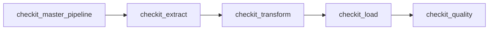
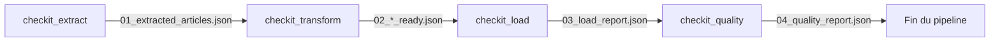

# Communication entre les DAGs

## Objectif

Le pipeline CheckIt.AI est composé de plusieurs DAGs indépendants qui s'exécutent successivement. Afin de limiter le couplage entre les différentes étapes, les DAGs ne communiquent jamais directement entre eux.

Les échanges sont réalisés à l'aide :

- d'un identifiant de lot commun (`batch_id`) ;
- d'un dossier partagé contenant les fichiers intermédiaires ;
- de la configuration transmise lors du déclenchement des DAGs.

Cette architecture permet de conserver des traitements indépendants tout en assurant la continuité du pipeline.

---

## Principe général

Le DAG maître initialise une nouvelle exécution du pipeline.

Il génère un identifiant de lot unique qui sera utilisé par l'ensemble des DAGs pour retrouver les fichiers produits par les étapes précédentes.

Le principe est illustré ci-dessous.



Le DAG maître attend la fin de chaque étape avant de déclencher la suivante.

---

## Identifiant de lot

Chaque exécution du pipeline possède un identifiant unique appelé **batch_id**.

Cet identifiant est dérivé du `run_id` du DAG maître puis normalisé afin d'être compatible avec le système de fichiers.

Exemple :

```text
manual__2026-07-15T08_31_32_412871_00_00
```

Le même identifiant est transmis à tous les DAGs via `dag_run.conf`.

Cette approche garantit que l'ensemble des traitements d'un même pipeline utilisent exactement le même espace de travail.

---

## Répertoire partagé

Toutes les données intermédiaires sont stockées dans un répertoire commun.

```text
/opt/airflow/shared/lots/

└── <batch_id>/
```

Chaque lot possède ainsi son propre dossier.

Exemple :

```text
/opt/airflow/shared/lots/

└── manual__2026-07-15T08_31_32_412871_00_00/
```

Cette organisation permet de conserver un historique complet des exécutions tout en évitant les conflits entre plusieurs pipelines.

---

## Cycle de vie des fichiers

Chaque DAG produit les fichiers nécessaires au DAG suivant.



Chaque étape ne lit que les fichiers produits par l'étape précédente.

---

## Fichiers produits

Le tableau suivant résume les principaux fichiers échangés entre les DAGs.

| Étape | Fichiers produits | Utilisés par |
|--------|-------------------|--------------|
| Extraction | `01_extracted_articles.json` | Transformation |
| Extraction | `01_extraction_report.json` | Transformation |
| Transformation | `02_articles_ready.json` | Chargement |
| Transformation | `02_images_ready.json` | Chargement |
| Transformation | `02_labels_ready.json` | Chargement |
| Transformation | `02_features_ready.json` | Chargement |
| Transformation | `02_transformation_report.json` | Chargement |
| Chargement | `03_load_report.json` | Contrôle qualité |
| Contrôle qualité | `04_quality_report.json` | Exploitation |

Chaque fichier représente l'état du lot à une étape donnée du pipeline.

---

## Configuration transmise

En plus des fichiers, le DAG maître transmet une configuration commune à tous les DAGs.

Les principaux paramètres sont :

| Paramètre | Description |
|------------|-------------|
| `batch_id` | Identifiant unique du lot |
| `parent_run_id` | Identifiant du pipeline maître |
| `execution_date` | Date logique du pipeline |
| `extractors` | Liste des extracteurs à utiliser |
| `require_image` | Indique si une image valide est obligatoire |
| `quality_thresholds` | Seuils utilisés lors du contrôle qualité |

Cette configuration est accessible depuis chaque DAG grâce à `dag_run.conf`.

---

## Pourquoi ne pas utiliser XCom ?

Airflow propose un mécanisme de communication appelé **XCom**, permettant de transmettre de petites quantités de données entre tâches.

Dans le cadre de CheckIt.AI, ce mécanisme n'a pas été retenu pour transporter les articles, car les lots peuvent contenir plusieurs dizaines ou centaines d'objets JSON ainsi que des informations multimodales.

Le stockage des fichiers dans un dossier partagé présente plusieurs avantages :

- aucune limitation liée à la taille des messages ;
- meilleure lisibilité des données produites ;
- possibilité de réutiliser un lot sans relancer l'extraction ;
- conservation des fichiers pour le débogage ;
- séparation claire entre orchestration et données métier.

Les XCom sont uniquement utilisés pour transmettre des informations légères, comme des manifestes ou des métadonnées d'exécution.

---

## Avantages de cette architecture

Cette stratégie de communication présente plusieurs bénéfices.

- Les DAGs restent totalement indépendants.
- Chaque étape peut être relancée individuellement.
- Les fichiers intermédiaires facilitent le diagnostic des erreurs.
- Les données sont conservées tout au long du pipeline.
- Les traitements peuvent évoluer sans modifier les autres DAGs.
- Plusieurs lots peuvent être exécutés successivement sans interférence.

---

## Résumé

Les DAGs de CheckIt.AI communiquent grâce à un identifiant de lot partagé et à un répertoire commun contenant les fichiers intermédiaires.

Cette architecture limite le couplage entre les différentes étapes, facilite la maintenance du pipeline et garantit la reproductibilité de chaque exécution. Elle constitue un élément central de l'organisation du projet en assurant la circulation des données de manière simple, robuste et traçable.