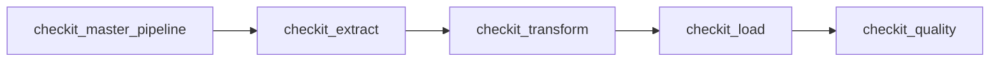
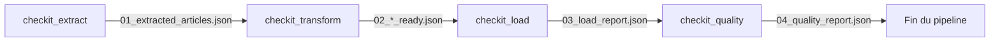

# Communication entre les DAGs

## Objectif

Le pipeline **CheckIt.AI** est constitué de plusieurs DAGs spécialisés qui s'exécutent successivement.

J'ai choisi de rendre ces DAGs aussi indépendants que possible. Ils ne communiquent donc jamais directement entre eux.

Les échanges reposent uniquement sur trois mécanismes :

- un identifiant de lot partagé (`batch_id`) ;
- un dossier partagé contenant les fichiers produits par chaque étape ;
- une configuration transmise lors du déclenchement des DAGs.

Cette architecture limite le couplage entre les différentes étapes tout en garantissant la continuité du pipeline. :contentReference[oaicite:0]{index=0} :contentReference[oaicite:1]{index=1}

---

## Principe général

Le DAG maître déclenche successivement les quatre DAGs spécialisés.

Chaque DAG attend la fin complète de l'étape précédente avant de commencer son exécution.



Cette exécution séquentielle garantit que chaque étape travaille uniquement sur des données déjà validées.

---

## Identifiant de lot

Chaque exécution du pipeline possède un identifiant unique appelé **`batch_id`**.

Le DAG maître transmet cet identifiant à tous les DAGs via `dag_run.conf`.

Au début de chaque DAG, cet identifiant est normalisé afin de produire un nom de dossier compatible avec le système de fichiers.

Par exemple :

```text
manual__2026-07-15T08_31_32.412871+00:00
```

devient :

```text
manual__2026-07-15T08_31_32_412871_00_00
```

Tous les DAGs utilisent ensuite exactement ce même identifiant pour retrouver les fichiers du lot courant. :contentReference[oaicite:2]{index=2} :contentReference[oaicite:3]{index=3} :contentReference[oaicite:4]{index=4} :contentReference[oaicite:5]{index=5}

---

## Répertoire partagé

Toutes les données intermédiaires sont stockées dans un dossier partagé.

```text
/opt/airflow/shared/lots/

└── <batch_id>/
```

Chaque exécution possède ainsi son propre espace de travail.

Par exemple :

```text
/opt/airflow/shared/lots/

└── manual__2026-07-15T08_31_32_412871_00_00/
```

Les DAGs n'échangent donc jamais directement les articles. Ils lisent uniquement les fichiers présents dans ce dossier partagé.

Cette organisation facilite également le diagnostic des erreurs puisqu'il est possible de retrouver facilement l'ensemble des fichiers produits par une exécution.

---

## Cycle de vie des fichiers

Chaque DAG produit les fichiers nécessaires à l'étape suivante.



Chaque étape lit uniquement les fichiers produits par le DAG précédent.

Cette organisation garantit une séparation claire entre les différentes responsabilités du pipeline.

---

## Fichiers intermédiaires

Au cours de certaines étapes, des fichiers temporaires sont également utilisés.

Par exemple :

```text
00_raw_extracted_articles.json

00_raw_extraction_report.json

02_transformed_payload.tmp.json

03_load_result.tmp.json
```

Ces fichiers servent uniquement pendant l'exécution d'un DAG.

Une fois la finalisation terminée avec succès, ils sont automatiquement supprimés afin de ne conserver que les fichiers utiles au reste du pipeline. :contentReference[oaicite:6]{index=6} :contentReference[oaicite:7]{index=7} :contentReference[oaicite:8]{index=8}

---

## Fichiers échangés entre les DAGs

Les principaux fichiers produits sont les suivants.

| Étape | Fichiers produits | Utilisés par |
|--------|-------------------|--------------|
| Extraction | `01_extracted_articles.json` | Transformation |
| Extraction | `01_extraction_report.json` | Chargement |
| Transformation | `02_articles_ready.json` | Chargement |
| Transformation | `02_images_ready.json` | Chargement |
| Transformation | `02_labels_ready.json` | Chargement |
| Transformation | `02_features_ready.json` | Chargement |
| Transformation | `02_transformation_report.json` | Chargement |
| Chargement | `03_load_report.json` | Contrôle qualité |
| Contrôle qualité | `04_quality_report.json` | Exploitation des résultats |

Chaque fichier représente l'état du lot à une étape précise du pipeline.

---

## Configuration transmise

En plus des fichiers, le DAG maître transmet une configuration commune via `dag_run.conf`.

Les principaux paramètres sont :

| Paramètre | Description |
|------------|-------------|
| `batch_id` | identifiant unique du lot |
| `parent_dag_id` | identifiant du DAG maître |
| `parent_run_id` | identifiant de l'exécution du DAG maître |
| `logical_date` | date logique de l'exécution |
| `triggered_at` | date de déclenchement |

Certains DAGs reçoivent également des paramètres spécifiques.

Par exemple :

| Paramètre | Utilisé par |
|------------|-------------|
| `extractors` | DAG d'extraction |
| `require_image` | DAG d'extraction |
| `quality_thresholds` | DAG de contrôle qualité |
| `articles_file` | DAG de transformation ou de chargement |
| `images_file` | DAG de chargement |
| `labels_file` | DAG de chargement |
| `features_file` | DAG de chargement |

Cette approche permet à chaque DAG de recevoir uniquement les informations dont il a réellement besoin. :contentReference[oaicite:9]{index=9} :contentReference[oaicite:10]{index=10} :contentReference[oaicite:11]{index=11} :contentReference[oaicite:12]{index=12}

---

## Pourquoi ne pas utiliser les XCom ?

Airflow propose un mécanisme appelé **XCom** permettant de transmettre des données entre les tâches.

J'ai choisi de ne jamais utiliser les XCom pour transporter les articles ou les collections JSON.

En effet, un lot peut contenir plusieurs milliers d'articles, des informations multimodales et plusieurs fichiers volumineux.

Les XCom sont donc réservés à des informations très légères, comme :

- les chemins des fichiers ;
- l'identifiant du lot ;
- quelques compteurs ;
- les durées d'exécution ;
- les identifiants PostgreSQL ;
- les statuts des traitements.

Les données métier restent toujours dans le dossier partagé. :contentReference[oaicite:13]{index=13} :contentReference[oaicite:14]{index=14} :contentReference[oaicite:15]{index=15} :contentReference[oaicite:16]{index=16}

---

## Avantages de cette architecture

Cette stratégie de communication présente plusieurs avantages.

- Les DAGs restent totalement indépendants.
- Les données volumineuses ne transitent jamais dans Airflow.
- Les fichiers intermédiaires facilitent le débogage.
- Chaque étape peut être relancée indépendamment.
- Les traitements restent faiblement couplés.
- Les échanges sont simples et robustes.
- Les performances d'Airflow sont préservées.
- L'ensemble des fichiers d'un lot reste facilement traçable.

---

## Résumé

Les DAGs de **CheckIt.AI** communiquent exclusivement grâce à un **identifiant de lot partagé**, à un **répertoire commun** et à une **configuration transmise lors du déclenchement**.

J'ai choisi cette architecture afin de séparer clairement les responsabilités de chaque DAG, de limiter les échanges entre les traitements et de conserver un pipeline simple, robuste et facilement maintenable.

Les données métier restent toujours stockées dans le dossier partagé tandis que les XCom sont réservés aux seuls manifestes et métadonnées nécessaires à l'orchestration du pipeline.