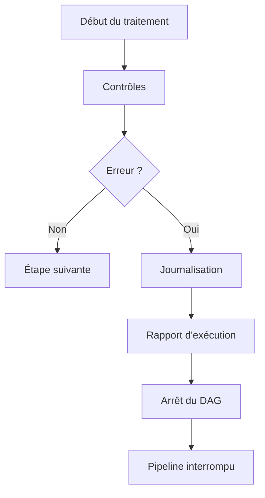
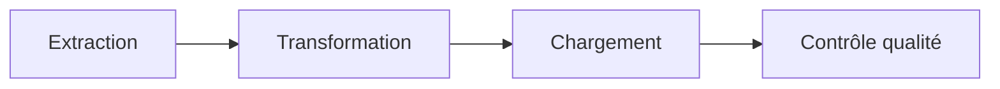
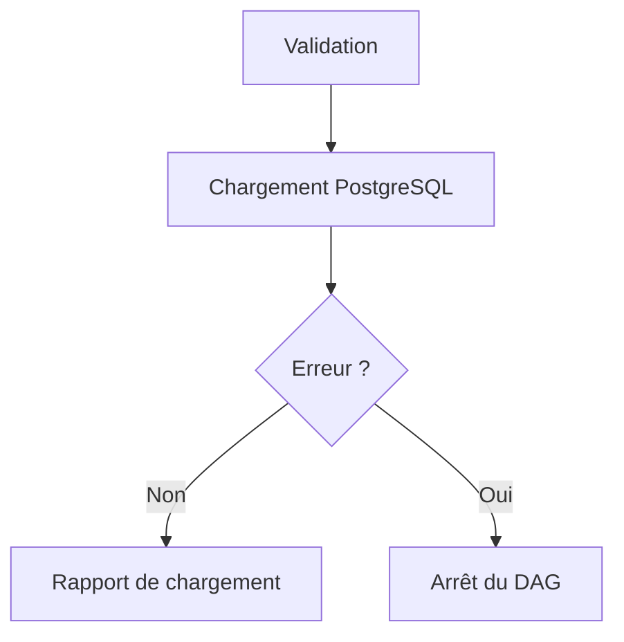

# Gestion des erreurs

## Objectif

La robustesse d'un pipeline de données ne dépend pas uniquement de sa capacité à traiter des informations, mais également de sa capacité à détecter, signaler et gérer les anomalies rencontrées lors de son exécution.

Dans **CheckIt.AI**, chaque DAG met en œuvre ses propres contrôles afin de garantir la cohérence des données avant leur transmission à l'étape suivante.

J'ai choisi une stratégie de validation progressive : chaque étape vérifie les données dont elle est responsable et interrompt le pipeline uniquement lorsqu'une anomalie compromet réellement la fiabilité du traitement.

Cette approche permet d'éviter la propagation de données incohérentes tout en facilitant le diagnostic des erreurs. :contentReference[oaicite:0]{index=0} :contentReference[oaicite:1]{index=1} :contentReference[oaicite:2]{index=2} :contentReference[oaicite:3]{index=3}

---

## Principe général

La gestion des erreurs repose sur plusieurs principes.

- détecter les anomalies le plus tôt possible ;
- produire des messages d'erreur explicites ;
- journaliser les informations utiles au diagnostic ;
- interrompre uniquement les traitements devenus incohérents ;
- conserver les fichiers nécessaires à l'analyse lorsque cela est possible.

Le pipeline applique ainsi une logique de validation progressive.

Chaque étape est responsable de ses propres contrôles.

---

## Validation progressive

Le pipeline est organisé de manière à détecter les erreurs au plus près de leur origine.

Chaque DAG vérifie les données qu'il reçoit avant de poursuivre le traitement.

Ainsi, une erreur détectée lors de la transformation ne peut jamais atteindre PostgreSQL, tandis qu'une anomalie détectée lors du contrôle qualité ne remet pas en cause le chargement déjà effectué.

---

## Contrôles réalisés

Les principaux contrôles concernent :

- présence des fichiers attendus ;
- validité des documents JSON ;
- cohérence des identifiants ;
- validation des images ;
- cohérence des références entre collections ;
- disponibilité de PostgreSQL ;
- cohérence des rapports produits ;
- respect des seuils qualité.

Cette stratégie permet de détecter rapidement les incohérences avant qu'elles ne se propagent dans le pipeline.

---

## Gestion des erreurs d'extraction

Le DAG d'extraction interagit avec plusieurs sources externes.

Ces sources pouvant être temporairement indisponibles, certaines erreurs sont volontairement considérées comme non bloquantes.

Par exemple :

- une API inaccessible ;
- un flux RSS indisponible ;
- une erreur réseau temporaire ;
- un délai de réponse dépassé.

Le service d'extraction isole ces erreurs afin que les autres sources puissent continuer à être traitées.

En revanche, le DAG échoue dans des situations critiques, notamment :

- aucun article extrait ;
- aucun article exploitable après traitement ;
- fichier intermédiaire absent ;
- manifeste invalide.

Cette stratégie garantit que le pipeline ne poursuit jamais son exécution avec un lot vide. :contentReference[oaicite:4]{index=4}

---

## Gestion des erreurs liées aux images

Le traitement des images constitue une étape importante du pipeline multimodal.

Plusieurs contrôles sont réalisés :

- présence d'une URL d'image ;
- téléchargement du fichier ;
- validation du contenu ;
- vérification du statut de validation ;
- contrôle du chemin local ;
- suppression éventuelle des articles selon la configuration.

Lorsque le paramètre `require_image` est activé, les articles ne possédant pas d'image valide sont automatiquement exclus du lot.

Cette approche garantit que les données multimodales respectent les contraintes définies pour le pipeline. :contentReference[oaicite:5]{index=5}

---

## Gestion des erreurs de transformation

Le DAG de transformation contrôle systématiquement les données produites avant de générer les collections PostgreSQL.

Les principales erreurs détectées sont :

- fichier d'entrée absent ;
- document JSON invalide ;
- structure incorrecte ;
- collection obligatoire manquante ;
- identifiant d'article absent ;
- références orphelines entre les collections.

Lorsqu'une incohérence est détectée, la transformation est immédiatement interrompue afin d'éviter la production de fichiers incompatibles avec PostgreSQL. :contentReference[oaicite:6]{index=6}

---

## Gestion des erreurs de chargement

Avant tout chargement dans PostgreSQL, le DAG réalise une nouvelle série de contrôles.

Il vérifie notamment :

- la cohérence des rapports ;
- les identifiants du lot ;
- les références entre les collections ;
- les statuts des images ;
- la validité des données à charger.

Le chargement est ensuite confié au service PostgreSQL.

Si celui-ci retourne un résultat invalide ou un statut inattendu, le DAG échoue immédiatement.

Cette organisation garantit que seules des données cohérentes sont transmises au service de stockage. :contentReference[oaicite:7]{index=7}

---

## Gestion des erreurs de contrôle qualité

Le DAG de contrôle qualité compare les indicateurs calculés dans PostgreSQL avec les seuils définis pour le pipeline.

Les principaux contrôles portent notamment sur :

- le nombre minimal d'articles ;
- le taux minimal d'articles valides ;
- le taux maximal de titres manquants ;
- le taux maximal de contenus manquants ;
- le taux maximal d'URL dupliquées ;
- le taux maximal d'images invalides.

Lorsque l'un de ces seuils n'est pas respecté, la liste des violations est enregistrée dans le rapport qualité puis le DAG est volontairement interrompu.

Le lot est alors considéré comme non conforme. :contentReference[oaicite:8]{index=8}

---

## Journalisation

L'ensemble du pipeline utilise un système commun de journalisation.

Les journaux enregistrent notamment :

- le début et la fin de chaque tâche ;
- les principales opérations réalisées ;
- les statistiques de traitement ;
- les avertissements ;
- les erreurs détectées ;
- les violations de qualité.

Cette journalisation facilite le diagnostic des anomalies ainsi que le suivi des différentes exécutions.

---

## Rapports produits

En complément des journaux Airflow, chaque DAG produit un rapport JSON décrivant son exécution.

| DAG | Rapport produit |
|------|-----------------|
| Extraction | `01_extraction_report.json` |
| Transformation | `02_transformation_report.json` |
| Chargement | `03_load_report.json` |
| Contrôle qualité | `04_quality_report.json` |

Ces rapports permettent de conserver un historique complet de chaque exécution tout en facilitant les analyses ultérieures.

---

## Pourquoi conserver des rapports ?

Les rapports produits à chaque étape présentent plusieurs intérêts.

Ils permettent notamment :

- de suivre l'avancement du pipeline ;
- de retrouver facilement les statistiques d'un lot ;
- d'identifier rapidement une étape en échec ;
- de faciliter le débogage ;
- d'alimenter les DAGs suivants sans recalculer certaines informations.

Chaque rapport constitue ainsi une trace durable de l'exécution du pipeline.

---

## Avantages de cette stratégie

Cette organisation présente plusieurs avantages.

- Les erreurs sont détectées dès leur apparition.
- Les responsabilités sont clairement réparties entre les DAGs.
- Les données incohérentes ne sont jamais propagées.
- Les contrôles sont adaptés à chaque étape.
- Les rapports facilitent le diagnostic.
- Les journaux permettent de comprendre rapidement l'origine d'une erreur.
- Les fichiers intermédiaires simplifient les reprises et les analyses.

---

## Résumé

La gestion des erreurs constitue un élément essentiel de **CheckIt.AI**.

J'ai choisi de répartir les contrôles entre les différents DAGs afin que chaque étape valide uniquement les données dont elle est responsable.

Cette stratégie permet de détecter rapidement les anomalies, de produire des rapports détaillés, de préserver la cohérence du pipeline et de garantir que seules des données fiables progressent jusqu'à la fin du traitement.