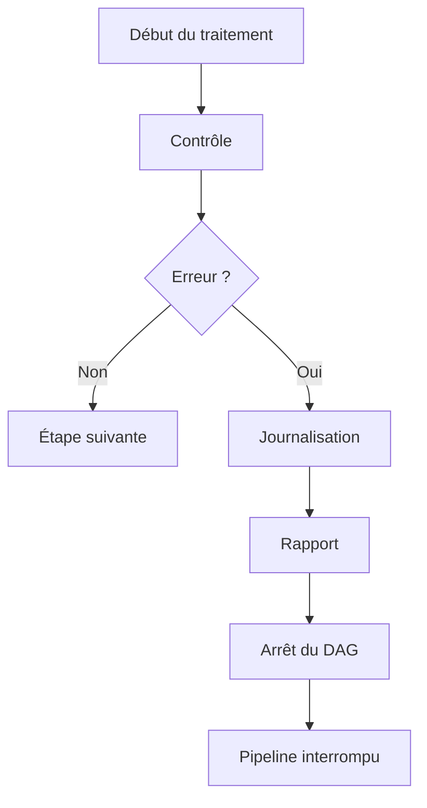
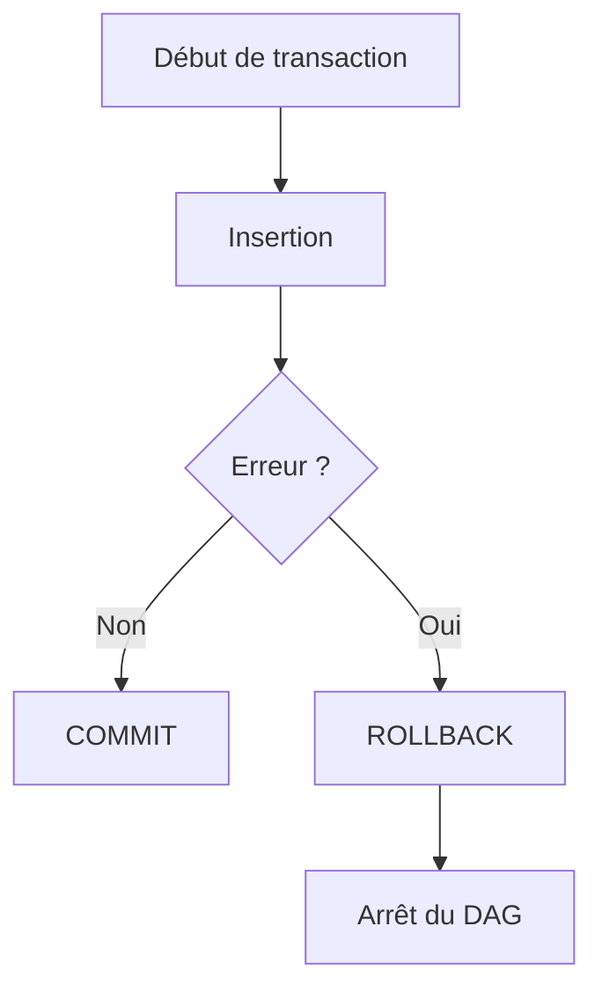

# Gestion des erreurs

## Objectif

La robustesse d'un pipeline de données ne dépend pas uniquement de sa capacité à traiter des informations, mais également de sa capacité à détecter, signaler et gérer les anomalies rencontrées lors de son exécution.

Dans CheckIt.AI, chaque DAG met en œuvre plusieurs mécanismes de contrôle afin de garantir l'intégrité des données tout au long du pipeline.

Lorsqu'une erreur critique est détectée, le traitement est interrompu afin d'éviter la propagation de données incohérentes vers les étapes suivantes.

---

## Principe général

La gestion des erreurs repose sur une stratégie simple :

- détecter les anomalies le plus tôt possible ;
- enregistrer des informations permettant le diagnostic ;
- interrompre uniquement les traitements devenus incohérents ;
- conserver les données déjà produites afin de faciliter l'analyse.

Le pipeline suit donc une logique de validation progressive.

---

## Détection des erreurs

Chaque DAG réalise ses propres contrôles en fonction de sa responsabilité.

Les principales vérifications concernent :

- la présence des fichiers d'entrée ;
- la validité des structures JSON ;
- la cohérence des identifiants ;
- la disponibilité des images ;
- la connexion à PostgreSQL ;
- le respect des contraintes d'intégrité ;
- le respect des seuils qualité.

Cette approche permet de détecter les anomalies au plus près de leur origine.

---

## Gestion des erreurs d'extraction

Le DAG d'extraction communique avec plusieurs sources externes.

Ces sources pouvant être temporairement indisponibles, certaines erreurs sont considérées comme non bloquantes.

Par exemple :

- une API inaccessible ;
- un flux RSS indisponible ;
- un délai de réponse dépassé.

Lorsque ces situations se produisent, le pipeline poursuit son exécution avec les autres sources disponibles.

En revanche, si aucune donnée exploitable n'est collectée, le DAG s'interrompt afin d'éviter la création d'un lot vide.

---

## Gestion des erreurs liées aux images

Les images constituent une composante essentielle du pipeline multimodal.

Plusieurs contrôles sont réalisés :

- présence d'une URL ;
- téléchargement du fichier ;
- validation du format ;
- vérification de l'intégrité ;
- contrôle du chemin local.

Lorsque la configuration impose une image valide (`require_image=True`), les articles ne satisfaisant pas ces critères sont exclus du lot.

Cette stratégie garantit que les données transmises aux étapes suivantes restent cohérentes avec les objectifs du projet.

---

## Gestion des erreurs de transformation

Le DAG de transformation vérifie la cohérence des données avant leur préparation pour PostgreSQL.

Les principales erreurs détectées sont :

- fichier d'entrée absent ;
- structure JSON invalide ;
- identifiants manquants ;
- incohérences entre les différentes structures.

Une erreur détectée à cette étape provoque immédiatement l'arrêt du DAG.

---

## Gestion des erreurs de chargement

Le chargement dans PostgreSQL est réalisé au sein d'une transaction.

Cette approche garantit qu'aucune insertion partielle ne peut être enregistrée.

Le fonctionnement est illustré ci-dessous.

En cas d'erreur :

- la transaction est annulée ;
- aucune donnée incomplète n'est conservée ;
- un message d'erreur est enregistré dans les journaux.

Cette stratégie assure l'intégrité de la base de données.

---

## Gestion des erreurs de contrôle qualité

Le DAG de contrôle qualité compare plusieurs indicateurs aux seuils définis dans la configuration du pipeline.

Quelques exemples :

- nombre minimal d'articles ;
- taux maximal de contenus manquants ;
- taux maximal d'images invalides ;
- taux maximal de doublons.

Lorsque l'un de ces seuils n'est pas respecté, le DAG est volontairement arrêté.

Le lot est alors considéré comme non conforme.

---

## Journalisation

Chaque étape du pipeline utilise un système de journalisation commun.

Les journaux enregistrent notamment :

- le début de chaque traitement ;
- les principales opérations réalisées ;
- les avertissements ;
- les erreurs rencontrées ;
- les statistiques de traitement.

Cette journalisation facilite le diagnostic des anomalies ainsi que le suivi du pipeline.

---

## Rapports produits

En complément des journaux Airflow, chaque étape produit un rapport JSON.

| DAG | Rapport |
|------|---------|
| Extraction | `01_extraction_report.json` |
| Transformation | `02_transformation_report.json` |
| Chargement | `03_load_report.json` |
| Contrôle qualité | `04_quality_report.json` |

Ces rapports permettent de conserver un historique détaillé de chaque exécution.

---

## Avantages de cette stratégie

L'approche retenue présente plusieurs avantages.

- Les erreurs sont détectées dès leur apparition.
- Les traitements restent indépendants.
- Les données incohérentes ne sont jamais propagées.
- Les fichiers intermédiaires facilitent le diagnostic.
- Les transactions garantissent l'intégrité de la base PostgreSQL.
- Les rapports permettent d'analyser facilement chaque exécution.

---

## Résumé

La gestion des erreurs constitue un élément essentiel du pipeline CheckIt.AI.

Chaque étape réalise des contrôles adaptés à son rôle, journalise les anomalies rencontrées et interrompt le traitement uniquement lorsqu'une incohérence compromet la fiabilité des données.

Cette stratégie garantit la robustesse du pipeline tout en facilitant son exploitation et sa maintenance.