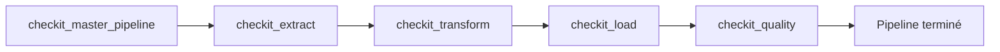
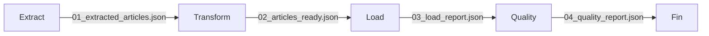
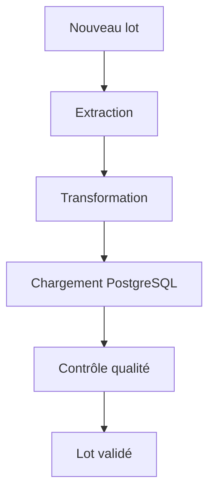

# Exécution complète du pipeline

## Objectif

Le pipeline CheckIt.AI est conçu comme une succession d'étapes indépendantes exécutées dans un ordre précis. Chaque étape produit les données nécessaires à la suivante jusqu'à constituer un jeu de données exploitable et validé.

L'ensemble du processus est orchestré par le DAG maître **`checkit_master_pipeline`**, qui déclenche successivement les différents DAGs spécialisés.

---

## Vue d'ensemble

Le déroulement complet d'une exécution est présenté ci-dessous.



Chaque DAG possède une responsabilité unique et ne démarre que lorsque le précédent s'est terminé avec succès.

---

## Déroulement d'une exécution

Une exécution complète du pipeline suit les étapes suivantes.

### 1. Initialisation

L'utilisateur déclenche le DAG maître depuis l'interface Airflow.

Le DAG :

- crée une nouvelle exécution ;
- génère un identifiant de lot (`batch_id`) ;
- prépare la configuration commune ;
- déclenche le DAG d'extraction.

---

### 2. Extraction

Le DAG **checkit_extract** interroge les différentes sources configurées.

Les opérations réalisées sont :

- récupération des articles ;
- téléchargement des images ;
- validation des fichiers ;
- suppression des articles non exploitables ;
- génération du premier lot.

Fichiers produits :

```text
01_extracted_articles.json

01_extraction_report.json
```

---

### 3. Transformation

Le DAG **checkit_transform** prépare les données pour PostgreSQL.

Cette étape :

- lit les articles extraits ;
- normalise les données ;
- sépare les informations dans les différentes structures ;
- génère les fichiers correspondant aux futures tables de la base.

Fichiers produits :

```text
02_articles_ready.json

02_images_ready.json

02_labels_ready.json

02_features_ready.json

02_transformation_report.json
```

---

### 4. Chargement

Le DAG **checkit_load** insère les données dans PostgreSQL.

Les principales opérations sont :

- validation des fichiers ;
- contrôle des références ;
- ouverture d'une transaction ;
- insertion des données ;
- validation de la transaction.

Fichier produit :

```text
03_load_report.json
```

---

### 5. Contrôle qualité

Le DAG **checkit_quality** analyse les données présentes dans PostgreSQL.

Les indicateurs calculés sont comparés aux seuils définis dans la configuration du pipeline.

À l'issue du traitement :

- un rapport qualité est généré ;
- le lot est validé ou rejeté.

Fichier produit :

```text
04_quality_report.json
```

---

## Communication entre les étapes

Chaque DAG produit les fichiers utilisés par le suivant.



Les données sont échangées via le dossier partagé du lot.

```
/opt/airflow/shared/lots/<batch_id>/
```

Cette organisation permet de conserver un historique complet de chaque exécution.

---

## Cycle de vie d'un lot

Le cycle de vie d'un lot peut être résumé de la manière suivante.



À chaque étape, de nouvelles informations sont ajoutées ou transformées jusqu'à produire un jeu de données complet.

---

## Résultat d'une exécution

À la fin du pipeline, les éléments suivants sont disponibles.

### Base PostgreSQL

Les principales tables sont alimentées :

- `sources`
- `pipeline_runs`
- `articles`
- `images`
- `article_labels`
- `article_features`

Ces données constituent le jeu de données final.

---

### Dossier du lot

Le répertoire partagé contient l'ensemble des fichiers générés pendant le traitement.

Exemple :

```text
/opt/airflow/shared/lots/

└── manual__2026-07-15T08_31_32_412871_00_00/

    ├── 01_extracted_articles.json
    ├── 01_extraction_report.json

    ├── 02_articles_ready.json
    ├── 02_images_ready.json
    ├── 02_labels_ready.json
    ├── 02_features_ready.json
    ├── 02_transformation_report.json

    ├── 03_load_report.json

    └── 04_quality_report.json
```

Ce dossier permet de retracer l'ensemble des traitements réalisés sur un lot.

---

## Reprise après erreur

Grâce au découpage du pipeline en plusieurs DAGs indépendants, il est possible de relancer uniquement une étape en cas d'échec.

Par exemple :

- relancer uniquement la transformation après une erreur de structure ;
- relancer le chargement après une interruption de PostgreSQL ;
- relancer le contrôle qualité après une modification des seuils.

Cette approche évite de recommencer l'ensemble du pipeline lorsque les données extraites restent valides.

---

## Avantages de cette organisation

Le découpage du pipeline présente plusieurs bénéfices.

- Les responsabilités sont clairement séparées.
- Les traitements restent indépendants.
- Les performances de chaque étape peuvent être mesurées individuellement.
- Les erreurs sont plus faciles à localiser.
- Les fichiers intermédiaires facilitent les tests et le débogage.
- Les différentes étapes peuvent évoluer indépendamment les unes des autres.

---

## Résumé

Une exécution complète du pipeline CheckIt.AI consiste à enchaîner successivement les étapes d'extraction, de transformation, de chargement et de contrôle qualité.

L'orchestration réalisée par Apache Airflow garantit que chaque étape est exécutée dans le bon ordre et uniquement lorsque la précédente s'est terminée avec succès. Cette architecture assure la cohérence des données, facilite la maintenance du pipeline et permet de produire un jeu de données multimodal fiable et exploitable.