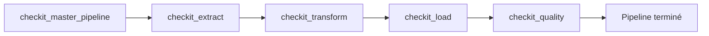
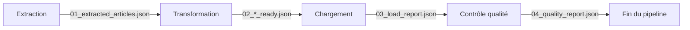
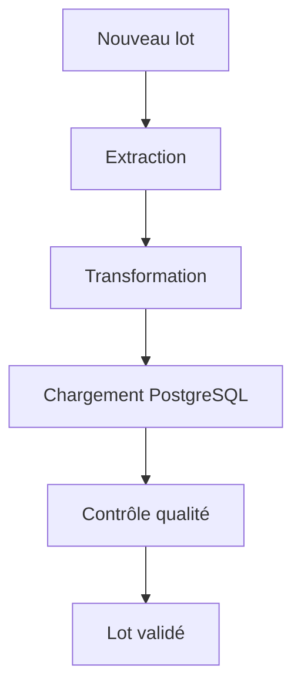

# Exécution complète du pipeline

## Objectif

Le pipeline **CheckIt.AI** est constitué de plusieurs DAGs spécialisés exécutés dans un ordre précis.

Chaque étape possède une responsabilité unique et produit les données nécessaires à la suivante jusqu'à obtenir un jeu de données multimodal chargé dans PostgreSQL puis validé par un contrôle qualité.

J'ai choisi de confier l'orchestration complète au DAG maître **`checkit_master_pipeline`**, qui déclenche successivement chacun des DAGs spécialisés tout en leur transmettant une configuration commune. :contentReference[oaicite:0]{index=0} :contentReference[oaicite:1]{index=1} :contentReference[oaicite:2]{index=2} :contentReference[oaicite:3]{index=3}

---

## Vue d'ensemble

Le déroulement complet du pipeline est présenté ci-dessous.



Le DAG maître attend systématiquement la fin d'une étape avant de déclencher la suivante.

Cette organisation garantit qu'aucun traitement n'est exécuté sur des données incomplètes.

---

## Déroulement d'une exécution

Une exécution complète du pipeline suit les étapes suivantes.

### 1. Initialisation

L'utilisateur déclenche le DAG maître depuis l'interface Airflow.

Le DAG maître :

- crée une nouvelle exécution ;
- construit un identifiant de lot (`batch_id`) ;
- prépare la configuration commune ;
- transmet cette configuration aux différents DAGs ;
- attend la fin de chaque étape avant de poursuivre.

Le même identifiant de lot est utilisé durant toute l'exécution du pipeline.

---

### 2. Extraction

Le DAG **`checkit_extract`** collecte les données depuis les différentes sources configurées.

Les principales opérations réalisées sont :

- extraction des articles ;
- téléchargement des images ;
- validation des images ;
- suppression des articles non exploitables ;
- génération du lot d'articles validés.

Les principaux fichiers produits sont :

```text
01_extracted_articles.json

01_extraction_report.json
```

Des fichiers intermédiaires sont également utilisés pendant cette étape avant d'être supprimés une fois le traitement terminé.

---

### 3. Transformation

Le DAG **`checkit_transform`** prépare les données pour PostgreSQL.

Cette étape :

- lit les articles extraits ;
- transforme les données vers le modèle relationnel ;
- sépare les différentes collections ;
- valide les références entre les entités ;
- génère les fichiers destinés au chargement.

Les fichiers produits sont :

```text
02_articles_ready.json

02_images_ready.json

02_labels_ready.json

02_features_ready.json

02_transformation_report.json
```

Un fichier temporaire est utilisé durant la transformation puis supprimé après la génération des fichiers définitifs.

---

### 4. Chargement

Le DAG **`checkit_load`** prépare puis charge les données dans PostgreSQL.

Cette étape réalise notamment :

- la validation des collections ;
- la vérification des références ;
- la préparation des métadonnées du pipeline ;
- le chargement dans PostgreSQL ;
- la génération du rapport de chargement.

Le principal fichier produit est :

```text
03_load_report.json
```

Un fichier intermédiaire est également utilisé pendant le chargement avant d'être supprimé une fois le rapport final généré.

---

### 5. Contrôle qualité

Le DAG **`checkit_quality`** calcule les indicateurs de qualité directement dans PostgreSQL.

Cette étape :

- lit le rapport de chargement ;
- récupère l'identifiant du pipeline ;
- calcule les KPI ;
- compare les résultats aux seuils de qualité ;
- produit le rapport final.

Le fichier généré est :

```text
04_quality_report.json
```

À l'issue de cette étape, le lot est déclaré conforme ou non conforme.

---

## Communication entre les étapes

Chaque DAG produit uniquement les fichiers nécessaires au suivant.



Toutes les données sont échangées via le dossier partagé du lot.

```text
/opt/airflow/shared/lots/<batch_id>/
```

Les données métier ne transitent jamais dans les XCom.

---

## Cycle de vie d'un lot

Le cycle de vie complet d'un lot peut être résumé de la manière suivante.



À chaque étape, les données sont enrichies, contrôlées ou restructurées avant d'être transmises au DAG suivant.

---

## Résultat d'une exécution

À la fin du pipeline, deux ensembles de résultats sont disponibles.

### Base PostgreSQL

Les principales tables sont alimentées :

- `sources`
- `pipeline_runs`
- `articles`
- `images`
- `article_labels`
- `article_features`

Ces tables constituent le jeu de données final exploitable.

---

### Dossier du lot

Le dossier partagé contient les principaux fichiers produits pendant l'exécution.

```text
/opt/airflow/shared/lots/

└── <batch_id>/

    ├── 01_extracted_articles.json
    ├── 01_extraction_report.json

    ├── 02_articles_ready.json
    ├── 02_images_ready.json
    ├── 02_labels_ready.json
    ├── 02_features_ready.json
    ├── 02_transformation_report.json

    ├── 03_load_report.json

    └── 04_quality_report.json
```

Les fichiers temporaires utilisés pendant certaines étapes sont supprimés automatiquement lorsque celles-ci se terminent avec succès.

---

## Reprise après erreur

Le découpage du pipeline en plusieurs DAGs indépendants permet de relancer uniquement l'étape ayant échoué.

Par exemple, il est possible de :

- relancer uniquement la transformation après une erreur de validation ;
- relancer uniquement le chargement après une indisponibilité de PostgreSQL ;
- relancer uniquement le contrôle qualité après une modification des seuils.

Cette organisation évite de recommencer les étapes précédentes lorsque leurs résultats restent valides.

---

## Suivi de l'exécution

Chaque DAG produit son propre rapport JSON.

| DAG | Rapport produit |
|------|-----------------|
| Extraction | `01_extraction_report.json` |
| Transformation | `02_transformation_report.json` |
| Chargement | `03_load_report.json` |
| Contrôle qualité | `04_quality_report.json` |

Ces rapports permettent de suivre précisément le déroulement du pipeline et de conserver un historique complet de chaque lot.

---

## Avantages de cette organisation

Cette architecture présente plusieurs avantages.

- Les responsabilités sont clairement réparties entre les DAGs.
- Les traitements restent faiblement couplés.
- Les fichiers intermédiaires facilitent les tests et le débogage.
- Les performances de chaque étape peuvent être mesurées séparément.
- Les contrôles sont réalisés progressivement.
- Les données volumineuses ne transitent jamais dans Airflow.
- Chaque étape peut être relancée indépendamment.
- L'ensemble des traitements reste facilement traçable.

---

## Résumé

Une exécution complète du pipeline **CheckIt.AI** consiste à enchaîner successivement les DAGs d'extraction, de transformation, de chargement puis de contrôle qualité.

J'ai choisi une architecture composée de DAGs spécialisés communiquant uniquement grâce à un identifiant de lot partagé, un dossier commun et une configuration transmise par le DAG maître.

Cette organisation garantit que chaque étape est exécutée dans le bon ordre, facilite la maintenance du pipeline, simplifie les reprises après erreur et permet de produire un jeu de données multimodal fiable, cohérent et directement exploitable.