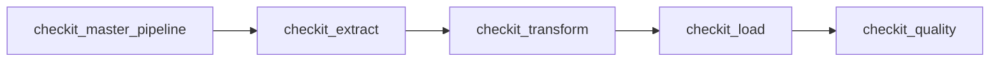
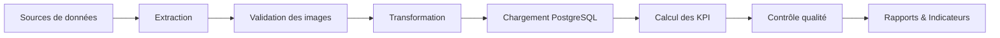

# Orchestration Airflow

## Objectif

L'ensemble du pipeline **CheckIt.AI** est orchestré par **Apache Airflow**.

J'ai choisi d'organiser le pipeline autour d'un DAG maître et de plusieurs DAGs spécialisés afin de séparer clairement les responsabilités de chaque étape du traitement.

Cette architecture permet :

- une forte modularité ;
- une maintenance simplifiée ;
- une reprise facilitée après une erreur ;
- une exécution reproductible ;
- un suivi précis des performances de chaque étape.

Le DAG maître orchestre l'ensemble du pipeline en déclenchant successivement les différents DAGs spécialisés tout en leur transmettant une configuration commune. :contentReference[oaicite:0]{index=0} :contentReference[oaicite:1]{index=1} :contentReference[oaicite:2]{index=2} :contentReference[oaicite:3]{index=3}

---

## Architecture générale



Le DAG maître attend systématiquement la fin complète d'une étape avant de déclencher la suivante.

Cette exécution séquentielle garantit que chaque DAG travaille uniquement sur des données validées.

---

## Le DAG maître : `checkit_master_pipeline`

Le DAG maître ne traite aucune donnée métier.

Son rôle consiste uniquement à orchestrer le pipeline.

Il :

- crée un identifiant de lot (`batch_id`) ;
- prépare la configuration commune ;
- transmet cette configuration aux DAGs spécialisés ;
- déclenche chaque DAG dans l'ordre ;
- attend leur terminaison ;
- interrompt le pipeline lorsqu'un DAG échoue.

Les DAGs sont déclenchés à l'aide de `TriggerDagRunOperator` avec une attente active de leur exécution (`wait_for_completion=True`). :contentReference[oaicite:4]{index=4}

---

## Le DAG `checkit_extract`

Le DAG d'extraction constitue la première étape métier.

Il est responsable de :

- lancer les extracteurs configurés ;
- collecter les articles ;
- télécharger les images ;
- valider les images ;
- filtrer les articles non exploitables ;
- produire le premier lot partagé.

Les principaux fichiers produits sont :

```text
01_extracted_articles.json

01_extraction_report.json
```

Des fichiers temporaires sont également utilisés pendant l'exécution avant d'être supprimés.

---

## Le DAG `checkit_transform`

Le DAG de transformation prépare les données pour PostgreSQL.

Il réalise notamment :

- la lecture des articles extraits ;
- la normalisation des données ;
- la séparation des collections ;
- la validation des références ;
- la préparation des futures tables PostgreSQL.

Les principaux fichiers produits sont :

```text
02_articles_ready.json

02_images_ready.json

02_labels_ready.json

02_features_ready.json

02_transformation_report.json
```

Un fichier temporaire est utilisé durant la transformation puis supprimé à la fin du traitement. :contentReference[oaicite:5]{index=5}

---

## Le DAG `checkit_load`

Le DAG de chargement prépare puis charge les données dans PostgreSQL.

Avant toute insertion, plusieurs contrôles sont réalisés :

- validation des fichiers JSON ;
- contrôle des identifiants ;
- validation des références ;
- vérification des statuts des images ;
- préparation des métadonnées du pipeline.

Le chargement est ensuite confié au service PostgreSQL.

Le principal fichier produit est :

```text
03_load_report.json
```

Le fichier intermédiaire utilisé pendant le chargement est automatiquement supprimé après la génération du rapport final. :contentReference[oaicite:6]{index=6}

---

## Le DAG `checkit_quality`

Le DAG de contrôle qualité constitue la dernière étape du pipeline.

Il :

- lit le rapport de chargement ;
- récupère les informations dans PostgreSQL ;
- calcule les KPI ;
- compare les résultats aux seuils de qualité ;
- produit le rapport final ;
- valide ou rejette le lot.

Le rapport produit est :

```text
04_quality_report.json
```

Les indicateurs sont calculés directement depuis PostgreSQL afin de refléter exactement les données effectivement chargées. :contentReference[oaicite:7]{index=7}

---

## Dossier partagé

Les DAGs échangent leurs données grâce à un répertoire partagé.

```text
/opt/airflow/shared/lots/

└── <batch_id>/
```

Chaque exécution possède son propre dossier.

Par exemple :

```text
/opt/airflow/shared/lots/

└── manual__2026-07-15T08_31_32_412871_00_00/

    ├── 01_extracted_articles.json
    ├── 01_extraction_report.json

    ├── 02_articles_ready.json
    ├── 02_images_ready.json
    ├── 02_labels_ready.json
    ├── 02_features_ready.json
    ├── 02_transformation_report.json

    ├── 03_load_report.json

    └── 04_quality_report.json
```

Les fichiers temporaires créés pendant certaines étapes sont supprimés automatiquement une fois leur rôle terminé.

---

## Communication entre les DAGs

Les données métier ne transitent jamais dans Airflow.

Les DAGs communiquent grâce :

- au `batch_id` partagé ;
- au dossier commun du lot ;
- à la configuration transmise via `dag_run.conf`.

Les XCom sont réservés aux informations légères telles que :

- les chemins des fichiers ;
- les compteurs ;
- les identifiants ;
- les durées d'exécution ;
- les statuts des traitements.

Cette approche améliore les performances d'Airflow tout en conservant une architecture faiblement couplée.

---

## Fonctionnement global



Chaque étape enrichit progressivement les données jusqu'à produire un jeu de données validé et directement exploitable.

---

## Philosophie de conception

J'ai choisi de découper le pipeline en plusieurs DAGs spécialisés plutôt qu'en un seul DAG volumineux.

Cette architecture présente plusieurs avantages :

- une responsabilité unique par DAG ;
- une maintenance simplifiée ;
- un débogage facilité ;
- des performances mesurables indépendamment ;
- une reprise ciblée après une erreur ;
- une meilleure évolutivité du pipeline ;
- une conservation complète des fichiers intermédiaires utiles au diagnostic.

Chaque DAG reste ainsi autonome tout en s'intégrant dans une chaîne de traitement cohérente.

---

## Résumé

L'orchestration de **CheckIt.AI** repose sur un DAG maître chargé de coordonner quatre DAGs spécialisés : **extraction**, **transformation**, **chargement** et **contrôle qualité**.

J'ai choisi cette architecture afin de séparer clairement les responsabilités, de limiter les dépendances entre les traitements et de garantir une exécution fiable, reproductible et facilement maintenable.

Grâce à cette organisation, le pipeline peut être relancé à partir d'une étape précise, les performances de chaque DAG peuvent être suivies individuellement et chaque exécution reste entièrement traçable.