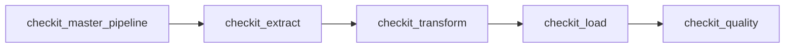
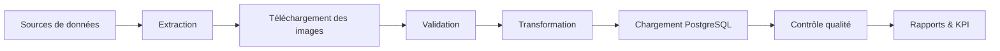

# Orchestration Airflow

## Objectif

L'ensemble du pipeline **CheckIt.AI** est orchestré par **Apache Airflow**.

Chaque étape du traitement est isolée dans un DAG indépendant afin de garantir :

- une architecture modulaire ;
- une meilleure maintenabilité ;
- une reprise simple en cas d'erreur ;
- une exécution reproductible ;
- un suivi précis des performances.

Le DAG maître orchestre l'ensemble du pipeline en déclenchant successivement les différents DAGs spécialisés.

---

## Vue d'ensemble



---

## Rôle de chaque DAG

### checkit_master

Orchestre l'ensemble du pipeline.

Il :

- crée un identifiant de lot unique (`batch_id`) ;
- transmet la configuration commune ;
- déclenche les DAGs enfants ;
- attend leur terminaison ;
- interrompt le pipeline en cas d'échec.

---

### checkit_extract

Responsable de la collecte des données.

Cette étape :

- lance les extracteurs configurés ;
- télécharge les images ;
- valide les images récupérées ;
- élimine les articles non exploitables ;
- produit le premier lot partagé.

Fichiers générés :

```
01_extracted_articles.json
01_extraction_report.json
```

---

### checkit_transform

Prépare les données pour PostgreSQL.

Cette étape :

- nettoie les données ;
- applique le schéma de la base ;
- sépare les informations dans les différentes tables ;
- génère les fichiers intermédiaires.

Fichiers générés :

```
02_articles_ready.json
02_images_ready.json
02_labels_ready.json
02_features_ready.json
02_transformation_report.json
```

---

### checkit_load

Charge les données dans PostgreSQL.

Avant l'insertion, plusieurs contrôles sont réalisés :

- validation des structures JSON ;
- contrôle des références entre tables ;
- vérification de la cohérence des images ;
- insertion transactionnelle.

Fichier généré :

```
03_load_report.json
```

---

### checkit_quality

Contrôle la qualité du lot chargé.

Les indicateurs calculés permettent notamment de mesurer :

- le nombre d'articles chargés ;
- le taux d'articles valides ;
- le taux d'images valides ;
- les contenus manquants ;
- les doublons ;
- les KPI du pipeline.

Fichier généré :

```
04_quality_report.json
```

---

## Dossier partagé

Les DAGs échangent leurs données via un répertoire partagé.

```
/opt/airflow/shared/lots/
└── <batch_id>/
```

Chaque exécution du pipeline possède son propre dossier.

Exemple :

```
/opt/airflow/shared/lots/
└── manual__2026-07-15T08_31_32_412871_00_00/
    ├── 01_extracted_articles.json
    ├── 01_extraction_report.json
    ├── 02_articles_ready.json
    ├── 02_images_ready.json
    ├── 02_labels_ready.json
    ├── 02_features_ready.json
    ├── 02_transformation_report.json
    ├── 03_load_report.json
    └── 04_quality_report.json
```

---

## Fonctionnement global



---

## Philosophie de conception

Chaque DAG possède une responsabilité unique.

Cette séparation permet :

- de relancer uniquement une étape en cas d'erreur ;
- de simplifier les tests unitaires ;
- d'améliorer la maintenance ;
- de faciliter les évolutions du pipeline ;
- de conserver un historique complet de chaque lot traité.