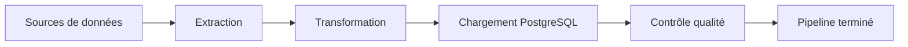

# Exécution du pipeline

## Objectif

Cette section présente les résultats obtenus lors d'une exécution complète du pipeline **CheckIt.AI**.

L'objectif est de vérifier que les différentes étapes développées au cours du projet fonctionnent correctement lorsqu'elles sont exécutées de manière enchaînée par Apache Airflow.

L'analyse porte sur l'ensemble du cycle de traitement, depuis la collecte des données jusqu'à la validation finale du lot.

---

## Déroulement d'une exécution

Une exécution complète suit le déroulement présenté ci-dessous.

Chaque étape démarre uniquement lorsque la précédente s'est terminée avec succès.

---

## Résultat de l'extraction

La première étape consiste à collecter les données provenant des différentes sources configurées.

Au cours de cette étape, le pipeline :

- interroge les API ;
- lit les flux RSS ;
- récupère les données issues des jeux de données ;
- télécharge les images ;
- valide les informations collectées.

Les articles exploitables sont ensuite enregistrés dans le premier lot partagé.

---

## Résultat de la transformation

Les données extraites sont ensuite converties afin de respecter le modèle relationnel utilisé par PostgreSQL.

Cette étape produit plusieurs collections spécialisées correspondant aux futures tables de la base de données :

- articles ;
- images ;
- labels ;
- caractéristiques.

Les différentes relations entre ces collections sont également vérifiées avant le chargement.

---

## Résultat du chargement

Le DAG de chargement insère les données dans PostgreSQL.

À cette étape :

- les références sont contrôlées ;
- les données sont validées ;
- les statistiques du pipeline sont enregistrées ;
- les rapports de chargement sont générés.

À l'issue du traitement, les principales tables de la base sont alimentées.

---

## Résultat du contrôle qualité

La dernière étape consiste à calculer différents indicateurs de qualité.

Les métriques calculées permettent notamment de mesurer :

- le nombre d'articles chargés ;
- le taux d'articles valides ;
- le nombre d'images validées ;
- le taux de contenus manquants ;
- le taux de doublons ;
- les principales statistiques du pipeline.

Ces indicateurs sont ensuite comparés aux seuils définis dans la configuration.

---

## Rapports produits

Une exécution complète génère plusieurs rapports successifs.

| Étape | Rapport |
|--------|---------|
| Extraction | `01_extraction_report.json` |
| Transformation | `02_transformation_report.json` |
| Chargement | `03_load_report.json` |
| Contrôle qualité | `04_quality_report.json` |

Ces rapports permettent de suivre précisément le déroulement du pipeline et de faciliter le diagnostic en cas d'erreur.

---

## Jeu de données obtenu

À la fin de l'exécution, les données sont disponibles sous deux formes :

- dans PostgreSQL ;
- dans le dossier partagé associé au lot.

Cette double conservation permet à la fois d'exploiter les données et de conserver une trace complète du traitement réalisé.

---

## Validation du pipeline

Une exécution est considérée comme réussie lorsque :

- tous les DAGs se terminent correctement ;
- les données sont chargées dans PostgreSQL ;
- le contrôle qualité valide le lot ;
- aucun seuil critique n'est dépassé.

Le pipeline produit alors un jeu de données multimodal directement exploitable.

---

## Conclusion

Les différentes exécutions réalisées au cours du projet montrent que l'architecture retenue permet d'enchaîner automatiquement les étapes d'extraction, de transformation, de chargement et de contrôle qualité.

Le pipeline répond ainsi à l'objectif fixé en produisant un jeu de données cohérent, traçable et prêt à être utilisé dans des travaux de fact-checking ou de détection de désinformation.