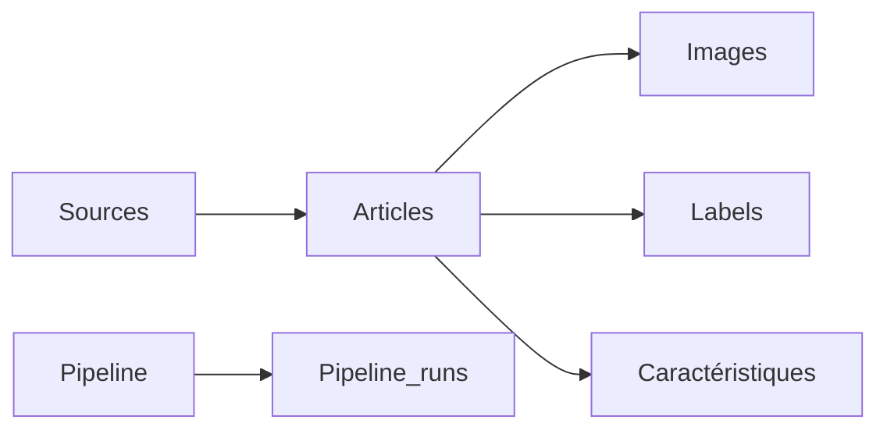

# Résultats dans PostgreSQL

## Objectif

À l'issue de l'exécution complète du pipeline, l'ensemble des données validées est chargé dans une base PostgreSQL.

Cette section présente le résultat obtenu après le chargement et montre comment les informations collectées sont organisées dans les différentes tables de la base.

L'objectif est de vérifier que le pipeline produit un modèle de données cohérent, exploitable et conforme à l'architecture définie précédemment.

---

## Vue d'ensemble

Le chargement alimente plusieurs tables spécialisées représentant les principales entités manipulées par le pipeline.

Chaque table possède une responsabilité spécifique et est reliée aux autres par des clés étrangères.

---

## Tables alimentées

À la fin d'une exécution réussie, les principales tables sont renseignées.

| Table | Contenu |
|--------|---------|
| `sources` | Sources d'information configurées |
| `pipeline_runs` | Historique des exécutions |
| `articles` | Articles collectés |
| `images` | Images associées aux articles |
| `article_labels` | Labels de véracité |
| `article_features` | Caractéristiques calculées |

Ces tables constituent le jeu de données final produit par le pipeline.

---

## Cohérence des données

Avant le chargement, plusieurs contrôles garantissent la cohérence des informations :

- présence des identifiants ;
- unicité des articles ;
- validité des références ;
- cohérence entre les différentes collections ;
- validation des images ;
- contrôle des champs obligatoires.

Ces vérifications permettent d'éviter l'insertion de données incohérentes dans la base.

---

## Historique des exécutions

Chaque lancement du pipeline crée un nouvel enregistrement dans la table `pipeline_runs`.

Cette table conserve notamment :

- l'identifiant du lot ;
- les dates de début et de fin ;
- les durées des différentes étapes ;
- le nombre d'articles traités ;
- les statistiques relatives aux images ;
- le statut final du pipeline.

Elle constitue un historique complet des traitements réalisés.

---

## Relations entre les tables

Les différentes tables sont reliées afin de garantir l'intégrité des données.

Par exemple :

- une image est associée à un article ;
- un label est associé à un article ;
- une caractéristique est associée à un article ;
- un article est associé à une source ;
- chaque article est rattaché à une exécution du pipeline.

Cette organisation facilite les analyses et les requêtes SQL.

---

## Exploitation des données

Une fois chargées dans PostgreSQL, les données peuvent être utilisées pour différents usages :

- exploration des données ;
- analyses statistiques ;
- constitution de jeux d'entraînement ;
- création de tableaux de bord ;
- développement de modèles de détection de désinformation.

Le stockage relationnel facilite également les requêtes complexes portant sur plusieurs tables.

---

## Vérification du chargement

Le bon déroulement du chargement peut être vérifié à partir de plusieurs éléments :

- présence des données dans les différentes tables ;
- cohérence des relations ;
- rapport de chargement (`03_load_report.json`) ;
- historique enregistré dans `pipeline_runs`.

Ces contrôles permettent de confirmer que le pipeline a correctement alimenté la base de données.

---

## Conclusion

Les résultats obtenus montrent que le pipeline alimente correctement PostgreSQL en répartissant les informations dans plusieurs tables spécialisées.

Cette organisation garantit l'intégrité des données, facilite leur exploitation et constitue une base solide pour les futures étapes d'analyse, de visualisation ou d'entraînement de modèles d'intelligence artificielle.