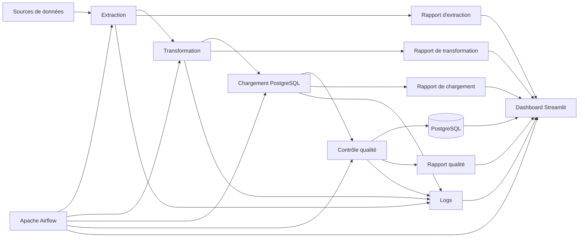

# Architecture de supervision

## Introduction

Le monitoring de **CheckIt.AI** repose sur plusieurs composants complémentaires permettant de superviser l'ensemble du pipeline d'acquisition.

Chaque composant possède une responsabilité spécifique. Ensemble, ils offrent une vision globale de l'état du pipeline, des données produites et des performances observées au cours des différentes exécutions.

Cette architecture facilite la détection des anomalies, les opérations de maintenance et contribue à la traçabilité des traitements.

---

## Architecture générale

La supervision s'appuie sur les différents composants du projet.

Cette organisation permet de suivre l'ensemble du cycle de vie d'un lot de données, depuis son extraction jusqu'à sa validation finale.

---

## Apache Airflow

Apache Airflow constitue le cœur du dispositif de supervision.

Il orchestre les différents DAGs du pipeline et fournit notamment :

- le statut de chaque DAG ;
- la durée des traitements ;
- l'historique des exécutions ;
- les erreurs rencontrées ;
- les journaux d'exécution.

Ces informations permettent de suivre l'avancement des traitements et d'identifier rapidement les éventuels incidents.

---

## Les rapports d'exécution

Chaque étape du pipeline génère un rapport JSON contenant les principales informations relatives au traitement réalisé.

Ces rapports permettent notamment de conserver :

- les statistiques de traitement ;
- le nombre d'éléments produits ;
- les temps d'exécution ;
- les éventuelles erreurs rencontrées ;
- les indicateurs spécifiques à chaque étape.

Ils constituent une source d'information essentielle pour le diagnostic et l'analyse des traitements.

---

## PostgreSQL

La base PostgreSQL joue un double rôle.

Elle stocke les données produites par le pipeline ainsi que les informations nécessaires au suivi des traitements.

On y retrouve notamment :

- les exécutions du pipeline ;
- les articles ;
- les images ;
- les labels ;
- les caractéristiques ;
- les informations utilisées pour calculer les principaux indicateurs de supervision.

La base constitue ainsi une source fiable pour l'analyse des traitements et l'élaboration des tableaux de bord.

---

## Les journaux d'exécution

Chaque composant du pipeline produit des journaux permettant de suivre précisément les traitements réalisés.

Ces journaux enregistrent notamment :

- les opérations effectuées ;
- les avertissements ;
- les erreurs ;
- les temps de traitement ;
- les informations utiles au diagnostic.

Les logs facilitent l'identification de l'origine d'un incident et permettent de comprendre le déroulement des traitements.

---

## Le dashboard de supervision

Le dashboard Streamlit centralise les informations issues des différents composants du pipeline.

Il présente notamment :

- l'état général du pipeline ;
- les informations issues de PostgreSQL ;
- les indicateurs de supervision ;
- le statut des services ;
- les statistiques générales.

Cette interface offre une vision synthétique du fonctionnement du pipeline sans nécessiter un accès direct aux outils techniques. Elle constitue le point d'entrée principal pour la supervision quotidienne.

---

## Complémentarité des composants

Chaque composant contribue à la supervision du pipeline selon son rôle.

| Composant | Rôle principal |
|-----------|----------------|
| Apache Airflow | Orchestration et suivi des DAGs |
| PostgreSQL | Stockage des données et des informations de suivi |
| Rapports JSON | Traçabilité des traitements |
| Logs | Diagnostic des incidents |
| Dashboard Streamlit | Centralisation et visualisation des indicateurs |

Cette répartition permet d'obtenir une supervision complète tout en conservant une séparation claire des responsabilités entre les différents composants.

---

## Conclusion

L'architecture de supervision de **CheckIt.AI** repose sur plusieurs composants complémentaires assurant le suivi du pipeline à différents niveaux.

L'orchestration par Apache Airflow, les rapports d'exécution, les journaux, la base PostgreSQL et le dashboard Streamlit permettent ensemble de superviser le fonctionnement du pipeline, de suivre ses performances, de contrôler la qualité des données et de faciliter les opérations de diagnostic et de maintenance.