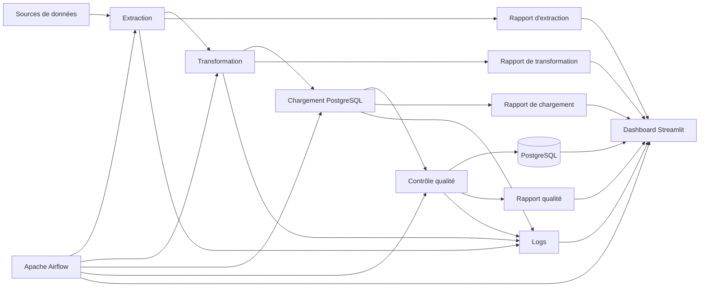

# Architecture de supervision

# Introduction

Le monitoring de **CheckIt.AI** repose sur plusieurs composants complémentaires qui permettent de superviser l'ensemble du pipeline d'acquisition.

Chaque composant possède une responsabilité spécifique. Ensemble, ils offrent une vision complète de l'état du pipeline, des données produites et des performances observées au cours des différentes exécutions.

Cette architecture permet de détecter rapidement les anomalies, de faciliter les opérations de maintenance et de garantir la traçabilité des traitements.

---

# Architecture générale

La supervision s'appuie sur les différents composants du projet.

Cette organisation permet de suivre l'ensemble du cycle de vie d'un lot de données, depuis son extraction jusqu'à sa validation finale.

---

# Apache Airflow

Apache Airflow constitue le cœur du dispositif de supervision.

Il orchestre les différents DAGs du pipeline et fournit notamment :

- le statut de chaque DAG ;
- la durée des traitements ;
- l'historique des exécutions ;
- les erreurs rencontrées ;
- les journaux d'exécution.

Airflow permet ainsi de suivre en temps réel le déroulement des traitements.

---

# Les rapports d'exécution

Chaque étape du pipeline génère un rapport JSON contenant les principales informations relatives au traitement réalisé.

Ces rapports permettent notamment de conserver :

- les statistiques de traitement ;
- le nombre d'éléments produits ;
- les temps d'exécution ;
- les éventuelles erreurs rencontrées ;
- les indicateurs spécifiques à chaque étape.

Ils constituent une source d'information importante pour le diagnostic du pipeline.

---

# PostgreSQL

La base PostgreSQL joue un double rôle.

Elle stocke les données produites par le pipeline, mais également une partie des informations utilisées pour le suivi des traitements.

On y retrouve notamment :

- les exécutions du pipeline ;
- les indicateurs calculés ;
- les articles ;
- les images ;
- les labels ;
- les caractéristiques.

La base constitue ainsi une source fiable pour le calcul des indicateurs de supervision.

---

# Les journaux d'exécution

Chaque composant du pipeline produit des journaux permettant de suivre précisément les traitements réalisés.

Ces journaux enregistrent notamment :

- les opérations effectuées ;
- les avertissements ;
- les erreurs ;
- les temps de traitement ;
- les informations utiles au diagnostic.

Les logs facilitent l'identification de l'origine d'un incident.

---

# Le dashboard de supervision

Le dashboard Streamlit rassemble les principales informations provenant des différents composants.

Il centralise notamment :

- l'état du pipeline ;
- les informations issues de PostgreSQL ;
- les principaux indicateurs ;
- le statut des services ;
- les statistiques générales.

Cette interface offre une vision synthétique du fonctionnement du pipeline sans nécessiter l'accès direct aux outils techniques.

---

# Complémentarité des composants

Chaque composant contribue à la supervision du pipeline selon son rôle.

| Composant | Rôle principal |
|-----------|----------------|
| Apache Airflow | Orchestration et suivi des DAGs |
| PostgreSQL | Stockage des données et des indicateurs |
| Rapports JSON | Traçabilité des traitements |
| Logs | Diagnostic des erreurs |
| Dashboard Streamlit | Visualisation et supervision |

Cette répartition permet d'obtenir une supervision complète tout en évitant de centraliser toutes les responsabilités dans un seul outil.

---

# Conclusion

L'architecture de supervision de CheckIt.AI repose sur plusieurs composants complémentaires qui assurent le suivi du pipeline à différents niveaux.

L'orchestration par Apache Airflow, les rapports d'exécution, les journaux, la base PostgreSQL et le dashboard Streamlit permettent ensemble de contrôler le bon fonctionnement du pipeline, de suivre les performances et de faciliter la maintenance de la plateforme.