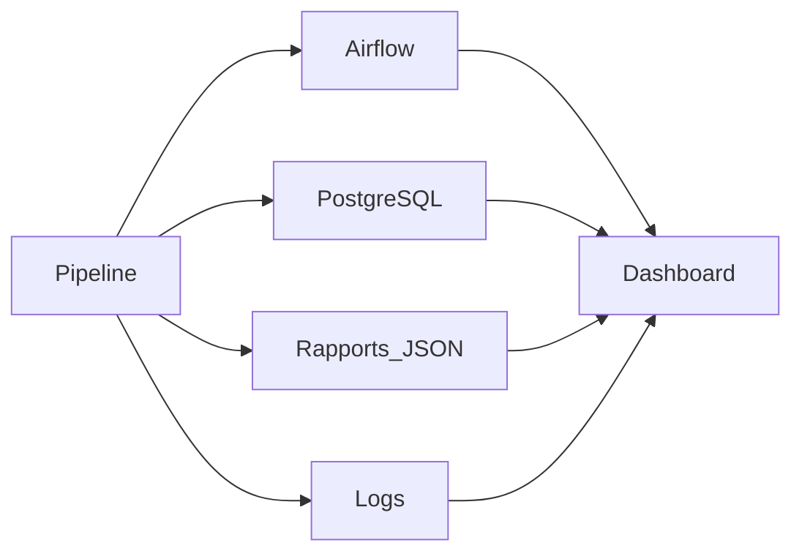

# Outils de supervision

## Introduction

Le dispositif de monitoring de **CheckIt.AI** repose sur plusieurs outils complémentaires. Chacun intervient à un niveau spécifique du pipeline et fournit des informations différentes permettant de superviser le fonctionnement de la plateforme.

Cette approche répartit les responsabilités entre plusieurs composants spécialisés, ce qui facilite le diagnostic des incidents, le suivi des traitements et l'analyse des performances.

---

## Apache Airflow

Apache Airflow assure l'orchestration complète du pipeline ETL.

Il supervise le déroulement des différentes étapes de traitement :

- l'extraction des données ;
- la transformation ;
- le chargement dans PostgreSQL ;
- le contrôle qualité.

Pour chaque exécution, Airflow fournit notamment :

- le statut des DAGs ;
- le statut des tâches ;
- la durée des traitements ;
- l'historique des exécutions ;
- les journaux d'exécution ;
- les éventuelles erreurs.

Ces informations permettent de suivre l'avancement des traitements et d'identifier rapidement les anomalies de fonctionnement.

---

## PostgreSQL

La base PostgreSQL constitue le référentiel principal des données produites par le pipeline.

Au-delà du stockage des articles, des images et des métadonnées, elle conserve également les informations nécessaires au calcul des indicateurs de supervision.

Les principales tables exploitées dans le cadre du monitoring concernent notamment :

- les exécutions du pipeline ;
- les articles collectés ;
- les images téléchargées ;
- les labels ;
- les caractéristiques calculées ;
- les informations utilisées pour produire les différents KPI.

Ces données permettent d'alimenter le dashboard et de suivre l'évolution du pipeline au fil des exécutions.

---

## Rapports d'exécution

Chaque étape du pipeline génère un rapport au format JSON.

Ces rapports contiennent des informations détaillées concernant le traitement réalisé.

Ils permettent notamment de retrouver :

- les statistiques de traitement ;
- les volumes de données ;
- les temps d'exécution ;
- les éventuelles erreurs ;
- les indicateurs spécifiques à chaque étape.

Ils constituent une source précieuse pour l'analyse d'une exécution passée et facilitent les opérations de diagnostic.

---

## Journaux d'exécution

L'ensemble des composants du projet produit des journaux d'exécution (logs).

Ces derniers enregistrent les principales opérations réalisées durant le traitement.

Ils permettent notamment de consulter :

- les différentes étapes exécutées ;
- les avertissements ;
- les erreurs rencontrées ;
- les temps de traitement ;
- les informations de diagnostic.

Les logs constituent généralement la première source d'information lors de l'analyse d'un incident.

---

## Dashboard Streamlit

Le dashboard développé avec Streamlit centralise les principales informations de supervision.

Il offre une interface graphique permettant de consulter rapidement :

- l'état général du pipeline ;
- les indicateurs de production ;
- les statistiques issues de PostgreSQL ;
- le statut des services ;
- les principaux KPI ;
- les informations de qualité et de complétude des données.

Cette interface constitue le point d'entrée principal pour le suivi quotidien du pipeline sans nécessiter un accès direct aux différents outils techniques.

---

## Docker

L'ensemble de la plateforme est exécuté dans un environnement Docker.

Cette approche facilite :

- le déploiement des différents services ;
- l'isolation des composants ;
- la reproductibilité des exécutions ;
- la maintenance de l'environnement.

Docker ne constitue pas un outil de monitoring à proprement parler, mais il fournit un environnement d'exécution stable et homogène qui facilite l'exploitation de la plateforme.

---

## Complémentarité des outils

Les différents outils utilisés interviennent à des niveaux complémentaires de la supervision.

| Outil | Fonction principale |
|--------|---------------------|
| Apache Airflow | Orchestration et suivi des traitements |
| PostgreSQL | Stockage des données et des informations de supervision |
| Rapports JSON | Traçabilité des traitements |
| Logs | Diagnostic des incidents |
| Dashboard Streamlit | Centralisation et visualisation des indicateurs |
| Docker | Exécution et isolation des services |

Cette répartition permet de disposer d'une supervision complète tout en conservant une architecture modulaire où chaque composant remplit une responsabilité clairement définie.

---

## Vue d'ensemble

Le schéma suivant illustre les interactions entre les différents outils utilisés pour la supervision.

Le dashboard constitue le point d'entrée principal pour consulter les informations de supervision, tandis que les autres composants fournissent les données nécessaires au suivi détaillé du pipeline.

---

## Conclusion

Le monitoring de **CheckIt.AI** repose sur plusieurs outils complémentaires qui interviennent à différents niveaux du pipeline.

Apache Airflow assure l'orchestration des traitements, PostgreSQL centralise les données utilisées pour le calcul des indicateurs, les rapports JSON et les journaux facilitent le diagnostic, tandis que le dashboard Streamlit rassemble ces informations au sein d'une interface unique.

Cette architecture permet de suivre le fonctionnement du pipeline, d'analyser les performances, de contrôler la qualité des données produites et de faciliter les opérations de maintenance.

Le chapitre suivant présente les différentes situations susceptibles de déclencher une alerte ainsi que les actions pouvant être mises en œuvre pour y répondre.