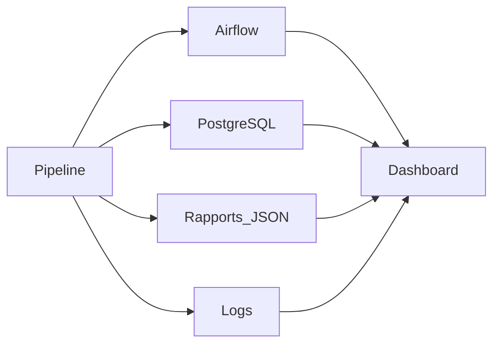

# Outils de supervision

# Introduction

Le dispositif de monitoring de CheckIt.AI repose sur plusieurs outils complémentaires. Chacun intervient à un niveau spécifique du pipeline et fournit des informations différentes permettant de superviser le fonctionnement de la plateforme.

Cette approche évite de dépendre d'un seul outil et facilite l'identification des anomalies lorsqu'un incident survient.

---

# Apache Airflow

Apache Airflow assure l'orchestration complète du pipeline ETL.

Il permet de superviser le déroulement des différentes étapes de traitement :

- extraction des données ;
- transformation ;
- chargement dans PostgreSQL ;
- contrôle qualité.

Pour chaque exécution, Airflow fournit notamment :

- le statut des DAGs ;
- la durée des traitements ;
- l'historique des exécutions ;
- les journaux d'exécution ;
- les éventuelles erreurs.

Ces informations permettent de vérifier rapidement que le pipeline s'est correctement déroulé.

---

# PostgreSQL

La base de données PostgreSQL constitue le référentiel principal des données produites par le pipeline.

Au-delà du stockage des articles et des images, elle permet également de conserver différentes informations utilisées pour le suivi des traitements.

Les principales tables exploitées dans le cadre du monitoring sont notamment :

- les exécutions du pipeline ;
- les articles collectés ;
- les images téléchargées ;
- les labels ;
- les caractéristiques calculées ;
- les métriques de traitement.

Ces données permettent de construire les différents indicateurs affichés dans le dashboard.

---

# Rapports d'exécution

Chaque étape du pipeline génère un rapport au format JSON.

Ces rapports contiennent des informations détaillées concernant le traitement réalisé.

Ils permettent notamment de retrouver :

- les statistiques de traitement ;
- les volumes de données ;
- les temps d'exécution ;
- les éventuelles erreurs ;
- les informations spécifiques à chaque étape.

Ils constituent une source précieuse pour l'analyse d'une exécution passée.

---

# Journaux d'exécution

L'ensemble des composants du projet produit des journaux (logs).

Ces derniers enregistrent les principales opérations réalisées durant l'exécution du pipeline.

Ils permettent notamment de consulter :

- les différentes étapes exécutées ;
- les avertissements ;
- les erreurs rencontrées ;
- les temps de traitement ;
- les informations de diagnostic.

Les logs constituent généralement la première source d'information lors de la recherche d'un incident.

---

# Dashboard Streamlit

Le dashboard développé avec Streamlit centralise les principales informations de supervision.

Il offre une interface graphique permettant de consulter rapidement :

- l'état général du pipeline ;
- les indicateurs de production ;
- les statistiques de la base PostgreSQL ;
- le statut des services ;
- les principaux KPI.

Cette interface facilite le suivi quotidien du pipeline sans avoir à consulter directement les différents outils techniques.

---

# Docker

L'ensemble de la plateforme est exécuté dans un environnement Docker.

Cette approche facilite :

- le déploiement ;
- l'isolation des services ;
- la reproductibilité des exécutions ;
- la maintenance de l'environnement.

Le monitoring bénéficie ainsi d'un environnement stable et reproductible.

---

# Complémentarité des outils

Les différents outils utilisés ne remplissent pas les mêmes fonctions.

| Outil | Fonction principale |
|--------|---------------------|
| Apache Airflow | Orchestration et suivi des traitements |
| PostgreSQL | Stockage des données et des indicateurs |
| Rapports JSON | Traçabilité des traitements |
| Logs | Diagnostic des incidents |
| Dashboard Streamlit | Visualisation des indicateurs |
| Docker | Exécution des services |

Cette répartition permet de disposer d'une supervision complète tout en conservant une architecture modulaire.

---

# Vue d'ensemble

Le schéma suivant illustre les interactions entre les différents outils utilisés pour la supervision.

Le dashboard constitue le point d'entrée principal pour consulter les informations de supervision, tandis que les autres outils fournissent les données nécessaires au suivi détaillé du pipeline.

---

# Conclusion

Le monitoring de CheckIt.AI repose sur plusieurs outils complémentaires qui assurent chacun une partie de la supervision.

Cette architecture permet de suivre les traitements en temps réel, d'analyser les performances, de diagnostiquer les erreurs et de garantir la qualité des données produites.

Le chapitre suivant présente les différentes situations susceptibles de déclencher une alerte ainsi que les actions associées.