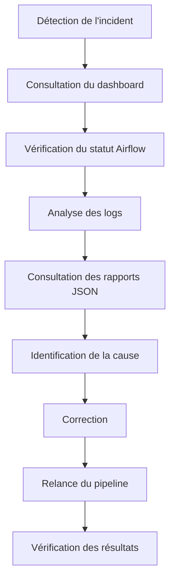

# Gestion des incidents

# Introduction

Malgré les différents mécanismes de validation intégrés au pipeline, des incidents peuvent survenir au cours d'une exécution. Ils peuvent être liés à une indisponibilité d'un service, à une erreur de configuration, à un changement de structure d'une source de données ou encore à un problème de stockage.

L'objectif de la gestion des incidents est de permettre une identification rapide de la cause du problème afin de limiter son impact sur le fonctionnement du pipeline.

---

# Cycle de gestion d'un incident

Lorsqu'une anomalie est détectée, une démarche structurée est suivie afin d'identifier son origine et de rétablir le fonctionnement normal du pipeline.

Cette procédure permet d'assurer une résolution méthodique des incidents.

---

# Identification de l'origine du problème

La première étape consiste à déterminer où l'incident s'est produit.

Plusieurs composants peuvent être consultés :

| Source d'information | Utilisation |
|----------------------|-------------|
| Dashboard Streamlit | Vue générale de l'état du pipeline |
| Apache Airflow | Identification de la tâche en échec |
| Logs | Analyse détaillée de l'erreur |
| Rapports JSON | Vérification des statistiques produites |
| PostgreSQL | Contrôle des données enregistrées |

Le croisement de ces informations permet généralement de localiser rapidement l'origine du dysfonctionnement.

---

# Incidents les plus fréquents

Les incidents susceptibles de se produire sont variés.

Les principaux cas rencontrés sont les suivants.

| Incident | Cause possible |
|----------|----------------|
| DAG en échec | Erreur d'exécution ou exception Python |
| API indisponible | Panne du service ou quota dépassé |
| Flux RSS inaccessible | Serveur distant indisponible |
| Changement de structure HTML | Sélecteurs de scraping devenus obsolètes |
| Échec du téléchargement d'une image | URL invalide ou fichier inaccessible |
| Erreur PostgreSQL | Connexion, contrainte ou problème d'écriture |
| Contrôle qualité non conforme | Données incomplètes ou invalides |

La majorité de ces incidents peuvent être diagnostiqués à l'aide des informations produites par le monitoring.

---

# Diagnostic

Une fois l'incident identifié, plusieurs vérifications peuvent être réalisées.

Par exemple :

- consulter le message d'erreur enregistré dans les logs ;
- vérifier la configuration utilisée ;
- contrôler l'accessibilité de la source concernée ;
- examiner les rapports générés par les différentes étapes ;
- comparer les résultats avec une exécution précédente.

Cette phase permet de confirmer la cause réelle du problème avant toute correction.

---

# Correction

La nature de la correction dépend du type d'incident rencontré.

Elle peut notamment consister à :

- corriger une configuration ;
- mettre à jour un extracteur ;
- adapter un scraper à une nouvelle structure HTML ;
- remplacer une clé API expirée ;
- corriger une erreur de code ;
- relancer un traitement interrompu.

Une fois la correction appliquée, une nouvelle exécution du pipeline permet de vérifier que le problème est résolu.

---

# Vérification après correction

Après la relance du pipeline, plusieurs contrôles sont réalisés.

Ils consistent notamment à vérifier :

- le succès de l'exécution Airflow ;
- l'absence d'erreurs dans les logs ;
- la cohérence des rapports JSON ;
- la présence des données dans PostgreSQL ;
- les indicateurs affichés dans le dashboard.

Cette étape permet de confirmer le retour à un fonctionnement normal.

---

# Amélioration continue

Chaque incident constitue une opportunité d'améliorer le pipeline.

Les informations collectées lors du diagnostic permettent notamment de :

- renforcer les contrôles de validation ;
- améliorer la robustesse des extracteurs ;
- optimiser les traitements ;
- enrichir les journaux d'exécution ;
- compléter les mécanismes de supervision.

Cette démarche contribue à augmenter progressivement la fiabilité du pipeline.

---

# Conclusion

La gestion des incidents complète le dispositif de monitoring en fournissant une méthode structurée pour identifier, analyser et corriger les anomalies.

Associée aux indicateurs de suivi, aux rapports d'exécution, aux logs et au dashboard, elle permet de maintenir un niveau élevé de disponibilité et de qualité du pipeline CheckIt.AI.