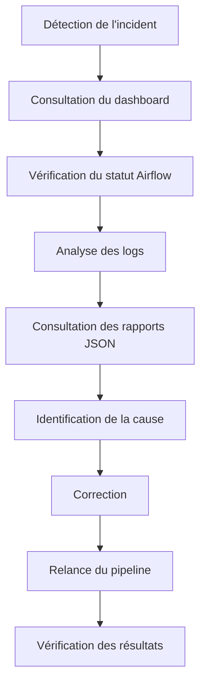

# Gestion des incidents

## Introduction

Malgré les différents mécanismes de validation intégrés au pipeline, des incidents peuvent survenir au cours d'une exécution. Ils peuvent être liés à une indisponibilité d'un service, à une erreur de configuration, à un changement de structure d'une source de données ou encore à un problème de stockage.

L'objectif de la gestion des incidents est de permettre une identification rapide de leur origine afin de limiter leur impact sur le fonctionnement du pipeline et sur la qualité des données produites.

---

## Cycle de gestion d'un incident

Lorsqu'une anomalie est détectée, une démarche structurée est suivie afin d'identifier son origine, de corriger le problème et de rétablir le fonctionnement normal du pipeline.

Cette procédure permet d'assurer un diagnostic méthodique et de limiter la durée des interruptions.

---

## Identification de l'origine du problème

La première étape consiste à déterminer à quel niveau du pipeline l'incident s'est produit.

Plusieurs composants peuvent être consultés.

| Source d'information | Utilisation |
|----------------------|-------------|
| Dashboard Streamlit | Vue générale de l'état du pipeline |
| Apache Airflow | Identification du DAG ou de la tâche en échec |
| Logs | Analyse détaillée des erreurs et des avertissements |
| Rapports JSON | Vérification des statistiques produites |
| PostgreSQL | Contrôle des données enregistrées et des indicateurs |

Le croisement de ces différentes sources permet généralement de localiser rapidement l'origine du dysfonctionnement.

---

## Incidents les plus fréquents

Les incidents susceptibles de se produire sont variés.

Les principaux cas rencontrés sont les suivants.

| Incident | Cause possible |
|----------|----------------|
| DAG en échec | Exception Python ou erreur d'exécution |
| API indisponible | Panne du service, quota dépassé ou erreur réseau |
| Flux RSS inaccessible | Serveur distant indisponible ou URL invalide |
| Changement de structure HTML | Sélecteurs de scraping devenus obsolètes |
| Échec du téléchargement d'une image | URL invalide, serveur inaccessible ou contenu non conforme |
| Erreur PostgreSQL | Connexion, contrainte ou problème d'écriture |
| Contrôle qualité non conforme | Données incomplètes, invalides ou incohérentes |

La majorité de ces incidents peuvent être diagnostiqués à l'aide des informations produites par le dispositif de monitoring.

---

## Diagnostic

Une fois l'incident identifié, plusieurs vérifications peuvent être réalisées afin de confirmer sa cause.

Par exemple :

- consulter les messages d'erreur enregistrés dans les logs ;
- vérifier la configuration utilisée ;
- contrôler l'accessibilité de la source concernée ;
- examiner les rapports générés par les différentes étapes ;
- comparer les résultats avec une exécution précédente ;
- vérifier les indicateurs affichés dans le dashboard.

Cette phase permet de confirmer la cause réelle du problème avant toute correction.

---

## Correction

La nature de la correction dépend du type d'incident rencontré.

Elle peut notamment consister à :

- corriger une configuration ;
- mettre à jour un extracteur ;
- adapter un scraper à une nouvelle structure HTML ;
- remplacer une clé API expirée ;
- corriger une erreur de code ;
- restaurer un service indisponible ;
- relancer un traitement interrompu.

Une fois la correction appliquée, une nouvelle exécution du pipeline permet de vérifier que le problème est résolu.

---

## Vérification après correction

Après la relance du pipeline, plusieurs contrôles sont réalisés afin de confirmer le retour à un fonctionnement normal.

Ils consistent notamment à vérifier :

- le succès de l'exécution dans Apache Airflow ;
- l'absence d'erreurs critiques dans les logs ;
- la cohérence des rapports JSON ;
- la présence des données dans PostgreSQL ;
- les indicateurs affichés dans le dashboard ;
- la conformité des résultats du contrôle qualité.

Cette étape permet de s'assurer que l'incident a bien été résolu et qu'aucune anomalie résiduelle n'est présente.

---

## Amélioration continue

Chaque incident constitue une opportunité d'améliorer le pipeline.

Les informations collectées lors du diagnostic permettent notamment de :

- renforcer les contrôles de validation ;
- améliorer la robustesse des extracteurs ;
- optimiser les traitements ;
- enrichir les journaux d'exécution ;
- compléter les mécanismes de supervision ;
- prévenir la réapparition d'incidents similaires.

Cette démarche contribue à améliorer progressivement la fiabilité, la robustesse et la maintenabilité du pipeline.

---

## Limites du dispositif actuel

Dans sa version actuelle, **CheckIt.AI** repose principalement sur une gestion manuelle des incidents.

Le diagnostic est réalisé à partir des informations fournies par Apache Airflow, le dashboard Streamlit, les rapports d'exécution, PostgreSQL et les journaux.

Le projet ne met pas encore en œuvre de mécanisme automatisé de gestion des incidents ou de relance automatique des traitements. Cette approche reste néanmoins adaptée au contexte pédagogique du projet et permet de mettre en évidence l'ensemble des informations nécessaires au diagnostic.

---

## Évolutions possibles

Dans un contexte de production, plusieurs améliorations pourraient être envisagées afin de renforcer la gestion des incidents :

- relance automatique de certains traitements après un échec temporaire ;
- notifications automatiques lors d'un incident critique ;
- création automatique de tickets d'incident ;
- centralisation des logs dans une plateforme dédiée ;
- tableaux de bord historiques permettant l'analyse des incidents récurrents ;
- intégration avec des solutions d'observabilité telles que Prometheus, Grafana ou ELK.

Ces évolutions permettraient d'améliorer la réactivité des équipes d'exploitation et de réduire le temps de résolution des incidents.

---

## Conclusion

La gestion des incidents complète le dispositif de monitoring en fournissant une méthode structurée pour détecter, analyser, corriger et vérifier les anomalies susceptibles d'affecter le pipeline.

Associée aux indicateurs de suivi, aux rapports d'exécution, aux journaux, à PostgreSQL, à Apache Airflow et au dashboard Streamlit, elle contribue à maintenir un niveau élevé de fiabilité, de qualité des données et de robustesse du pipeline **CheckIt.AI**.