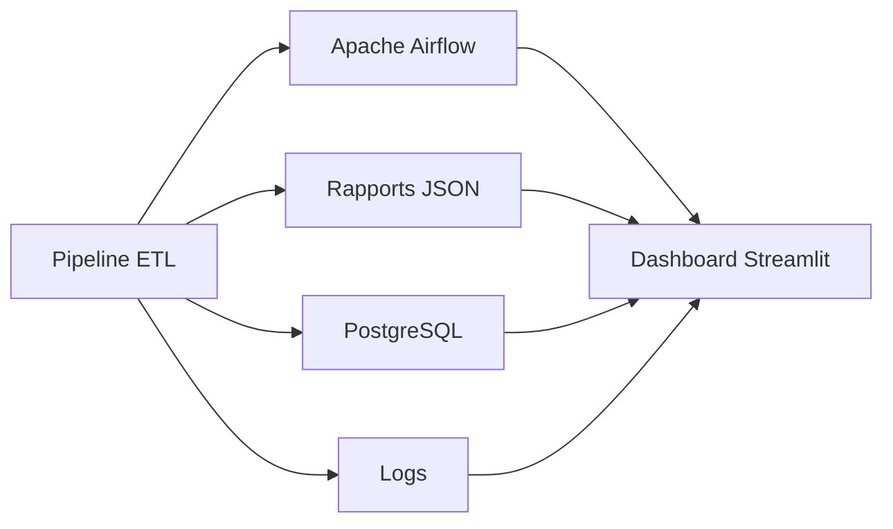

# Monitoring du pipeline

# Présentation

Le développement d'un pipeline ETL ne se limite pas à l'acquisition et au traitement des données. Une fois le pipeline déployé, il est également nécessaire de pouvoir surveiller son fonctionnement, détecter rapidement les anomalies et vérifier en permanence la qualité des données produites.

Dans **CheckIt.AI**, le monitoring a pour objectif d'assurer la fiabilité de l'ensemble de la chaîne de traitement, depuis l'extraction des données jusqu'à leur stockage dans PostgreSQL.

Cette supervision repose sur plusieurs mécanismes complémentaires :

- l'orchestration des traitements avec Apache Airflow ;
- les rapports produits à chaque étape du pipeline ;
- les informations enregistrées dans PostgreSQL ;
- les journaux d'exécution ;
- le tableau de bord développé avec Streamlit.

L'ensemble de ces composants permet de suivre l'état du pipeline, d'analyser ses performances et de faciliter le diagnostic en cas d'incident.

---

# Objectifs

Le plan de monitoring poursuit plusieurs objectifs.

Il permet notamment de :

- vérifier le bon déroulement des traitements ;
- contrôler la qualité des données produites ;
- mesurer les performances du pipeline ;
- détecter rapidement les anomalies ;
- faciliter l'identification des causes d'un incident ;
- assurer la traçabilité des différentes exécutions.

La supervision constitue ainsi un élément essentiel pour garantir la fiabilité du pipeline dans la durée.

---

# Organisation de cette section

Cette partie est organisée autour des différents aspects de la supervision du pipeline.

1. **Objectifs du monitoring** : rôle de la supervision et enjeux associés.
2. **Architecture de supervision** : présentation des composants utilisés pour surveiller le pipeline.
3. **Indicateurs de suivi (KPI)** : principaux indicateurs calculés au cours des exécutions.
4. **Outils de supervision** : Airflow, PostgreSQL, rapports, logs et dashboard.
5. **Gestion des alertes** : situations nécessitant une intervention.
6. **Gestion des incidents** : procédure de diagnostic et de résolution.
7. **Perspectives d'évolution** : améliorations envisageables du dispositif de monitoring.

---

# Vue d'ensemble

Le monitoring repose sur plusieurs composants qui collaborent afin de fournir une vision complète de l'état du pipeline.

Chaque composant apporte une information complémentaire :

- **Apache Airflow** supervise l'exécution des DAGs ;
- les **rapports JSON** conservent les résultats détaillés de chaque étape ;
- **PostgreSQL** stocke les indicateurs et les données produites ;
- les **logs** facilitent le diagnostic des erreurs ;
- le **dashboard Streamlit** centralise les informations utiles à la supervision.

---

# Conclusion

Le monitoring constitue la dernière brique du pipeline CheckIt.AI.

Il permet de vérifier que les traitements s'exécutent correctement, que les données produites sont conformes aux attentes et que les performances du pipeline restent maîtrisées.

Les chapitres suivants détaillent les différents mécanismes mis en œuvre pour superviser le pipeline, suivre les indicateurs de qualité et faciliter la maintenance de la plateforme.